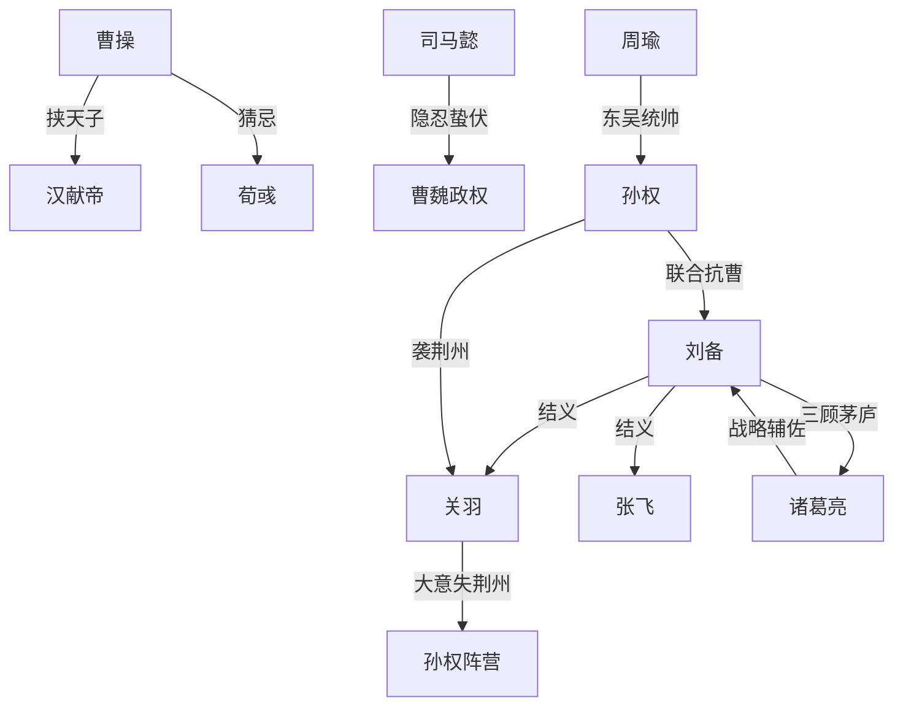

# 《三国演义》跨学科深度解析
### 文学 × 历史 × 哲学 × 心理学 × 社会学 × 政治学 × 经济学 × 组织行为学 × 商业战略 × 职业发展

> 说明：以下内容中，**【事实】**标注可考的历史/文本依据，**【原著观点】**标注小说文本本身传达的立场，**【学界/评论观点】**标注后世研究者与评论家的分析，**【本团队分析】**标注本次跨学科解读的推论。四者严格区分，避免混淆。

---

## 【一、作品全景】

**【事实】** 《三国演义》全名《三国志通俗演义》，成书于元末明初，通行本经明代罗贯中编纂整理，清初毛纶、毛宗岗父子评改定型为今日通行的"毛本"。它并非单一作者原创，而是在陈寿《三国志》、裴松之注、唐宋说书话本、金元"讲史"平话（如《三国志平话》）、元杂剧三国戏基础上层累而成的集体创作结晶，罗贯中的贡献主要是文人化的整理、结构化与文学提升。

**【事实】** 罗贯中生平记载稀少，多数信息来自后人零星笔记，一般认为他经历了元末群雄逐鹿的乱世（曾传说依附张士诚），这段亲历乱世的经验被认为是他理解"群雄逐鹿"母题的现实基础。

**【学界观点】** 明初朱元璋建立汉人政权后，社会急需重建儒家正统伦理与"华夷之辨"的意识形态，"拥刘反曹"（尊蜀汉为正统、贬曹魏为篡逆）的叙事倾向，被多数学者（如章培恒、袁行霈等）解读为呼应了这一时代对"正统性"与"忠义"伦理的强烈需求，而非单纯的历史评判。

**【事实/历史背景】** 小说的历史原型时期为东汉末年至西晋统一（约184年黄巾之乱—280年三国归晋），这是中国历史上中央权威崩溃、军阀割据、人口锐减（东汉末年人口从五千多万锐减至三国末不足千万）、社会秩序全面重组的时期。

**【文学地位】** 中国古典四大名著之一，中国章回体历史演义小说的奠基与巅峰之作，确立了"七实三虚"的历史小说创作范式，深刻影响了后世历史小说、评书、戏曲乃至东亚文化圈（日本、朝鲜半岛、越南、琉球）的政治想象与权谋文化。

**【学界/评论观点】** 日本学者吉川英治的《三国志》改写、当代管理学界将其作为"东方权谋/组织管理教材"，都说明这部作品的影响早已溢出文学范畴，进入政治哲学、军事思想、组织行为学乃至流行文化（游戏、影视）领域。

**【本团队分析】一句话总结：**

> **这部作品真正讨论的不是"谁该统一天下"，而是"在结构性衰败与道德理想主义之间，个体的才能、忠诚与欲望如何被历史进程反复检验、消耗与最终吞没"。**

---

## 【二、故事结构：因果链与底层逻辑】

### 时间线与因果链（开端—发展—高潮—结局）

| 阶段 | 关键事件 | 起因 | 关键人物选择 | 直接后果 |
|---|---|---|---|---|
| 开端 | 黄巾之乱（184） | 东汉外戚宦官交替专权、土地兼并、天灾频发 | 张角起事；各地豪强奉命"平乱"获得兵权 | 中央权威瓦解，军阀坐大的种子埋下 |
| 开端 | 董卓乱政、十八路诸侯讨董 | 何进召外兵入京失败，董卓趁乱掌权废立皇帝 | 各路诸侯"讨董"实为借机扩张势力，联盟内耗 | 证明"共同敌人"式联盟极不稳定，为后续群雄割据定调 |
| 发展 | 曹操"挟天子以令诸侯" | 曹操意识到"名分"的政治价值高于军事本身 | 曹操主动迎汉献帝 | 曹操获得道义制高点，其余诸侯失去"正统"话语权 |
| 发展 | 官渡之战（200） | 袁绍与曹操争夺北方主导权 | 曹操用许攸之谋奇袭乌巢；袁绍刚愎自用不纳许攸、田丰之谏 | 曹操以弱胜强统一北方，验证"用人纳谏"对"资源体量"的胜出 |
| 高潮 | 三顾茅庐、隆中对 | 刘备屡败无根据地，急需战略与人才 | 刘备放低身段三次拜访；诸葛亮提出"跨有荆益、联吴抗曹"总体战略 | 刘备集团首次拥有清晰的长期战略，蜀汉雏形确立 |
| 高潮 | 赤壁之战（208） | 曹操南下欲一统天下 | 孙权、刘备结盟；周瑜、诸葛亮联合用火攻 | 曹操惨败退回北方，三国鼎立格局实质形成 |
| 发展 | 关羽失荆州、刘备伐吴、夷陵之战（222） | 关羽刚愎轻敌得罪孙权，孙权袭荆州杀关羽；刘备为义气与战略利益双重驱动伐吴 | 刘备不听诸葛亮、赵云劝阻，执意东征 | 蜀汉精锐尽丧，刘备白帝城托孤，"隆中对"两路出兵的战略基础被永久摧毁 |
| 转折 | 诸葛亮北伐（六出祁山） | 蜀汉国力最弱，诸葛亮"知其不可为而为之"，以攻代守延续政权合法性 | 诸葛亮事必躬亲、连年用兵；未能培养出足够接班梯队 | 蜀汉国力持续透支，诸葛亮病逝五丈原 |
| 结局 | 三国归晋（280） | 曹魏权臣司马氏架空曹家（重演曹操对汉的路径），逐步兼并蜀、吴 | 司马懿隐忍蛰伏数十年，司马昭、司马炎完成篡代 | "分久必合"，但统一者并非小说情感上认同的任何一方，而是最初被视为配角的司马氏 |

### 底层逻辑（本团队分析）

1. **"名分—实力—人才"三角决定命运**：曹操靠"挟天子"获得名分红利，靠屯田制、唯才是举获得实力与人才，三者叠加使其集团最具韧性。
2. **理想主义在结构性力量前的悲剧性**：刘备集团代表的"仁义/忠汉"理想，始终未能转化为可持续的制度与资源基础，最终败给更冷酷务实的司马氏。
3. **历史的"反讽闭环"**：曹操以权臣身份架空汉室，被小说塑造为"奸雄"；司马懿以同样路径架空曹魏，最终却"摘了桃子"统一天下——小说借此暗示：**道德评判无法改变权力结构的运行规律**，这是全书最深刻、也最容易被读者忽略的结构性反讽。
4. **个人才能存在"边际"**：诸葛亮的智谋无法弥补蜀汉在人口、土地、经济基础上的结构性劣势，说明**个体能动性对系统性劣势的补偿存在天花板**——这是贯穿全书、对今日组织管理最具迁移价值的规律之一。

---

## 【三、人物全景分析】

> 每位人物按：身份定位／核心欲望恐惧价值观／优势弱点盲点／成长轨迹与转折／关系网络／心理学分析／历史原型对照／现实映射／对不同人群的借鉴 展开。因篇幅巨大，采用精简结构化呈现核心要点。

### 1. 刘备
- **定位**：蜀汉开国之君，"仁德"理想的人格化身。
- **核心欲望/恐惧**：欲望是"匡扶汉室"的历史使命感与身份认同（自称中山靖王之后）；恐惧是"失去道义正当性"，因此极度重视舆论形象。
- **优势/弱点/盲点**：优势是识人用人、百折不挠、共情力强；弱点是决策常被情感（对关羽、张飞的义气）压倒战略理性；盲点是对"仁义人设"的路径依赖，使他在夷陵之战前无法进行冷静的成本收益计算。
- **关键转折**：从织席贩履的平民到"三顾茅庐"获得战略家，再到夷陵惨败、白帝城托孤——完整呈现"理想主义者遭遇现实反噬"的弧光。
- **心理学分析（荣格原型）**："圣王/照顾者（Caregiver）"原型的极致体现，其阴影面（Shadow）是压抑下的权力欲与在情义面前的非理性执念——夷陵之战正是这一阴影的总爆发。
- **历史原型**：史实中的刘备远比小说中更具枭雄气质、善于权谋（如借荆州、取益州手段并不"仁义"），小说对其"仁德"形象有明显文学美化，这是**学界公认的"七实三虚"中"虚"的典型代表**。
- **现实映射**：理想主义创业者、价值观驱动型领导者。
- **借鉴与警示**：
  - 对30岁职场人：人格魅力与价值观能凝聚人心，但**不能替代战略纪律**；
  - 对管理者：招募人才的诚意（三顾茅庐）是稀缺资源，但情感不能凌驾于组织决策之上；
  - 对创业者：夷陵之战是经典的"因情绪化决策导致公司资源被系统性摧毁"案例，警示创始人须建立"冷静期"机制。

### 2. 诸葛亮
- **定位**：蜀汉丞相，"智绝"的文化符号，理性与忠诚的化身。
- **核心欲望/恐惧**：欲望是"知遇之恩必以死相报"的士人伦理与实现政治理想；恐惧是蜀汉在其身后无以为继（这是他"事必躬亲"的深层驱动）。
- **优势/弱点/盲点**：优势是战略规划（隆中对）、组织协调、鞠躬尽瘁的执行力；弱点/盲点是**过度中央集权导致组织无法沉淀人才梯队**（"蜀中无大将，廖化作先锋"正是这一盲点的历史性回响），也导致他自己被过度工作透支而早逝。
- **关键转折**：从隐居隆中的观察者，到刘备去世后独撑危局的实际统治者，其个人使命感在"知其不可为而为之"的北伐中达到悲剧顶点。
- **心理学分析**：荣格"智者/圣贤（Sage）"原型；用CBT视角看，他存在"我必须亲自完成一切才不辜负托孤"的核心信念（Core Belief），这是一种适应不良的完美主义认知模式，长期导致过劳。
- **历史原型**：史实中的诸葛亮治国才能确凿，但"多智近妖"式的神机妙算（如借东风、空城计）多为小说虚构，是文学夸张的典型。
- **现实映射**：高执行力、事必躬亲的职业经理人/创始人型高管。
- **借鉴与警示**：
  - 对管理者：**不授权、不培养继任者，是组织最大的长期风险**，诸葛亮式"个人英雄主义"在企业中往往制造"关键人依赖"（Key Person Risk）；
  - 对30岁职场人：忠诚与责任感值得肯定，但需警惕"过劳正当化"的自我叙事。

### 3. 曹操
- **定位**：曹魏奠基者，"治世之能臣，乱世之奸雄"（原著借许劭之口定评）。
- **核心欲望/恐惧**：欲望是掌控秩序、建立功业并将权力延续给后代；恐惧是被背叛（多疑性格的根源，如误杀吕伯奢一家）。
- **优势/弱点/盲点**：优势是唯才是举、务实高效、极强的组织与制度建设能力（屯田制解决军粮问题）；弱点是极端多疑、猜忌导致人才流失（如许攸、荀彧的结局）；盲点是将"效率"凌驾于"人心"之上，赤壁之战中的骄傲轻敌也是这一盲点的体现。
- **心理学分析**：荣格"统治者/皇帝（Ruler）"原型，兼具阴影面"暴君"特质；他的多疑可从依恋理论角度理解为对"被背叛"的高度警觉性。
- **历史原型**：史实中的曹操是杰出的政治家、军事家、文学家（建安文学的核心人物），小说因"拥刘反曹"的正统叙事需要，对其"奸"的一面进行了显著放大，这是**学界普遍认为对历史人物最不公平的文学处理之一**。
- **现实映射**：结果导向、制度型、高效但强势的商业领袖。
- **借鉴与警示**：
  - 对创业者/管理者：唯才是举、制度先行（如屯田制）是组织建立韧性的关键，值得学习；
  - 对领导力：多疑内耗人才是许多组织"高层人才流失"的心理根源，需警惕权力越大越孤独导致的信任赤字。

### 4. 关羽
- **定位**："义绝"，忠义人格的极致象征，后世被神化为"关公"。
- **核心欲望**：极端重视个人荣誉与"义"的名声。
- **弱点/盲点**：刚愎自用、轻视他人（拒绝与东吴联姻、瞧不起黄忠同列），最终"大意失荆州"，直接导致蜀汉战略基础崩塌。
- **心理学分析**：过度膨胀的自我效能感（Self-efficacy）与荣誉认同一旦与现实脱节，会导致灾难性决策——这是典型的"能力光环下的战略性自负"。
- **现实映射**：业务能力极强但人际关系处理僵化、听不进不同意见的高绩效员工/子公司负责人。
- **借鉴**：对职场人——单一维度的高能力不能替代政治敏感度与团队协作意识。

### 5. 张飞
- **定位**：勇猛忠义但性格暴烈的武将。
- **弱点/盲点**：治军严苛、对下属缺乏共情，最终被部下所杀——这是全书中"性格即命运"最直白的案例。
- **借鉴**：对管理者——对下属的高压管理若无情感账户支撑，终将反噬。

### 6. 孙权
- **定位**：东吴之主，务实的"守成型"领导者。
- **优势**：善于平衡内部势力（张昭、周瑜、鲁肃、陆逊各阶段依赖不同班底）、审时度势（联刘抗曹、后又袭荆州联魏抗刘），战略灵活性最强。
- **盲点**：缺乏统一天下的雄心与执行力，长期满足于"划江自保"。
- **现实映射**：稳健型职业经理人/家族企业"守成一代"。
- **借鉴**：对组织管理者——灵活的联盟策略（该联合时联合，该背叛时背叛）是现实政治/商业竞争中常见但需谨慎评估道德成本的策略。

### 7. 周瑜
- **定位**：东吴统帅，赤壁之战的实际军事指挥者。
- **心理学分析**：小说虚构的"既生瑜何生亮"心结，是典型的"社会比较（Social Comparison）"导致的认知扭曲，历史上周瑜实为气度恢宏之人，此为**小说为凸显诸葛亮而做的文学牺牲**（学界公认的不公平之处）。
- **借鉴**：对职场人——警惕将同事/竞争对手的成功过度内化为自我价值的威胁。

### 8. 司马懿
- **定位**：曹魏权臣，晋朝奠基人，全书真正的"终局赢家"。
- **核心策略**：隐忍蛰伏、以时间换空间、不争一时之勇。
- **心理学分析**：极高的延迟满足能力（Delayed Gratification）与情绪调节能力，是ACT（接纳承诺疗法）中"心理灵活性"的极端案例——能在长期受压制、被猜忌的情境下不与情绪对抗，持续朝长期目标行动。
- **现实映射**：长期主义者、深藏不露的"影子接班人"。
- **借鉴**：对30岁职场人及管理者——**真正的权力常属于最能延迟满足、最不需要即时被看见的人**，这是全书对"隐忍价值"最具现实意义的注脚。

### 9. 吕布、董卓
- **定位**：反面案例，代表"有实力无价值观"的短视型野心家。
- **借鉴**：吕布"三姓家奴"式的反复无常，说明**短期利益导向的信誉破产会使个体丧失一切长期合作机会**——对职场诚信、商业信誉具有直接警示意义。

### 10. 貂蝉
- **定位**：小说虚构或高度文学化的女性角色，作为"连环计"的工具性存在。
- **【本团队分析/社会学视角】**：貂蝉几乎是全书唯一具有主动叙事功能的女性角色，但其功能被完全工具化——她的"美"是被王允当作政治武器使用的资源，而非她自身意志的延伸。这反映了原著整体的性别视角局限（详见第六部分）。
- **对现代女性的借鉴**：警惕在组织/家庭叙事中被简化为"资源"或"工具"的角色定位，主动争取叙事主体性。

### 人物关系网络（简要）

- **蜀汉阵营**：刘备（核心）— 诸葛亮（战略大脑）— 关羽/张飞（结义兄弟，武力支柱）— 赵云（忠诚护卫）— 姜维（继承人，理想主义的延续与最终失败）
- **曹魏阵营**：曹操（核心）— 荀彧/郭嘉（谋士，理念冲突导致荀彧结局悲剧）— 司马懿（潜伏的终局赢家）
- **东吴阵营**：孙权（核心）— 周瑜/鲁肃/陆逊（历代都督，体现制度化的人才梯队建设，这是三国中人才接续最健康的阵营）

---

## 【四、思想与主题】

**【原著观点】** 开篇"话说天下大势，分久必合，合久必分"直接点明历史循环观；全书通过"拥刘反曹"表达对"正统—忠义"伦理的推崇。

**【本团队分析】** 但细读全书会发现一个**原著未必自觉、却客观呈现的深层张力**：小说在情感上歌颂刘备集团的仁义，却在结构上让最冷酷务实的曹魏—司马氏一脉笑到最后。这本身构成了对"道德理想主义是否能对抗历史结构性力量"这一问题的一次深刻、甚至带有悲观色彩的隐性回答。

### 各主题的表达

- **权力**：权力的本质在小说中呈现为"名分+实力+人才"的组合博弈，而非单纯的道德正当性（曹操"挟天子"的成功证明了这一点）。
- **利益**：孙刘联盟"合则两利、分则两害"的反复摇摆，说明利益联盟本质上是动态博弈而非永久同盟。
- **家庭**：刘关张"桃园结义"以拟制家庭（非血缘兄弟）替代真实家庭，反映乱世中信任结构对血缘的替代需求。
- **爱情**：全书爱情叙事极度稀薄且工具化（如貂蝉、孙尚香的婚姻均服务于政治目的），这是**本书最受当代批评的结构性缺陷之一**。
- **组织**：曹魏的制度建设（屯田、唯才是举）、东吴的都督接力制、蜀汉对诸葛亮的高度依赖，构成组织韧性的三种对照样本。
- **战争**：战争被呈现为智谋与资源的双重较量，而非单纯武力对抗（赤壁、官渡均以少胜多，凸显"信息与决策质量"高于"体量"的可能性，但长期而言体量仍决定结局，如蜀汉最终因国力耗竭而亡）。
- **制度**：全书隐含对"中央集权崩溃—军阀混战—新集权重建"这一制度周期的深刻观察。
- **财富**：财富始终服务于军事与政治目的，本身极少作为独立价值被讨论，反映传统农业社会"重农抑商"的经济观。
- **自由**：几乎所有人物的"自由"都从属于身份使命（刘备的"汉室宗亲"身份、诸葛亮的"托孤之重"），个体自由意志在结构性角色面前空间极小。
- **责任**：责任伦理（尤其是诸葛亮的"鞠躬尽瘁，死而后已"）被塑造为最高美德，但也暗含"责任过载导致组织脆弱"的反面教训。
- **命运**："谋事在人，成事在天"的天命观贯穿全书，与个人才能的极致展现（诸葛亮）形成张力——这正是全书悲剧美学的核心来源。

### 作者真正想回答的问题（本团队分析）

> 在一个旧秩序崩溃、新秩序尚未建立的时代，**才德兼备的个体是否能够凭借道义与智慧扭转历史的结构性力量？** 小说给出的答案是复杂而悲观的：能在局部、短期内扭转（赤壁），但无法在长期、根本上抗衡结构性劣势（蜀汉的灭亡）。

### 跨时代仍然成立的规律

1. 名分（合法性叙事）与实力同等重要，甚至有时比实力更具决定性。
2. 组织的人才梯队建设比单一天才的存在更具长期韧性。
3. 短期道德声誉的破产（如吕布）会摧毁长期合作的可能性。
4. 情绪化决策（夷陵之战）是系统性资源毁灭的常见触发点。
5. 延迟满足与隐忍（司马懿）在长周期博弈中往往是最终赢家的共性特质。

---

## 【五、多维度解读】

**①普通个人成长**：全书本质是一部"如何在资源有限的情况下建立个人品牌与联盟"的故事（刘备白手起家的路径），也警示"人设"（仁义形象）一旦固化，会限制关键时刻的理性决策空间。

**②30岁成年人视角**：刘备、诸葛亮出山时都已过而立之年（刘备41岁遇诸葛亮出山时年27岁），说明"大器晚成"与"厚积薄发"在传统叙事中被高度肯定，但也要警惕诸葛亮式"过度承担导致早衰"的陷阱——30岁是建立可持续工作节奏、而非透支式拼搏的关键窗口期。

**③女性视角**：全书女性角色叙事空间极窄，多为政治联姻或谋略工具（貂蝉、孙尚香、甘夫人），**这是原著明显的时代局限，也是当代女性读者最需要批判性阅读的部分**——可以反向追问："如果貂蝉、孙尚香拥有自主叙事权，历史会如何不同？"

**④职场与组织管理**：曹魏的"唯才是举"人才政策、东吴的都督接班梯队、蜀汉的"一人独大"模式，构成三种可直接对照现代企业组织设计的样本，蜀汉模式尤其警示"关键人依赖"风险。

**⑤创业与商业战略**：隆中对是古代"顶层战略设计"的经典范例（明确使命—评估资源—制定跨期路径），而夷陵之战是"因情绪偏离既定战略导致公司资源清零"的经典反面案例。

**⑥领导力**：曹操的"制度型领导力"、刘备的"魅力型领导力"、孙权的"平衡型领导力"，构成领导力风格光谱的三种典型，各有优劣，无绝对最优解。

**⑦心理健康**：诸葛亮的过劳而死，是"责任型完美主义"导致职业倦怠（Burnout）的古典案例；关羽的自负导致的战略误判，可用认知行为疗法中的"认知扭曲"（如"全或无思维""过度概括"）加以分析。

**⑧社会制度**：全书展现了从中央集权崩溃到军阀混战、再到新集权重建的完整制度周期，具有跨文明的普遍性（可与罗马帝国衰亡、欧洲中世纪割据相比较）。

**⑨历史发展**：三国归晋的结局提醒我们，历史进程的"赢家"未必是情感上最受认同的一方，制度效率与长期国力往往是决定性变量。

**⑩现代AI时代的假设推演（本团队推演，非史实）**：若故事发生在今天，信息战（舆论正当性）将通过社交媒体即时放大，"挟天子以令诸侯"式的话语权争夺会演变为"平台/媒体控制权"之争；诸葛亮式的"事必躬亲"在今天会被AI辅助决策系统部分替代，个人才能的"信息处理瓶颈"将被显著突破，但组织的人才梯队与信任机制问题依然无法被技术完全解决。

---

## 【六、客观评价与争议】

**支持者的高度评价（学界/评论）**：
- 结构宏大、人物塑造鲜明立体，确立了历史演义小说的美学范式；
- 对权谋、组织、战争的描写具有跨时代的现实洞察力，被广泛应用于军事教育与商业管理培训；
- 忠义伦理对东亚社会道德观塑造影响深远。

**批评者的主要质疑**：
- **历史真实性问题**："七实三虚"导致大量历史人物形象被严重扭曲（曹操被脸谱化为奸雄、周瑜被矮化、诸葛亮被神化），鲁迅曾在《中国小说史略》中评价此类历史演义"欲显刘备之长厚而似伪，状诸葛之多智而近妖"，这是**学界公认最经典、最中肯的批评之一**。
- **性别视角局限**：女性角色几乎无独立叙事空间，工具化倾向明显，这是当代女性主义批评视角下最突出的问题。
- **道德二元化**：忠奸对立的叙事框架简化了历史人物的复杂性，容易强化非黑即白的思维模式。
- **战争美学化**：对战争谋略的欣赏式描写，客观上存在美化暴力与权谋的风险，需读者保持批判性距离。

**哪些属于时代局限**：性别观念、"华夷正统"的政治伦理框架、农业社会的经济观（重农抑商），均是特定历史条件的产物，不宜简单套用于当代价值判断。

**哪些批评具有合理性**：历史失真对人物评价的长期误导（如"曹操=奸臣"的刻板印象至今影响大众认知）、女性叙事缺失，均是经得起当代学术检验的合理批评。

**【本团队综合评价】**：《三国演义》作为文学作品，其艺术成就与文化影响力毋庸置疑；但读者应清晰区分"文学真实"与"历史真实"，避免将小说中的道德评判直接等同于历史人物的真实面貌，也应对其性别视角的局限保持批判性认识。它是一部值得反复阅读、但需要"带着批判性眼镜"阅读的经典。

---

## 【七、现实应用】

**人生原则（10条）**
1. 名分（叙事正当性）与实力同样重要，学会为自己的目标建立合理的"名分"。
2. 情绪化决策是系统性损失的最大触发点（夷陵之战）。
3. 短期信誉破产会摧毁长期合作可能（吕布）。
4. 延迟满足与隐忍常是长周期博弈的制胜关键（司马懿）。
5. 过度承担、不肯放权会透支自己（诸葛亮）。
6. 单一维度的能力优势不能替代综合判断力（关羽）。
7. 联盟是动态博弈，而非永久承诺（孙刘联盟）。
8. "厚积薄发"胜过"仓促求成"（刘备27年基业积累）。
9. 性格弱点若不自知，终将成为命运转折点（张飞、关羽）。
10. 天命观提醒我们尽人事、但不必以结果苛责自己（"谋事在人，成事在天"）。

**职场原则（10条）**
1. 建立个人可信度（信誉资产）比短期胜利更重要。
2. 不要让"人设"限制你在关键时刻的理性判断。
3. 主动为团队/上级提供清晰的战略框架（隆中对式思维）。
4. 警惕被过度依赖导致的职业倦怠。
5. 与同僚的比较心理（"既生瑜何生亮"）会扭曲判断，需自我觉察。
6. 团队协作能力与专业能力同等重要（关羽的教训）。
7. 学会向上管理，及时纳谏（对照袁绍拒谏的失败）。
8. 建立人才梯队意识，避免让自己成为"单点故障"。
9. 保持灵活性，审时度势调整立场（孙权式务实）。
10. 长期主义者往往比短期爆发者笑到最后（司马懿）。

**组织管理原则（10条）**
1. 制度建设（如屯田制）比依赖个人魅力更具组织韧性。
2. 唯才是举，破除出身门第的用人偏见。
3. 建立接班人梯队机制（东吴都督制），避免关键人依赖。
4. 权力过度集中会导致组织在领导者离世后迅速衰弱。
5. 多疑猜忌型管理会导致人才持续流失。
6. 联盟型合作需明确共同利益边界，并预留退出机制。
7. 组织文化（如忠义精神）能提升凝聚力，但不能替代制度设计。
8. 资源劣势下的组织，更需要清晰的长期战略而非短期冒险。
9. 允许内部分歧与谏言渠道畅通（对比曹操纳谏 vs 袁绍拒谏）。
10. 组织的最终竞争力取决于制度效率，而非某个高光时刻的战术胜利。

**商业战略原则（10条）**
1. 顶层战略设计要清晰回答"资源—目标—路径"（隆中对模型）。
2. 以弱胜强需依赖信息优势与决策速度（赤壁、官渡）。
3. 战略执行中最大的风险常来自内部情绪化偏离既定战略。
4. 联盟战略需动态评估，而非静态承诺。
5. 声誉与信任是长期战略资产，一旦破产极难修复。
6. 资源劣势方应聚焦差异化打法，而非正面消耗战（诸葛亮北伐的困境警示：即便战术精妙，若整体国力差距过大，仍难扭转结局）。
7. 制度效率的复利效应，长期将超越单次战术胜利的价值。
8. 战略需要为"关键人离场"做预案（诸葛亮身后蜀汉迅速衰弱的教训）。
9. 保持战略耐心，避免被短期情绪或荣誉诉求绑架决策。
10. 认清结构性劣势的存在，理性评估"能赢的仗"与"必输的仗"。

**沟通与人性规律（10条）**
1. 人在极度自负时最容易忽视风险信号（关羽）。
2. 面子与荣誉诉求常凌驾于理性利益之上，需要在沟通中被认真对待而非忽视。
3. 共同的外部威胁能暂时凝聚分歧各方，但威胁消失后联盟迅速瓦解。
4. 隐忍与低调常被误读为软弱，但实际可能是长期布局的策略。
5. 权力越大越容易滋生猜忌，沟通信任需要持续投入维护。
6. 情绪化的道义诉求（为兄弟报仇）能驱动重大非理性决策，需警惕群体情绪的裹挟。
7. 真诚的求贤姿态（三顾茅庐）本身具有强大的说服力。
8. 过度神化或矮化他人（诸葛亮 vs 周瑜的文学处理）都会扭曲对真实能力的判断。
9. 短期承诺违背（背信）会永久性降低他人对你的信任预期。
10. 天命/不可控因素的存在，提醒沟通与决策中应保留谦逊与弹性。

**最值得警惕的错误**：情绪凌驾战略（夷陵之战）、权力过度集中不建立继任梯队（蜀汉）、短期背信弃义（吕布）、刚愎自负拒绝纳谏（袁绍、关羽）。

**最值得长期坚持的价值观**：忠诚与责任感（在不透支自我的前提下）、唯才是举的开放性、审时度势的战略灵活性、延迟满足的长期主义精神。

**现实案例应用示例**：现代企业中"创始人过度集权导致继任危机"（对照诸葛亮/蜀汉模式）、"因情绪化决策导致重大资源损失的商业并购/投资失败案例"（对照夷陵之战），都是可直接迁移的分析框架。

---

## 【八、最终总结】

**①一句话总结**：《三国演义》是一部关于"理想主义在结构性历史力量前如何挣扎、闪耀又最终耗尽"的乱世史诗。

**②核心思想（约100字）**：全书借三国鼎立、终归司马氏的历史进程，揭示了"名分—实力—人才"三者共同决定历史走向的规律，并以刘备、诸葛亮的仁义理想最终未能扭转结构性劣势的悲剧结局，隐晦地叩问道德理想主义能否真正对抗历史的冷酷逻辑，同时肯定了制度建设、人才梯队与长期主义在组织存续中的根本性作用。

**③最重要人物 TOP10**：曹操、刘备、诸葛亮、关羽、孙权、司马懿、周瑜、张飞、赵云、袁绍。

**④最重要事件 TOP10**：黄巾之乱、董卓乱政与十八路诸侯讨董、曹操迎汉献帝、官渡之战、三顾茅庐/隆中对、赤壁之战、刘备取益州/三分格局形成、关羽失荆州、夷陵之战、诸葛亮北伐与病逝五丈原（三国归晋为其历史延续）。

**⑤最经典语录（附背景与含义，均为公版古典文本，属公共领域内容）**：
- "话说天下大势，分久必合，合久必分。"——开篇总纲，表达历史循环观。
- "治世之能臣，乱世之奸雄。"——许劭对曹操的评价，奠定其复杂人格基调。
- "谋事在人，成事在天。"——诸葛亮在关键战役受挫时的感叹，体现天命观与个人努力的张力。
- "鞠躬尽瘁，死而后已。"——出自《后出师表》，诸葛亮责任伦理的最高表达。

**⑥思维导图（Markdown）**

```
三国演义
├── 时代背景：东汉崩溃—军阀混战—三国鼎立—西晋统一
├── 三大阵营
│   ├── 蜀汉：仁义理想 / 关键人依赖 / 结构性劣势
│   ├── 曹魏：制度效率 / 唯才是举 / 最终被内部篡代
│   └── 东吴：务实平衡 / 人才梯队健康 / 缺乏统一雄心
├── 核心张力：道德理想主义 vs 历史结构性力量
└── 现实映射：组织管理 / 商业战略 / 个人成长 / 领导力
```

**⑦人物关系图（Markdown / Mermaid）**



**⑧故事时间线（Markdown）**

```
184年  黄巾之乱爆发
189年  董卓乱政，十八路诸侯讨董
196年  曹操迎汉献帝，挟天子以令诸侯
200年  官渡之战，曹操统一北方
207年  三顾茅庐，隆中对
208年  赤壁之战，三国鼎立雏形形成
219年  关羽失荆州
221年  刘备称帝，伐吴
222年  夷陵之战，蜀汉精锐尽丧
223年  白帝城托孤
227-234年 诸葛亮六出祁山北伐
234年  诸葛亮病逝五丈原
263年  蜀汉灭亡
280年  西晋灭吴，三国归晋
```

**⑨争议观点对照表**

| 议题 | 支持/肯定观点 | 批评/质疑观点 |
|---|---|---|
| 曹操形象 | 展现复杂枭雄魅力，文学感染力强 | 历史失真严重，脸谱化为"奸雄"有失公允（鲁迅评"近伪""近妖"式批评的延伸） |
| 诸葛亮形象 | 智慧与忠诚的完美人格典范 | 被神化过度，"多智而近妖"，掩盖了其治国才能之外的历史真实局限 |
| 女性角色 | 塑造了貂蝉等有记忆点的形象 | 女性叙事空间极窄，工具化倾向明显，缺乏独立主体性 |
| 忠义伦理 | 强化了东亚社会的道德凝聚力 | 容易固化非黑即白的道德二元思维，简化历史复杂性 |
| 历史价值 | 普及历史知识，激发大众兴趣 | 大众常将小说情节误认为信史，造成长期历史认知偏差 |

**⑩推荐延伸阅读与学术资料**
- 陈寿《三国志》、裴松之注——最核心的原始史料对照文本。
- 鲁迅《中国小说史略》——关于历史演义"实"与"虚"的经典批评。
- 田余庆《秦汉魏晋史探微》——魏晋政治史的重要学术研究。
- 吉川英治《三国志》（日本改写本）——可对比东亚文化圈的不同诠释视角。
- 影视作品：1994年央视版电视剧《三国演义》、2010年电视剧《三国》、日本NHK相关纪录片，均可作为不同叙事重心的比较素材。
- 游戏《三国志》系列（光荣）——作为"三国文化"在现代娱乐产业中的延伸案例，亦可观察大众文化如何进一步再造历史人物形象。

---

*本文档为跨学科分析框架下的综合解读，旨在提供系统性理解与现实应用参考，不构成历史学术定论，读者可结合原著与更多学术文献进一步深入研究。*
