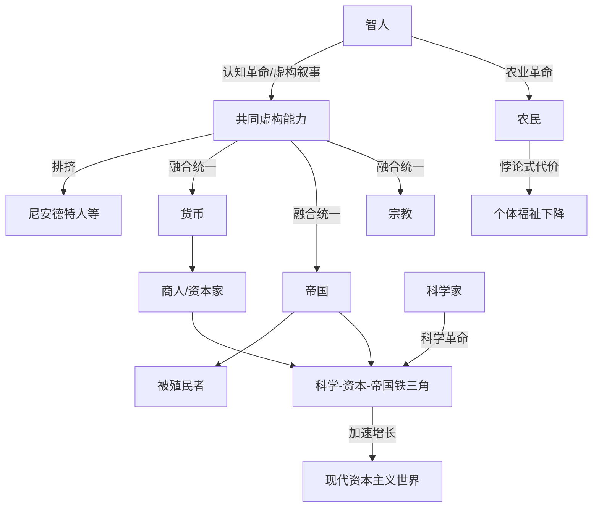

# 《人类简史》跨学科深度解析
### 文学评论 × 历史学 × 哲学 × 心理学 × 社会学 × 政治学 × 经济学 × 组织行为学 × 商业战略 × 职业规划

> 说明：以下内容中，**【事实】**标注可考的作者背景/文本依据，**【原著观点】**标注作者尤瓦尔·赫拉利本人在书中提出的论点，**【学界/评论观点】**标注后世历史学家、人类学家、评论家的分析与批评，**【本团队分析】**标注本次跨学科解读的推论。四者严格区分，避免混淆。
>
> 特别说明：《人类简史》是非虚构的宏观历史普及著作，没有传统意义上的"情节"与"虚构人物"。本报告在【二、故事结构】与【三、人物全景分析】两部分，将其转化为"论证结构的因果链"与"关键历史行动者/角色原型"进行对应处理，以保留原报告框架的分析深度，同时忠于本书的文体性质。

---

## 【一、作品全景】

**【事实】** 作者尤瓦尔·赫拉利（Yuval Noah Harari），以色列历史学家，任教于耶路撒冷希伯来大学，早年专攻中世纪与近代军事史，博士毕业于牛津大学。《人类简史：从动物到上帝》（*Sapiens: A Brief History of Humankind*）2011年以希伯来文首版，2014年推出英译本后成为全球现象级畅销书，此后陆续出版《未来简史》《今日简史》，形成"简史三部曲"。

**【事实】** 赫拉利本人是素食主义者、长期修习内观禅修（Vipassana），公开出柜为同性恋者——这些个人背景与他在书中反复强调的"痛苦是真实的、快乐值得被认真对待""意识形态与身份是历史建构而非天然本质"等立场存在明显呼应，是理解其世界观的重要背景。

**【事实/学术脉络】** 本书延续了"大历史"（Big History，代表学者大卫·克里斯蒂安 David Christian）与贾雷德·戴蒙德（Jared Diamond）《枪炮、病菌与钢铁》开创的宏观跨学科历史写作传统，将进化生物学、人类学、考古学、经济学、认知科学熔于一炉，试图用一条主线（虚构故事支撑大规模合作）串起七万年人类史。

**【事实/时代环境】** 本书成书于2008年全球金融危机之后、社交媒体崛起初期，全球读者对"宏大叙事—为何世界会变成今天这样"的解释需求强烈；书籍在2014-2018年间获比尔·盖茨、马克·扎克伯格、贝拉克·奥巴马等科技与政治精英公开推荐，进一步将其影响力从学术圈扩展至硅谷科技圈与全球公共讨论。

**【学界/评论观点】** 学术历史学界与人类学界对本书评价呈现两极：一方面肯定其科普价值与综合能力，另一方面批评其对具体史料的取舍存在"讲故事优先于严谨考据"的倾向（详见第六部分）。

**【本团队分析】** 创作动机可归纳为：在专业史学日益碎片化、公众对"人类整体命运"缺乏认知框架的时代，赫拉利试图提供一个可供非专业读者把握的"人类文明操作系统说明书"，其潜台词是为后续讨论人工智能、生物科技对人类未来的冲击（《未来简史》）做认识论铺垫。

**【本团队分析】一句话总结：**

> **这部作品真正讨论的不是"人类历史上发生了哪些事件"，而是"智人如何依靠共同相信的虚构故事，突破生物本能的合作规模上限，从而重塑地球与自身命运——但这种能力的胜利，并不等同于个体幸福或意义的胜利"。**

---

## 【二、故事结构：论证的因果链与底层逻辑】

> 本书没有情节意义上的"人物命运"，其"故事线"是四次结构性跃迁（认知革命—农业革命—人类的融合统一—科学革命）及其对人类合作规模、生活方式与自我认知的连锁影响。

### 论证时间线与因果链

| 阶段 | 关键跃迁 | 起因 | 关键"选择"/机制 | 直接后果 |
|---|---|---|---|---|
| 开端 | 认知革命（约7万年前） | 智人大脑经历基因突变，获得可谈论"不存在事物"的语言能力 | 智人能够创造并共享虚构故事（神话、宗教、部落图腾、后来的国家与公司） | 智人得以在陌生人之间建立信任与大规模协作，从而在与尼安德特人等其他人类物种的竞争中胜出并将其排挤/灭绝 |
| 发展 | 农业革命（约1.2万年前） | 气候变化与人口压力，人类开始驯化小麦、水稻、动物 | individual/群体为短期粮食安全放弃游猎采集的多样生活方式，转向定居农耕 | **【原著观点】** 赫拉利提出"史上最大骗局"论：农业革命使物种（智人）整体数量与"成功"大增，但绝大多数个体的劳动强度上升、饮食单一化、疾病增多，个体福祉未必改善——物种层面的成功与个体层面的幸福出现分离 |
| 高潮 | 人类的融合统一：货币、帝国、宗教三大普遍秩序 | 农业定居后人口规模扩大，需要超越血缘与部落的信任与协作机制 | 货币（普遍等价物的共同信念）、帝国（跨文化政治整合）、宗教（普世价值系统）三者作为可以跨文化传播的"共同虚构"逐渐将分散的人类文化整合为少数几个大文明圈 | 人类历史呈现出从"许多互相隔绝的文化"走向"少数几个乃至最终一个全球体系"的趋同轨迹 |
| 转折 | 科学革命（约500年前） | 欧洲文明率先形成"承认自己无知"的认识论态度，区别于此前"经典已包含全部真理"的世界观 | 科学、资本、帝国三者结成同盟：科学家需要资本支持研究，资本需要帝国扩张获取市场与资源，帝国需要科学技术支撑军事与统治 | 欧洲通过这一"铁三角"实现全球殖民扩张与工业革命，人类历史首次出现能够自我加速的指数型增长（技术、资本、人口） |
| 结局/现状 | 资本主义—工业—民族国家秩序的形成与"人类是否更幸福"的追问 | 现代性带来物质极大丰富、平均寿命延长、暴力减少（如平克式论据），但同时带来传统共同体（家庭、部落、宗教社群）的瓦解，个体被抛入"市场与国家"构成的新型孤独结构中 | **【原著观点】** 赫拉利以"我们比祖先更快乐吗？"收束全书，给出审慎存疑的答案，并预告下一阶段：生物科技与人工智能可能使智人本身不再是历史的终点（引向《未来简史》的"数据主义"与"后人类"议题） |

### 底层逻辑（本团队分析）

1. **"共同虚构"是智人合作规模的操作系统**：无论是图腾、货币、帝国、宗教、公司、国家、人权，本质上都是"许多互不相识的人共同相信同一个故事"这一底层机制的不同应用层——这是全书唯一且反复出现的核心解释框架。
2. **物种层面的"成功"与个体层面的"福祉"是两条可以背离的曲线**：农业革命是全书最具冲击力的案例，证明"文明规模扩大"不等于"个体生活变好"，这一悖论贯穿至工业革命、现代资本主义。
3. **技术—资本—权力的铁三角自我强化**：科学革命之后，知识生产、资本积累、政治/军事扩张三者形成正反馈循环，是现代世界加速变化的根本机制。
4. **"自然/天然"往往是历史建构的伪装**：书中反复拆解"性别分工、种姓等级、民族认同"等看似天然的秩序，指出它们均是特定历史阶段被"共同虚构"合法化的产物，可被重新审视和改写。

---

## 【三、人物全景分析（历史行动者与角色原型）】

> 由于本书无虚构人物，此处将书中反复讨论的"关键历史行动者类型"作为分析单元，套用人物分析框架，以保留跨学科解读深度。

### 1. 智人（Homo sapiens）——本书真正的"主角"
- **定位**：全书唯一的叙事主角，一个物种被当作"人物"来书写其欲望、恐惧与成长弧光。
- **核心欲望/恐惧**：欲望是扩大合作规模、掌控环境不确定性；恐惧（隐含）是被淘汰——书中反复对照尼安德特人等已灭绝人类物种，暗示智人的"胜利"具有偶然性而非必然优越性。
- **优势/弱点/盲点**：优势是独有的"虚构叙事"认知能力；盲点是**容易将自己创造的虚构（金钱、国家、种族、进步）误认为客观实在**，从而被自己制造的系统反噬（如意识形态战争、生态破坏）。
- **心理学分析（荣格原型）**："创造者/魔术师（Magician）"原型——通过语言/符号创造出全新的现实层次（intersubjective reality），但其阴影面是"被自己的造物统治"（如书中讨论的"被小麦驯化的人类"这一反转隐喻）。
- **现实映射**：任何依靠"共同故事"运转的现代组织——企业、国家、宗教团体、粉丝社群。
- **借鉴与警示**：
  - 对管理者/创业者：品牌、企业文化、使命愿景本质上都是"共同虚构"，其力量真实存在，但也需警惕组织被自己编织的叙事绑架（如过度理想化的企业文化掩盖真实问题）；
  - 对30岁职场人：许多"天经地义"的职场规则（如"必须买房""35岁危机"）本质是特定时代的社会建构，值得像审视"农业革命神话"一样重新审视。

### 2. 尼安德特人及其他已灭绝人类物种——"被淘汰者"
- **定位**：智人扩张史上的"沉默的对照组"。
- **【本团队分析】**：他们的灭绝提醒我们，历史的"优胜者叙事"往往掩盖了偶然性与暴力过程，值得对"成功者逻辑"保持警惕——这对理解商业竞争中"赢家通吃"叙事具有反思价值。

### 3. 狩猎采集者（Hunter-gatherers）
- **定位**：农业革命之前的人类生活方式代表，书中被塑造为对照现代生活的"参照系"。
- **【原著观点】**：狩猎采集者的工作时长可能短于农民、饮食更多样、社会更平等（无常设阶层与专制统治的物质基础）。
- **【学界观点】**：部分人类学家批评这一描述有"浪漫化史前生活"的倾向，实际狩猎采集社会内部暴力与不平等程度因群体而异，不能一概而论（详见第六部分）。
- **现实映射**：现代"极简主义/慢生活"倡导者、对"内卷"文化的反思者。
- **借鉴**：对现代人——"更多物质积累=更幸福"并非历史与人性的必然规律，值得反思何为真正的生活质量。

### 4. 农民（早期定居农业者）
- **定位**：农业革命的"被驯化者"，全书悲剧色彩最浓的角色类型。
- **【原著观点】**：农民为换取粮食产量与人口增长，付出了更长劳动时间、更单一饮食结构、更多传染病风险、更森严社会等级的代价——"我们以为是人类驯化了小麦，或许其实是小麦驯化了人类"。
- **心理学分析**：这是一种集体层面的"沉没成本陷阱"——一旦人口因粮食增产而膨胀，就再也无法退回狩猎采集的生活方式，即便个体福祉可能下降。
- **借鉴**：对企业/个人决策——警惕"规模扩张的不可逆性"，扩张一旦启动，回撤成本极高，决策前需评估长期代价而非只看短期产出指标。

### 5. 帝国建造者（如秦始皇、罗马皇帝、蒙古大汗等类型化角色）
- **定位**：跨文化整合的推动者，"融合统一"叙事的执行者。
- **心理学分析（荣格原型）**："统治者（Ruler）"原型的历史化身，核心驱动是通过建立普遍秩序（法律、货币、文字、道路）将异质文化纳入单一治理框架。
- **【原著观点】**：帝国虽常伴随暴力征服，但客观上是人类历史"从多元走向统一"的主要推动机制之一，赫拉利对帝国的评价明显比传统民族主义史观更审慎中性，不简单等同于"侵略=恶"。
- **现实映射**：大型企业并购整合者、跨国公司全球化战略制定者。
- **借鉴**：对商业战略顾问——扩张与整合能创造规模效应与效率，但代价（文化摩擦、本地反抗、治理成本）需要被同等重视。

### 6. 商人与资本家
- **定位**：货币这一"共同虚构"的最大受益者与传播者。
- **【原著观点】**：货币是人类历史上传播最广、最成功的一套"共同故事"，因为它是唯一一种几乎所有文化都愿意相信的"信任系统"，比宗教和帝国更具跨文化穿透力。
- **现实映射**：现代金融体系参与者、加密货币与新型支付体系的信仰者。
- **借鉴**：对经济决策者/普通人——理解货币本质上是"集体信任"而非天然实物价值，有助于更理性看待通胀、汇率、资产泡沫等现象背后的心理与社会机制。

### 7. 科学家（科学革命的推动者）
- **定位**："承认无知"认识论的践行者，现代加速增长的技术引擎。
- **心理学分析**：区别于此前"先知/圣贤"式的全知姿态，科学家角色的核心心理特征是**对不确定性的容忍与主动拥抱**（可与ACT疗法中的"接纳不确定性"心理灵活性相类比）。
- **【原著观点】**：科学革命的起点不是"知道了什么"，而是"承认自己不知道"，这一认识论转变比任何具体发现都更具革命性。
- **借鉴**：对创业者/管理者——承认"我们不知道市场会如何变化"，比假装掌握确定性答案的管理风格，更有利于组织的长期适应力。

### 8. 宗教创立者/神职人员
- **定位**：普世价值秩序的建构者，与货币、帝国并列的三大"融合统一"力量之一。
- **【原著观点】**：宗教之所以能跨越部落与文化边界传播，是因为它提供了一套"超越具体个人与地域"的普遍法则（如佛教的"苦"、基督教的"救赎"），这种普遍性使其可以被无限复制传播给陌生人。
- **借鉴**：对组织文化建设者——真正有传播力的组织使命，往往需要具备超越具体个人利益的"普遍性诉求"，而非仅服务小团体利益。

### 9. 被殖民者/奴隶/历史进程的承受者
- **定位**：全书隐含但未被充分展开的"历史代价承担方"。
- **【本团队分析/社会学视角】**：赫拉利在讨论"科学-资本-帝国"铁三角带来的加速发展时，客观上也提到了殖民扩张、跨大西洋奴隶贸易等历史暴力代价，但整体叙事仍以"智人整体的能力跃升"为主线，对具体受害群体的历史主体性着墨相对有限——这是当代后殖民视角批评者最常提出的质疑点之一（详见第六部分）。
- **对现代女性/少数群体的借鉴**：警惕宏大叙事在强调"人类整体进步"时，可能遮蔽具体群体（女性、被殖民民族、弱势阶层）在同一历史进程中付出的不对称代价，阅读时应主动补充这一视角。

### 10. 作者赫拉利本人——叙事之外的"元人物"
- **定位**：站在全知视角进行综合叙事的当代历史学家，也是本书隐含的价值立场来源。
- **【本团队分析】**：赫拉利虽力图保持客观中立的科普语调，但其素食主义、禅修实践、对"意识形态皆为虚构"的怀疑主义立场，共同构成了一种隐性的"世俗人文主义+存在主义式清醒"的价值取向，理解这一点有助于读者辨识书中哪些论述是"事实陈述"、哪些实为"作者的价值排序"（例如对动物福利、消费主义的批判段落）。

### 角色关系网络（简要）

- **认知革命轴线**：智人（主角）— 尼安德特人等（被淘汰者）— 虚构叙事能力（核心机制）
- **农业革命轴线**：狩猎采集者（旧生活方式）— 农民（新生活方式的承担者）— 小麦/水稻等被驯化物种（悖论式的"隐性驯化者"）
- **融合统一轴线**：帝国建造者 — 商人/货币体系 — 宗教创立者，三者并行推动人类从多元走向统一
- **科学革命轴线**：科学家 — 资本家 — 帝国/国家权力，三者结成加速增长的同盟，被殖民者/弱势群体承担了这一加速进程的部分代价

---

## 【四、思想与主题】

**【原著观点】** 赫拉利的核心世界观是**彻底的建构主义与怀疑主义人文史观**：人权、国家、公司、货币、种族、性别角色等一切被认为"天经地义"的社会秩序，本质上都是"主体间性的虚构"（inter-subjective reality）——它们既非纯粹客观实在，也非个人层面的谎言，而是"因为足够多的人共同相信"而变得真实且强大的社会事实。

**【本团队分析】** 这一框架带来一种双重效果：一方面它极具解放性，让读者意识到"看似天然的等级/规则"可以被重新审视和改写；另一方面它也隐含一种历史虚无主义风险——如果一切秩序都是虚构，"应当追求怎样的秩序"这一规范性问题反而被悬置，这是本书在思想深度上留下的开放缺口，也是学界批评的焦点之一（见第六部分）。

### 各主题的表达

- **权力**：权力被理解为"能够说服更多人相信同一虚构故事"的能力，而非单纯的暴力垄断——这与政治学中"合法性"（legitimacy）概念高度呼应。
- **利益**：货币作为人类历史上最成功的"信任系统"，使得毫不相识、毫无共同文化的人之间也能进行利益交换，这被赫拉利视为货币超越宗教和政治的深层原因。
- **家庭**：农业革命及后续国家/市场的兴起，逐步瓦解了原始的部落式大家庭结构，用"核心家庭+国家+市场"替代了"部落共同体"提供的安全网，这一转变的心理代价（孤独感上升）是现代性的重要副作用。
- **爱情**：书中较少直接讨论浪漫爱情，但对"婚姻制度""性别分工的历史建构性"有专门章节，指出父权制的普遍性缺乏清晰的生物学必然性解释，是历史上悬而未决的"未解之谜"之一。
- **组织**：公司、国家、宗教组织被并列讨论为"共同虚构"的制度化形式，赫拉利尤其强调"有限责任公司"这一法律虚构对现代资本主义的奠基性作用。
- **战争**：帝国扩张与科学-资本-帝国的铁三角机制中，战争被呈现为技术与制度加速迭代的（代价高昂的）催化剂之一。
- **制度**：货币、帝国、宗教被并称为人类历史上三大"普遍秩序"（universal orders），是理解人类如何从数千个孤立文化走向少数几个大文明圈、乃至今日全球化体系的核心分析工具。
- **财富**：财富积累与资本主义的兴起被置于"科学革命"的历史坐标中理解，资本主义本身也被视为一种"信用与增长神话"的共同虚构（对"未来会持续增长"的集体信念支撑了整个信贷体系）。
- **自由**：个体自由（尤其是脱离家族/部落束缚的现代个人主义）被理解为国家与市场共同"解放"个体、同时也将个体重新"原子化"纳入更大系统的双重历史过程。
- **责任**：书末对"我们是否该为自己创造出的技术（核能、基因编辑等）负责"提出伦理追问，为后续《未来简史》的技术伦理讨论埋下伏笔。
- **命运**：全书结尾提出全人类命运的关键追问——当智人即将掌握改写自身生物基础（基因编辑、人机融合）的能力时，"我们到底想要什么"这一问题从未像今天这样紧迫，而人类在回答这一问题上准备得极不充分。

### 作者真正想回答的问题（本团队分析）

> **智人凭借"共同虚构"的能力从生物链的边缘走向地球主宰，这种能力是否也应该被用来审慎地决定我们想要怎样的未来？** 赫拉利的态度是审慎怀疑而非乐观庆祝：能力的增长（技术、合作规模、物质财富）与福祉、意义、方向感的增长并不同步，甚至可能出现结构性背离。

### 跨时代仍然成立的规律

1. 大规模陌生人之间的合作，必须依赖某种"共同相信的故事"（无论是宗教、货币、法律还是企业文化）。
2. 规模的扩张（人口、组织、资本）具有历史不可逆性，一旦开始极难回撤，代价常常滞后显现。
3. "自然/天然"常常是历史建构的伪装，值得对看似理所当然的社会秩序保持审视习惯。
4. 物种/组织/国家层面的"成功"（规模、增长率）与个体层面的"福祉"是两个可能背离的指标，不能互相替代。
5. 技术能力的增长速度长期快于人类伦理与制度设计的适应速度，这一"能力—智慧"落差贯穿农业革命至今，并在当代（AI、基因编辑）达到新高峰。

---

## 【五、多维度解读】

**①普通个人成长**：审视自己生活中哪些"天经地义"的信念（如"必须结婚生子""成功=财富积累"）其实是特定历史阶段的社会建构，可以像审视"农业革命神话"一样被重新评估和选择。

**②30岁成年人视角**：书中"物种成功 ≠ 个体幸福"的核心悖论，直接映射到当代"内卷"讨论——努力提升的可能是社会/行业整体的竞争烈度（物种层面），而非个体的生活质量（个体层面），这提醒30岁的人重新定义"值得追求的成功"。

**③女性视角**：赫拉利明确将父权制列为"历史悬案"（缺乏充分的生物学必然性解释却近乎普遍存在），这一论述本身即是对"性别分工天然论"的有力解构，鼓励女性读者以历史建构视角重新审视当下性别角色期待，而非将其视为不可改变的自然律。

**④职场与组织管理**：企业本质上是一种"有限责任公司"式的现代共同虚构，其凝聚力来自成员对共同故事（使命、文化、品牌）的共同相信；管理者可以从"宗教/帝国如何跨文化传播价值观"中获得组织文化建设的启示。

**⑤创业与商业战略**：货币与资本主义被解构为"关于持续增长的集体信念"，创业者应认识到融资与估值本质上依赖这种集体信念的维系，需警惕信念破裂（信任崩塌）对商业模式的系统性冲击。

**⑥领导力**：帝国建造者的角色原型提示，真正的大规模整合领导力，核心能力是设计并传播一套能被异质群体共同接受的"普遍秩序"（制度、语言、货币），而非仅仅依靠个人魅力或武力。

**⑦心理健康**：书末"快乐"章节讨论了"享乐适应"（hedonic adaptation）与进化心理学视角下现代人的普遍性焦虑——人类的情绪调节机制是为狩猎采集时代的生存压力而演化，与现代都市生活的节奏和刺激存在结构性错配，这是理解当代焦虑症高发的一个跨学科视角。

**⑧社会制度**：货币、帝国、宗教三大"融合统一"力量的框架，为理解全球化、跨国公司、国际组织等当代制度提供了历史纵深的分析工具。

**⑨历史发展**：本书本身即是对"历史发展"最直接的跨学科论述，其"认知—农业—融合—科学"四阶段框架已成为许多通识教育课程的标准分析模型。

**⑩现代AI时代（本团队推演，结合作者后续著作）**：赫拉利本人在《未来简史》《今日简史》中进一步指出，生物科技与算法可能使"人类=有独立意志的个体"这一现代性核心叙事本身被瓦解（"数据主义"：决策权从个体意识让渡给算法），这意味着本书末尾提出的"我们该如何负责任地使用改写自身命运的能力"这一问题，在AI时代变得更加紧迫且答案更不确定。

---

## 【六、客观评价与争议】

**支持者的高度评价（学界/评论）**：
- 综合能力卓越，成功将进化生物学、人类学、经济学、历史学熔于一炉，为非专业读者提供了罕见的宏观认知框架；
- "共同虚构支撑大规模合作"这一核心洞见具有很强的跨学科解释力与迁移应用价值；
- 语言平实、叙事引人入胜，极大拓展了严肃历史写作的公众影响力。

**批评者的主要质疑**：
- **史料取舍与过度简化**：部分历史学家、考古学家、人类学家批评本书为追求叙事流畅性，牺牲了具体地区、族群历史的复杂性与多样性，存在"讲故事优先于严谨考据"的倾向。
- **对狩猎采集社会的浪漫化**：书中对史前狩猎采集生活"更平等、更幸福"的描绘，被部分人类学家认为证据不足、存在选择性引用，实际考古与民族志证据显示不同狩猎采集群体之间的暴力与不平等程度差异极大。
- **"农业革命是史上最大骗局"论证的争议**：该论点广为流传但也被部分学者认为夸大了个体福祉下降的普遍性，忽视了区域和时期差异。
- **后殖民视角的批评**：部分评论者指出，本书在讨论"科学-资本-帝国"加速增长机制时，对殖民主义、奴隶贸易等历史暴力代价的伦理分量处理相对轻描淡写，整体仍以"智人物种能力跃升"为主叙事线索。
- **学术引用规范问题**：作为面向大众的科普著作，其引注体系不符合专业史学论文规范，部分具体论断被指"缺乏一手史料支撑"。

**哪些属于时代局限**：本书写作于全球化高速发展、技术乐观主义氛围仍占主流的2008-2011年前后，书末对AI/生物科技的忧思在当时相对超前，但对具体技术路径的预测（如后续《未来简史》中的部分推演）也带有明显的时代局限性，需结合最新科技发展动态审视。

**哪些批评具有合理性**：史料简化与地区代表性不足的批评，经得起专业史学检验，是阅读本书时应保持的基本警惕；后殖民视角的批评也具有实质性意义，提醒读者宏大叙事容易遮蔽具体群体的历史代价。

**【本团队综合评价】**：《人类简史》作为一部面向大众的宏观历史综合著作，其最大价值在于提供了一套强有力、可迁移的"共同虚构支撑大规模合作"的解释框架，这一框架对理解现代组织、货币、意识形态具有持久的现实意义；但读者应清醒认识到，它是"一家之言的宏大叙事"而非严谨的专业史学著作，具体史实细节需与专业历史学、人类学研究相互印证，不宜将其结论直接等同于学术定论。

---

## 【七、现实应用】

**人生原则（10条）**
1. 审视自己相信的"天经地义"的规则，追问它是否只是特定历史阶段的建构。
2. 物种/群体层面的"成功"不等于个体的幸福，定义属于自己的成功标准。
3. 规模化选择（买房、生育、扩大开支）具有不可逆性，决策前评估长期代价。
4. 承认自己的无知，是获得真正进步的认识论起点（科学革命的启示）。
5. 大规模合作依赖共同的故事，理解并善用"叙事"的力量而非被其操纵。
6. 警惕把"自己创造的系统"（如社交媒体人设、消费主义标准）误认为客观真理。
7. 关注享乐适应效应，理解为什么"得到更多"未必带来持续的幸福感。
8. 对看似普遍、天然的等级秩序（性别、阶层）保持历史化审视的习惯。
9. 认识到能力增长快于智慧增长是人类历史的常态，对自身决策保持谦逊。
10. 在做重大人生选择时，问自己："这是我真正想要的，还是被某种集体叙事推着走？"

**职场原则（10条）**
1. 企业文化本质是"共同虚构"，其力量真实，需要被认真设计而非视为软性摆设。
2. 品牌与叙事的传播力，往往取决于其"普遍性"程度而非仅服务小团体利益。
3. 组织规模扩张前，评估其不可逆性与长期治理成本，而非只看短期增长指标。
4. 承认团队/行业的不确定性，比假装掌握确定答案更有利于长期适应力。
5. 警惕陷入"内卷式"竞争，区分"行业整体规模扩张"与"个人真实成长"。
6. 理解货币与资本本质上是信任系统，有助于更理性看待薪酬、股权、估值波动。
7. 关注职业倦怠背后的进化心理学错配（现代工作节奏与原始情绪调节机制不匹配）。
8. 建立跨文化/跨团队协作时，寻找能被异质群体共同接受的"普遍性叙事"。
9. 对"传统就该这样做"的职场惯例保持质疑，具体分析其历史成因是否仍然成立。
10. 在AI/自动化冲击下，重新思考"人类独特价值"是否仍系于旧有技能，而非叙事与判断力等更持久的能力。

**组织管理原则（10条）**
1. 有效的组织依赖成员对共同故事（使命/愿景）的真实相信，而非仅靠制度强制。
2. 扩张与整合能创造规模效应，但需同等重视文化摩擦与治理成本（帝国建造者的教训）。
3. 建立跨越具体个人/部门利益的"普遍性诉求"，才能获得组织最广泛的认同。
4. 组织的"信任系统"（如内部透明度、诚信文化）一旦崩塌，重建成本极高。
5. 承认组织决策中的不确定性，建立能够快速试错调整的机制，而非依赖单一确定性叙事。
6. 警惕组织被自己创造的叙事（如"我们是行业颠覆者"）绑架，丧失对真实问题的洞察。
7. 关注制度设计（如公司治理结构）本身的历史建构性，定期审视其是否仍适应当下需求。
8. 建立跨代际、跨文化团队协作机制，参考"宗教/帝国"跨文化传播价值观的历史经验。
9. 组织规模扩张需警惕不可逆的成本沉没，扩张前应做审慎的长期代价评估。
10. 组织的长期竞争力，取决于其叙事系统能否随环境变化而自我更新，而非固守初创期故事。

**商业战略原则（10条）**
1. 资本市场的估值与融资本质上依赖对"持续增长"的集体信念，需警惕信念反转的系统性风险。
2. 品牌战略的核心是设计一个足够多人愿意共同相信的故事，而非单纯的产品功能堆砌。
3. 全球化扩张策略可参考"货币—帝国—宗教"三种历史上最成功的跨文化整合机制。
4. 技术—资本—权力的"铁三角"效应提示：单一维度的优势（仅有技术或仅有资本）难以形成持续壁垒。
5. 警惕把短期规模增长等同于长期价值创造，区分"物种层面成功"与"个体/企业真实福祉"。
6. 承认市场的不确定性，比构建虚假的确定性预测更有利于长期战略韧性。
7. 战略决策前评估扩张的不可逆性，为可能的战略收缩预留退出路径。
8. 建立能被多元利益相关方（员工、用户、投资人、监管者）共同接受的普遍性叙事，降低整合阻力。
9. 长期护城河的构建，往往取决于信任系统的建设速度，而非单次技术突破。
10. 在AI/生物科技冲击行业格局的背景下，重新评估企业核心叙事的可持续性与伦理边界。

**沟通与人性规律（10条）**
1. 说服陌生人合作的最有效方式，是提供一个他们愿意共同相信的故事，而非单纯的利益陈述。
2. 人们对"天然/自古以来"的说法有天然信任倾向，警惕被这种修辞误导，也理解其说服力。
3. 共同的价值叙事比单纯的规则强制更能维系长期信任关系。
4. 面对不确定性时，人们更容易被"确定性叙事"吸引，需要区分真正的确定性与虚假的确定性安慰。
5. 群体认同（民族、宗教、企业文化）的强大凝聚力源于共同虚构，理解这一点有助于更理性地参与和引导群体认同。
6. 对"必然如此"的说法保持追问："这是自然规律，还是历史建构？"
7. 信任系统一旦被打破，重建所需的时间和成本远高于建立时的投入，沟通中应格外珍惜信誉资产。
8. 意识形态冲突的本质常常是"两套共同虚构"的竞争，理解这一点有助于降低沟通中的道德优越感。
9. 承认自己认知的局限性，往往比展示全知全能更容易建立长期信任（科学革命式谦逊）。
10. 关注群体叙事变化的早期信号，是预判社会/市场趋势变化的重要沟通技能。

**最值得警惕的错误**：把"共同虚构"误当作客观真理而丧失反思能力；把规模/增长等同于福祉而忽视个体真实体验；忽视扩张决策的不可逆性；用宏大叙事掩盖具体群体（弱势者）承担的真实代价。

**最值得长期坚持的价值观**：对确定性保持审慎的谦逊（承认无知）；对"天然秩序"保持历史化审视的习惯；重视个体真实福祉而非仅仅追求规模化的"成功"；对技术能力的伦理边界保持持续追问。

**现实案例应用示例**：企业"唯增长论"导致忽视员工真实福祉与组织健康（对照"农业革命悖论"）、加密货币/资本市场因集体信念反转而崩盘（对照"货币是信任系统"）、AI技术快速迭代但伦理与监管框架滞后（对照"能力增长快于智慧增长"），都是可直接迁移的分析框架。

---

## 【八、最终总结】

**①一句话总结**：《人类简史》是一部论证"智人凭借共同相信的虚构故事获得统治地球的合作能力，却未必因此获得与之匹配的幸福与智慧"的宏观历史综合之作。

**②核心思想（约100字）**：全书以认知革命、农业革命、人类的融合统一、科学革命四次跃迁为主线，揭示了智人凭借独有的"共同虚构"能力不断扩大合作规模、最终主宰地球的历史逻辑，同时反复叩问"物种层面的成功"是否等同于"个体层面的幸福"，并在结尾提出：当人类即将掌握改写自身生物基础的能力时，我们对"想要怎样的未来"这一问题的准备远远不足。

**③最重要"人物"（角色原型）TOP10**：智人（主角物种）、尼安德特人（被淘汰者）、狩猎采集者、农民、帝国建造者、商人/资本家、科学家、宗教创立者、被殖民者/历史代价承担者、作者赫拉利本人（叙事视角）。

**④最重要"事件"（历史跃迁）TOP10**：认知革命（约7万年前）、智人排挤其他人类物种、农业革命（约1.2万年前）、"史上最大骗局"的提出、货币作为普遍信任系统的兴起、帝国跨文化整合、宗教作为普世秩序的传播、科学革命（承认无知）、科学-资本-帝国铁三角与殖民扩张、工业革命与现代资本主义的形成。

**⑤最经典语录（附背景与含义，均为对原著论点的转述与概括，非逐字引用）**：
- 关于虚构故事的力量——赫拉利反复强调，正是"能够谈论根本不存在的事物"这一独特认知能力，使智人能够与成千上万陌生人展开前所未有的大规模合作，这是全书最核心的论点。
- 关于农业革命的悖论——书中提出，农业革命看似是人类驯化了作物，但从个体劳动强度与生活质量的角度看，也可以理解为作物"驯化"了人类，这一反转视角是本书最具冲击力的论证之一。
- 关于货币的普遍性——赫拉利指出，货币是人类历史上唯一一种几乎所有文化都愿意接受的信任体系，其跨文化穿透力甚至超过宗教与帝国。
- 关于幸福的追问——全书收尾处，作者以"我们是否比祖先更幸福"这一开放式追问，警示读者不要将物质与技术的进步简单等同于生活意义与幸福感的提升。

**⑥思维导图（Markdown）**

```
人类简史
├── 认知革命（约7万年前）
│   └── 虚构叙事能力 → 大规模陌生人合作 → 排挤其他人类物种
├── 农业革命（约1.2万年前）
│   └── 定居农耕 → 人口增长 vs 个体福祉下降（"史上最大骗局"）
├── 人类的融合统一
│   ├── 货币：跨文化信任系统
│   ├── 帝国：跨文化政治整合
│   └── 宗教：跨文化普世价值
├── 科学革命（约500年前）
│   └── 承认无知 → 科学-资本-帝国铁三角 → 殖民扩张与工业革命
└── 核心追问：物种层面的成功 ≠ 个体层面的幸福，未来命运掌握在谁手中？
```

**⑦"人物"（角色原型）关系图（Markdown / Mermaid）**



**⑧故事时间线（历史跃迁，Markdown）**

```
约7万年前     认知革命：智人获得虚构叙事能力，开始大规模合作
约7万-1万年前  智人扩散全球，其他人类物种（如尼安德特人）陆续灭绝
约1.2万年前    农业革命开始，人类从游猎采集转向定居农耕
公元前3000年左右 早期文字、城邦与帝国雏形出现（如两河流域）
约2000多年前   佛教、儒家、基督教等普世宗教陆续兴起，成为跨文化秩序
约500年前     科学革命开始：欧洲形成"承认无知"的认识论
15-19世纪     科学-资本-帝国铁三角推动全球殖民扩张与工业革命
20世纪至今    资本主义-工业-民族国家秩序全面确立，全球化加速
21世纪        生物科技与人工智能兴起，人类首次面临改写自身生物基础的可能性
```

**⑨争议观点对照表**

| 议题 | 支持/肯定观点 | 批评/质疑观点 |
|---|---|---|
| "共同虚构"框架 | 极具跨学科解释力，能统一解释货币、宗教、国家等多元现象 | 部分学者认为过度简化，忽视具体制度的历史复杂性与地区差异 |
| 农业革命是"史上最大骗局" | 冲击性强，揭示物种成功与个体福祉的背离，极具启发性 | 部分历史学家/考古学家认为证据不足以支撑如此普遍化的结论 |
| 狩猎采集社会的描绘 | 提供了反思现代生活方式的重要参照系 | 人类学界批评存在浪漫化倾向，实际证据显示暴力与不平等程度差异极大 |
| 对殖民历史的处理 | 承认科学-资本-帝国铁三角带来的历史暴力代价 | 后殖民视角批评其对具体受害群体的历史主体性着墨不足 |
| 学术引用规范 | 作为科普著作，语言流畅、覆盖面广，普及价值突出 | 专业史学界批评引注不规范，部分论断缺乏一手史料支撑 |

**⑩推荐延伸阅读、影视作品及相关学术资料**
- 尤瓦尔·赫拉利《未来简史》《今日简史》——"简史三部曲"的后续，延伸讨论生物科技、算法与人类未来。
- 贾雷德·戴蒙德《枪炮、病菌与钢铁》——同类型宏观历史写作的重要参照文本，聚焦地理环境对文明兴衰的影响。
- 大卫·克里斯蒂安（David Christian）"大历史"（Big History）相关著作与公开课——本书方法论的重要学术源头。
- 史蒂芬·平克《人性中的善良天使》——可与本书对"暴力是否随文明进程下降"这一议题相互参照比较。
- 学术评论：可查阅《美国人类学家》（American Anthropologist）等期刊上关于本书史料争议的专业书评，作为平衡视角的补充阅读。
- 纪录片/公开演讲：赫拉利本人在TED、达沃斯论坛等公开场合的演讲，可作为理解其思想脉络演变的辅助材料。

---

*本文档为跨学科分析框架下的综合解读，旨在提供系统性理解与现实应用参考，不构成历史学术定论，读者可结合原著与更多学术文献进一步深入研究。*
