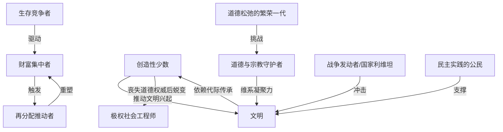

# 《历史的教训》跨学科深度解析
### 文学评论 × 历史学 × 哲学 × 心理学 × 社会学 × 政治学 × 经济学 × 组织行为学 × 商业战略 × 职业规划

> 说明：以下内容中，**【事实】**标注可考的作者背景/文本依据，**【原著观点】**标注威尔·杜兰特与阿里尔·杜兰特夫妇在书中提出的论点，**【学界/评论观点】**标注后世历史学家、社会科学家的分析与批评，**【本团队分析】**标注本次跨学科解读的推论。四者严格区分，避免混淆。
>
> 特别说明：《历史的教训》（*The Lessons of History*，1968）是一部高度浓缩的历史哲学随笔集，全书按十三个主题章节展开（如生物学与历史、道德与历史、经济与历史等），并非线性叙事。本报告在【二、故事结构】与【三、人物全景分析】两部分，分别转化为"主题论证的逻辑推进链"与"贯穿历史反复出现的关键力量/角色原型"进行对应处理，以忠于本书的随笔文体，同时保留分析框架的深度。

---

## 【一、作品全景】

**【事实】** 本书作者威尔·杜兰特（Will Durant，1885-1981）与阿里尔·杜兰特（Ariel Durant，1898-1981）为终身合作的夫妻学者搭档。威尔·杜兰特早年以《哲学的故事》（1926）成为大众哲学普及领域的畅销作家，此后与阿里尔用近四十年时间合著十一卷本巨著《文明的故事》（*The Story of Civilization*，1935-1975），系统梳理从古代文明到拿破仑时代的世界文明史，该系列第十卷《卢梭与大革命》为二人赢得1968年普利策非虚构类文学奖，二人也于1977年共同获颁美国总统自由勋章。

**【事实】** 《历史的教训》正是完成于二人撰写十一卷本巨著过程之中（1968年出版，此时十一卷本尚未全部完成），是两位作者试图从数十年浩繁的历史书写实践中，提炼出若干可反复验证的宏观规律而写成的一部极简篇幅（约十万字）的思想结晶之作，本质上是"退一步"对自己毕生研究工作的哲学性总结与自我追问。

**【事实/时代环境】** 本书写作与出版正值1960年代末美国社会剧烈动荡的历史节点——越南战争持续升级、民权运动与校园反战运动风起云涌、传统价值观与代际关系发生剧烈冲突。**【本团队分析】** 在这一背景下，两位年逾八旬的历史学者以毕生积累的历史纵深视野，为身处剧烈变动、容易陷入"历史终结感"或"文明崩溃感"的同代读者，提供了一种"这一切在历史上早已反复发生"的长时段冷静视角，这也是本书至今仍被频繁引用于危机时刻公共讨论的重要原因。

**【文学/学术地位】** 本书篇幅极短却极为凝练，被普遍视为20世纪最重要的"历史智慧文学"（wisdom literature）代表作之一，风格上更接近蒙田随笔或马可·奥勒留《沉思录》式的箴言体论述，而非严谨的学术专著；数十年来持续在企业管理、政治评论、投资分析等领域被广泛引用，尤以其"财富集中与再分配的周期性规律"论述在金融投资界流传甚广。

**【学界/评论观点】** 学术历史学界对本书的态度同样存在分歧——一方面认可其罕见的综合概括能力与优美文笔，另一方面也批评其论证方式偏重箴言式断言而非严谨的实证论证（详见第六部分）。

**【本团队分析】** 创作动机可归纳为：在完成数十年具体历史书写之后，两位作者试图追问一个比任何单一历史事件都更根本的问题——**历史是否真的存在可供后人借鉴的"教训"，还是每一代人都注定要重新经历同样的错误？** 这一追问本身带有深刻的自我怀疑色彩（全书开篇即以"迟疑"为题，坦承历史归纳的方法论局限），使本书区别于一般的历史普及读物，更接近一部诚实面对自身局限的哲学反思之作。

**【本团队分析】一句话总结：**

> **这部作品真正讨论的不是"历史上发生过哪些具体事件"，而是"人类的生物本能与群体行为模式在数千年文明进程中反复重演的程度，究竟在多大程度上限制了我们从历史中真正'学到教训'的可能性"。**

---

## 【二、故事结构：主题论证的逻辑推进链与底层逻辑】

> 本书按十三个主题章节展开论述，不构成线性叙事，但各章节之间存在清晰的逻辑递进关系——从对历史研究方法本身的自我怀疑出发，逐层深入生物本能、群体特征、经济规律、政治制度，最终收束于对"进步"本身是否真实存在这一终极追问。

### 主题论证脉络与因果链

| 阶段 | 核心章节主题 | 提出的核心命题 | 论证逻辑与历史依据 | 得出的结论 |
|---|---|---|---|---|
| 开端：方法论自省 | "迟疑" | 历史归纳是否可靠？史料本身是否具有代表性偏差？ | 作者坦承，被记录下来的历史往往偏向战争、灾难与精英人物，而绝大多数人类日常生活（劳作、生育、平凡的爱与死）从未被系统记录 | 任何从历史中提炼"规律"的尝试都必须带着方法论上的谦逊，本书随后的所有论断都应在这一自我怀疑的前提下被理解 |
| 发展：生物学基础 | 生物学与历史 | 人类历史的底层逻辑是否首先是一套生物法则？ | 生存竞争、自然选择带来的不平等、繁殖压力导致的人口扩张与领土冲突，被作者视为解释战争与经济竞争的生物学根源 | 政治与经济制度的设计空间，终究受制于无法被制度完全消除的生物本能——自由与平等在生物学意义上是一对永恒的张力，而非可被彻底调和的对立面 |
| 发展：群体与个体特征 | 种族与历史、性格与历史 | "种族"差异是否是文明兴衰的决定性因素？人性是否随历史进程而根本改变？ | 作者明确反对以"种族优劣"解释文明差异，转而强调文化与环境的塑造作用；同时提出人性中的基本驱力（攻击性、贪婪、性、群体归属需求）历经数千年文明进程并未发生本质改变，改变的只是满足这些驱力的工具与外在形式 | 技术与制度在演化，但人性本身的稳定性远超我们的直觉预期——这一命题构成了本书对"历史是否真正进步"这一终极问题的重要伏笔 |
| 高潮：道德、宗教与经济的周期律 | 道德与历史、宗教与历史、经济与历史 | 道德标准、宗教信仰与财富分配是否遵循某种可辨识的历史周期？ | 作者观察到，社会道德尺度往往在和平繁荣时期趋于松弛、在战争危机时期趋于紧缩，形成周期性摆荡；宗教作为维系社会凝聚力与道德约束的历史力量，其式微往往伴随世俗意识形态（民族主义等）的替代性兴起；自由竞争的经济体系天然导致财富持续向少数人集中，这一集中过程最终会通过和平改革或暴力革命实现周期性再分配 | 道德、信仰与财富分配并非线性进步或单向恶化，而是呈现历史性的钟摆式循环，理解这种循环有助于避免将当下的道德焦虑或财富不均简单视为"史无前例的危机" |
| 转折：制度实验与政治形态 | 社会主义与历史、政府与历史 | 历史上是否存在过"社会主义式"制度实验？何种政府形式最为持久有效？ | 作者援引古代苏美尔、印加帝国等历史上早期的集体化经济实验，观察到此类制度普遍经历"高度集中调配—效率与创新动力衰退—制度松动或崩解"的相似轨迹；同时比较君主制、贵族制、民主制在不同历史条件下的适应性 | 民主制被作者认为是对公民教育水平要求最高、因而也最难长期维系的政府形式，其优劣需结合具体历史条件评估，不存在放之四海而皆准的"最优政体" |
| 结局：战争、文明兴衰与进步的终极追问 | 历史与战争、增长与衰败、进步是否真实 | 战争是否是历史的常态而非例外？文明兴衰是否遵循某种普遍模式？人类历史整体上是否真的在"进步"？ | 作者统计有记载的历史中和平年代极为罕见，战争近乎是国家间关系的默认状态；文明的兴起依赖于一小群"创造性少数"应对外部与内部挑战的能力，衰败则源于这一创造性少数丧失道德权威、社会失去内部凝聚力；而"进步"必须以远超单一世代的时间尺度衡量，且每一代人都必须重新学习并传承文明成果，文明本身并非可以被生物学意义上"遗传"的既得财产 | **【原著观点】** 作者最终给出一个审慎的肯定回答：从物质生活水平、知识积累、平均寿命等多个维度看，人类历史整体上确实存在真实的进步，但这种进步高度脆弱、极不均衡，且完全依赖于教育对文明成果的代际传承——一旦传承链条断裂，此前积累的一切都可能在极短时间内丧失 |

### 底层逻辑（本团队分析）

1. **生物本能是历史规律的地基，而非制度设计能够完全超越的背景变量**：与强调"制度可被重新设计"的当代制度经济学论述相比，杜兰特夫妇的立场更为悲观审慎——他们认为竞争、不平等倾向、群体归属本能等生物学特征具有远超任何制度安排的持久性，这构成本书区别于纯粹"制度决定论"式历史解释的核心立场。
2. **几乎所有社会力量（道德、宗教、财富分配）都呈现钟摆式周期，而非线性的进步或退步**：理解这种周期性摆荡，是避免将任何特定历史时刻的危机感或乐观情绪过度绝对化的关键。
3. **文明的存续依赖"创造性少数"的道德权威，而非仅仅依赖物质力量或制度设计**：一旦掌握资源与权力的精英阶层丧失被广泛社会认可的道德正当性，即便物质基础依然强大，文明的内部凝聚力也会加速瓦解。
4. **文明成果不可被生物学意义上"继承"，必须由每一代人重新学习**：这是全书对"进步是否真实"这一问题最深刻的哲学回答——进步的载体不是基因而是教育与文化传承，这意味着任何一代人的疏忽都可能导致文明成果的实质性倒退。

---

## 【三、人物全景分析（贯穿历史反复出现的力量与角色原型）】

> 由于本书是箴言体历史哲学随笔而非叙事文学，此处将书中反复援引、贯穿数千年历史反复重演的"力量化身"作为分析单元。

### 1. 生存竞争者（The Competitor）
- **定位**：驱动经济与政治行为的最底层生物学力量的人格化身。
- **核心欲望/恐惧**：欲望是在资源有限的环境中确保自身及后代的生存优势；恐惧是被淘汰、被边缘化。
- **心理学分析**：进化心理学与荣格"战士（Warrior）"原型的历史性投射——这种竞争本能并非病理性的，而是被杜兰特夫妇视为人类行为最稳定的常量之一。
- **【原著观点】** 作者认为，无论经济学理论如何设计激励机制，最终都必须正视并容纳这种竞争本能，而非假设人类会因制度改良而彻底放弃竞争倾向。
- **现实映射**：任何充分竞争的市场环境中的从业者与企业。
- **借鉴与警示**：对创业者/职场人——接受适度竞争是人类社会的常态而非例外，与其试图消除竞争压力，不如设计能够将竞争导向建设性方向（创新、效率）而非破坏性方向（零和倾轧）的环境。

### 2. 创造性少数（The Creative Minority）
- **定位**：借用汤因比"创造性少数"概念、被杜兰特夫妇高度认同的文明兴起驱动力量。
- **核心欲望/恐惧**：欲望是通过应对时代挑战（技术、军事、组织创新）确立并维持社会的道德与实践权威；恐惧是丧失这种权威后被广大民众抛弃或被新兴的挑战者取代。
- **优势/弱点/盲点**：优势是敏锐的应变与创新能力；盲点是**容易在获得权力后逐渐蜕变为纯粹的既得利益集团，丧失最初赢得社会尊重的创造性与道德感召力**，这是本书对"文明衰败"最核心的解释机制。
- **心理学分析（荣格原型）**："创造者（Creator）"原型及其"暴君（Tyrant）"式堕落阴影——从建设性领导力蜕变为纯粹的权力维护，是这一角色原型最典型的心理弧光。
- **现实映射**：任何组织中最初凭借真才实学与创新赢得权威、此后逐渐蜕变为纯粹依靠职位权力维系地位的核心团队。
- **借鉴与警示**：
  - 对管理者/创业者：警惕组织的核心团队随着时间推移，从"创造性少数"蜕变为单纯的既得利益既得者，需要建立持续的自我更新机制；
  - 对30岁职场人：持续保有"创造性少数"式的实质贡献能力，而非仅依赖资历与职位本身获得的权威，是长期职业生命力的根本来源。

### 3. 财富集中者（The Wealth-Concentrator）
- **定位**：自由竞争经济体系下财富持续向少数人集中这一历史规律的人格化身。
- **【原著观点】** 作者提出，凡是自由竞争程度较高的经济体系，财富都会呈现持续向少数人集中的历史倾向，这并非某种特定制度的偶然缺陷，而是自由本身与平等之间存在的内在张力所致。
- **心理学分析**：这一角色的心理驱动接近荣格"国王/统治者"原型中的资源囤积倾向，也与CBT视角下的"稀缺心态"（scarcity mindset）自我强化循环相关——财富集中本身会强化维护既有优势的心理与行为模式。
- **借鉴**：对经济决策者/普通投资者——理解财富集中是自由市场体系的历史性常态而非异常现象，有助于更冷静地评估贫富分化议题，同时认识到这一趋势往往会触发下一阶段的再分配力量（详见下条）。

### 4. 再分配推动者（The Redistributor）
- **定位**：与"财富集中者"构成历史钟摆两端的对立力量，代表通过和平改革或暴力革命实现财富再分配的历史行动者。
- **【原著观点】** 作者指出，财富集中一旦超过社会可承受的限度，历史上要么通过和平的税收与社会政策改革实现渐进再分配，要么通过暴力革命实现剧烈再分配，二者之间不存在"完全避免再分配"的第三条道路。
- **借鉴**：对商业战略顾问/组织管理者——极端的内部资源与话语权集中若长期得不到制度性疏导，历史规律提示这种失衡终将以某种形式（无论温和或激烈）被打破，主动设计渐进再分配机制往往优于被动等待危机爆发。

### 5. 道德与宗教守护者（The Moral-Religious Guardian）
- **定位**：维系社会凝聚力与行为约束的历史力量，通常与建制化宗教或传统道德体系相关联。
- **【原著观点】** 作者认为，历史上大多数社会的道德秩序，很大程度上依赖宗教信仰提供的超验约束与凝聚力，而非纯粹依赖世俗法律与理性说服；当宗教式微时，社会往往会以民族主义、意识形态崇拜等世俗替代品填补这一凝聚力真空，而这种替代品未必比宗教更为温和。
- **借鉴**：对组织文化建设者——任何组织若缺乏某种超越具体利益计算的共同信念与凝聚力来源，仅靠制度与激励机制维系的合作关系往往更为脆弱。

### 6. 道德松弛的繁荣一代（The Loosening Generation）
- **定位**：和平繁荣时期道德约束趋于松弛这一历史周期现象的人格化身。
- **【原著观点】** 作者观察到，社会道德标准的松紧程度往往与外部生存压力成反比——战争与匮乏时期道德约束趋紧，和平富足时期道德约束趋松，这一钟摆式波动本身构成一种历史周期律，而非单向的道德堕落或进步。
- **借鉴**：对30岁职场人/普通个人——避免将当下所处时代的道德风气简单判断为"史无前例的堕落"或"史无前例的进步"，理解其周期性本质有助于建立更稳定的自我价值判断标准。

### 7. 战争发动者/国家利维坦（The War-Maker）
- **定位**：作者统计发现，有记载的人类历史中真正维持和平的年代占比极低，战争近乎是国家间关系的历史默认状态。
- **【原著观点】** 作者并未将战争简单归因为个别领导人的邪恶或愚蠢，而是将其视为生存竞争本能在国家层面的制度化延伸——国家作为组织化的暴力垄断者，其行为逻辑难以彻底摆脱这一底层驱动。
- **借鉴**：对政治学/国际关系视角——理解和平并非历史的默认状态而是需要持续主动维护的稀缺成果，有助于避免对国际秩序的稳定性抱有过度乐观的假设。

### 8. 极权社会工程师（The Totalitarian Social Engineer）
- **定位**：历史上尝试通过高度集中调配实现"社会主义式"平等分配实验的统治者原型。
- **历史原型**：**【事实】** 书中援引古代苏美尔、印加帝国等历史上早期的高度中央集权经济调配体系作为案例。
- **【原著观点】** 作者观察到，此类高度集中的经济调配体系，普遍会经历"初期效率提升—创新与个体激励动力衰退—制度松动或最终崩解"的相似轨迹，这一规律被作者视为对任何历史时期"完全消除市场竞争、依赖中央调配"式制度实验的审慎警示。
- **借鉴**：对组织管理者——任何试图通过高度中央集权的资源调配替代内部竞争与个体激励机制的组织设计，都需要警惕效率与创新动能随时间衰退的历史规律性风险。

### 9. 民主实践的公民（The Democratic Citizen）
- **定位**：作者认为对公民教育水平要求最高、因而也最难长期维系的政府形式的参与者。
- **【原著观点】** 作者认为，民主制的良好运作高度依赖广大公民具备相应的知识水平与理性判断能力，这一前提条件在历史上并非总能被满足，这也是作者对民主制长期稳定性持审慎而非盲目乐观态度的原因。
- **借鉴**：对社会制度视角/职业规划师——任何依赖广泛参与和自我治理的组织形式（无论是国家还是企业的扁平化管理），其可持续性都高度依赖参与者自身认知与责任能力的持续提升，而非仅仅依赖制度设计本身。

### 10. 威尔与阿里尔·杜兰特本人（元角色）
- **定位**：以毕生历史书写实践为基础、在晚年进行自我总结与自我怀疑的历史学家夫妻搭档。
- **【本团队分析】**：二人在本书开篇即坦承历史归纳方法论的局限性（史料记录的偏差、个体经验的多样性难以被简单概括），这种"以谦逊姿态提出宏大论断"的写作策略本身构成了一种独特的知识分子姿态——既自信于毕生积累的历史洞察，又诚实地承认这些洞察终究只是概率性的历史倾向，而非可放诸四海而皆准的铁律。

### 角色关系网络（简要）

- **文明兴衰核心轴**：创造性少数（推动文明兴起）⇄ 极权社会工程师/道德松弛的繁荣一代（内部衰败因素）
- **经济周期轴**：财富集中者 ⇄ 再分配推动者，二者构成历史钟摆的两端，永不停止的动态博弈
- **凝聚力维系轴**：道德与宗教守护者 ⇄ 战争发动者/生存竞争者，前者试图约束、后者不断挑战社会的内部凝聚力边界
- **政治形态轴**：民主实践的公民与极权社会工程师，代表历史上对"如何组织集体决策"这一问题的两种极端回应路径

---

## 【四、思想与主题】

**【原著观点】** 杜兰特夫妇的核心世界观是**审慎的历史循环论与人性稳定论**：与许多强调制度可被彻底重新设计、历史进程主要由权力结构选择决定的当代社会科学论述不同，本书更强调人性中的生物学常量（竞争、不平等倾向、群体归属需求）在数千年文明进程中具有惊人的稳定性，历史更多呈现为若干核心张力（自由与平等、集中与再分配、松弛与紧缩）之间的周期性摆荡，而非单向的线性进步或退步。

**【本团队分析】** 这一立场与强调"制度可以被主动设计和改变"的当代制度经济学论述（如探讨攫取性与包容性制度的相关理论）形成了有价值的思想张力：前者更强调人性与生物本能的持久性对制度设计空间的根本约束，后者更强调历史关键节点上制度选择的能动性与可塑性——两种视角并非互斥，而是分别揭示了历史进程中"变量"（制度设计）与"常量"（人性本能）两个不同层面的作用机制，将二者结合理解，或许比单独采信任何一方更接近历史的复杂全貌。

### 各主题的表达

- **权力**：权力被理解为竞争本能在社会组织层面的制度化延伸，其运作既受制度设计影响，也始终无法完全摆脱底层生物学驱动的竞争逻辑。
- **利益**：财富与资源的分配始终在"自由竞争导致集中"与"社会压力导致再分配"两种力量之间动态博弈，不存在能够一劳永逸终结这一博弈的制度安排。
- **家庭**：**【本团队分析】** 本书虽未设专章讨论家庭，但其对"繁殖压力导致人口扩张与领土冲突"的生物学分析，隐含地将家庭/生育行为视为驱动宏观历史进程（移民、战争、资源竞争）的重要微观基础单元。
- **组织**：文明本身被视为一种超大规模的组织，其兴衰高度依赖"创造性少数"能否持续保有社会认可的道德权威与创新能力，这一分析框架同样适用于理解任何具体组织的生命周期。
- **战争**：战争被视为历史近乎默认的常态而非例外情形，其根源被追溯至生存竞争本能在国家层面的组织化延伸，而非仅仅归因于特定领导人的决策失误。
- **制度**：社会主义式的高度集中调配、民主制的广泛参与、君主制的集权统治，均被置于具体历史条件下加以比较评估，作者拒绝给出普适性的"最优制度"结论，转而强调制度适应性因时因地而异。
- **财富**：财富集中被视为自由本身的自然产物而非制度设计的偶然缺陷，这意味着任何追求绝对平等的制度设计，都必然以限制自由竞争为代价，二者之间的权衡是永恒的政治经济学难题。
- **自由**：自由与平等被明确刻画为历史上长期存在的对立张力，而非可被彻底调和的互补关系，这是本书区别于许多现代政治哲学论述的鲜明立场。
- **责任**：文明成果的代际传承责任被赋予极高的伦理分量——每一代人都有责任通过教育将文明积累的知识与道德规范传递给下一代，这一传承链条的断裂被视为文明衰退最直接的机制。
- **命运**：历史的"命运"不是由单一的必然性法则决定，而是由生物本能的持久性与制度、文化选择的能动性共同交织而成的概率性倾向，这使本书的历史观既非纯粹的宿命论，也非纯粹的自由意志论。

### 作者真正想回答的问题（本团队分析）

> **在生物本能与人性驱力历经数千年文明进程几乎未发生根本改变的前提下，人类是否真的能够从历史中"学到教训"，从而避免重蹈覆辙？** 作者的回答带有深刻的辩证色彩：具体的制度、技术与知识确实在积累进步，但驱动人类行为的底层本能与由此产生的历史周期（财富集中与再分配、道德松弛与紧缩、文明兴起与衰败）很可能会持续重演，因此"教训"更多体现为对这些周期性规律的清醒认知，而非对具体错误的一次性纠正。

### 跨时代仍然成立的规律

1. 自由与平等之间存在无法被制度设计彻底消除的内在张力，任何声称"鱼与熊掌兼得"的制度承诺都值得审慎审视。
2. 财富集中与再分配呈现历史性的钟摆循环，理解这一周期性有助于避免将当下的贫富分化简单视为史无前例的异常状态。
3. 文明的兴衰高度依赖掌握资源与权力的"创造性少数"能否持续保有被广泛认可的道德权威，而非仅仅依赖物质力量。
4. 道德标准的松紧随和平/危机时期呈现周期性摆荡，而非单向的进步或堕落。
5. 文明成果不能被生物学意义上继承，必须依靠每一代人重新学习和主动传承，这一传承链条的脆弱性是理解"进步是否真实"这一问题的关键。

---

## 【五、多维度解读】

**①普通个人成长**：理解人性中的竞争本能、群体归属需求、道德松紧的周期性摆荡是历史常态而非个人独有的困扰，有助于以更平和的心态看待自身面临的欲望冲突与道德挣扎。

**②30岁成年人视角**：财富集中与再分配的历史钟摆规律提示，30岁前后个人财富积累策略应兼顾"抓住自由竞争红利期"与"预判社会性再分配压力"两种情境，避免将当下的经济环境简单外推为永恒不变的常态。

**③女性视角**：**【本团队分析】** 值得特别指出的是，阿里尔·杜兰特作为本书的共同作者，在两人早期合作的多卷《文明的故事》著作中并未被正式列名为共同作者，直至系列后期才获得应有的署名认可，这一事实本身即是20世纪学术界性别署名惯例的一个缩影，值得当代女性读者在阅读本书学术贡献分配问题时保持批判性关注。

**④职场与组织管理**：借用本书"创造性少数"概念诊断组织健康度——核心团队是否仍在持续贡献实质性的创新与专业价值，还是已经蜕变为仅凭资历与职位维系权威的既得利益集团，这一诊断视角对任何成熟组织的领导力评估都有直接借鉴价值。

**⑤创业与商业战略**：财富/资源集中与再分配的历史钟摆规律提示企业内部资源分配同样存在类似动态——过度集中的资源与决策权若长期得不到制度性疏导，历史规律显示这种失衡终将以某种形式被打破，主动设计内部资源再分配机制通常优于被动应对危机。

**⑥领导力**：本书对"创造性少数"从建设性创新力量蜕变为纯粹既得利益维护者这一心理弧光的刻画，为评估领导力的可持续性提供了重要视角——真正持久的领导权威来自持续的实质贡献，而非单纯依靠既有地位的路径依赖。

**⑦心理健康**：本书对人性中攻击性、竞争欲、群体归属需求等基本驱力"数千年未曾根本改变"的论述，提示我们许多个人心理困扰（如竞争焦虑、归属感缺失）具有深刻的人类学普遍性，而非仅仅是当代社会独有的病态现象，这一认识本身具有一定的心理安顿作用。

**⑧社会制度**：本书对民主制"对公民教育水平要求最高、因而也最难长期维系"这一论断，为理解当代民主制度面临的种种挑战（如虚假信息传播、政治极化）提供了一种历史纵深的解释框架，而非将其简单归因于某一届具体政府或某项具体政策的失误。

**⑨历史发展**：本书对文明兴衰"创造性少数丧失道德权威"这一机制的强调，可与汤因比"挑战与回应"理论、斯宾格勒文明有机体理论等其他宏观历史哲学传统相互参照比较，共同构成理解文明兴衰规律的多元理论谱系。

**⑩现代AI时代（本团队推演，非原著内容）**：若以本书的历史周期视角审视AI时代，一个值得关注的问题是——算法与数据资源是否会成为新一轮"财富集中"的载体，进而触发历史规律所预示的某种形式的"再分配"压力（无论是税收改革、算法监管还是更剧烈的社会冲突）；同时，"创造性少数"这一概念在AI时代可能进一步窄化为掌握核心算法与算力资源的极少数科技精英，这一趋势是否会加速还是延缓本书所述的文明兴衰周期，是一个值得持续关注的开放性问题。

---

## 【六、客观评价与争议】

**支持者的高度评价（学界/评论）**：
- 文笔凝练优美，成功将数十年浩繁的历史研究浓缩为一部极具可读性的哲学随笔，被广泛视为"历史智慧文学"的典范；
- 对财富集中与再分配、道德周期性摆荡等规律的提炼，具有跨越具体历史时期的持久解释力，至今仍被投资界、政治评论界频繁引用；
- 坦承历史归纳方法论局限的自省姿态，体现了罕见的学术诚实，区别于许多宏大历史理论的过度自信。

**批评者的主要质疑**：
- **论证方式偏重箴言断言而非严谨实证**：部分历史学家批评本书作为一部篇幅极短的随笔集，其论断更接近格言警句式的归纳概括，而非有系统实证数据支撑的学术论证，这与本书"从毕生历史研究中提炼规律"的定位存在一定张力。
- **生物决定论倾向的意识形态争议**：部分社会科学学者指出，本书将不平等归因为生物学意义上的"自然选择"结果，客观上存在将社会不平等自然化、从而弱化对制度性/结构性不公正批判力度的风险，这一立场与强调"制度可被人为改变"的当代制度经济学论述（如对攫取性与包容性制度的区分）形成了明显的思想分歧。
- **西方中心视角的局限**：尽管《文明的故事》系列声称覆盖全球文明史，但学界普遍认为其论述重心与篇幅分配仍明显偏重西方（尤其是欧洲）文明脉络，对非西方文明的历史经验挖掘相对有限，这也部分延续到《历史的教训》一书对历史案例的选取上。
- **性别署名与学术贡献的历史局限**：如前所述，阿里尔·杜兰特的共同作者身份在系列早期未获正式署名认可，反映了20世纪中期学术界对女性学术贡献认可不足的普遍时代局限。

**哪些属于时代局限**：本书写作于1960年代末，其对民主制脆弱性、道德周期律的论述，部分带有冷战时期西方知识分子对社会稳定性普遍焦虑的时代印记；性别署名问题也是特定历史时期学术惯例的产物。

**哪些批评具有合理性**：生物决定论倾向可能弱化对制度性不公正批判力度的质疑，具有相当的理论合理性，提醒读者在借鉴本书"财富集中是自然规律"这一论断时，不应因此忽视具体制度设计对减轻或加剧不平等的实际作用空间；西方中心视角的局限性批评也经得起当代全球史视角的检验。

**【本团队综合评价】**：《历史的教训》作为一部高度凝练的历史哲学随笔，其最持久的价值在于以罕见的宏观视野提炼出若干跨越具体历史情境、具有长期解释力的周期性规律（尤其是财富集中/再分配与道德松紧的钟摆效应），这些洞察至今仍具有强大的现实迁移价值；但读者应清醒认识到，本书的论证方式更接近箴言式的历史智慧提炼，而非严谨的实证社会科学研究，其"生物本能决定历史周期"的整体立场也应与强调制度能动性的当代社会科学理论相互参照、辩证吸收，而非单方面采信。

---

## 【七、现实应用】

**人生原则（10条）**
1. 接受适度竞争是人性与历史的常态，与其试图消除竞争压力，不如学会将其导向建设性方向。
2. 财富积累与社会性再分配压力构成历史钟摆的两端，个人财富规划应兼顾把握红利期与预判周期性调整。
3. 持续保有实质性的创新与贡献能力，而非仅依赖资历本身获得的权威，是长期个人影响力的根本来源。
4. 不必将当下所处时代的道德风气简单判断为"史无前例"，理解其周期性本质有助于建立稳定的自我价值判断。
5. 文明与个人的知识积累都无法被"生物学意义上继承"，主动学习与持续自我更新是维系长期竞争力的必要投入。
6. 群体归属需求是人性的基本驱力之一，理性认识这一需求有助于更清醒地评估自己的社会关系选择。
7. 和平与稳定并非默认状态，而是需要持续主动维护的稀缺成果，无论是国家秩序还是个人生活的安稳。
8. 警惕将不平等简单等同于制度不公，同时也不因"不平等有其自然基础"而完全放弃对结构性改善空间的追求。
9. 保持对自身认知局限的谦逊姿态（如本书开篇的自我怀疑），是获得更审慎判断力的重要前提。
10. 长期视角下评估个人处境时，应以远超短期波动的时间尺度衡量真正的进步，而非被单一阶段的得失所左右。

**职场原则（10条）**
1. 用"创造性少数"标准自我评估：自己是否仍在持续贡献实质性价值，还是已经开始仅依赖资历维系地位。
2. 识别组织核心团队是否正从最初的创新力量蜕变为纯粹的既得利益集团，这一诊断对判断组织长期健康度至关重要。
3. 理解职场内部资源分配同样存在"集中—再分配"的历史钟摆逻辑，过度集中若得不到疏导终将引发某种形式的调整。
4. 组织内部道德/文化氛围的松紧同样存在周期性摆荡（顺境时松弛、逆境时紧缩），不必对短期变化过度反应。
5. 竞争压力是职场常态，与其试图彻底回避，不如设计将其导向创新而非零和内耗的机制。
6. 民主式/扁平化的团队治理对成员的认知与责任能力要求极高，推行前应评估团队的实际准备程度。
7. 保有持续学习与自我更新的习惯，避免陷入"文明成果可被继承"的错觉，专业能力同样需要每一阶段重新投入维系。
8. 建立并维护超越具体利益计算的团队凝聚力来源（共同使命、文化认同），而非仅依赖制度与激励维系合作。
9. 警惕将短期的道德/纪律松弛简单视为团队堕落的信号，理解其周期性本质有助于更理性地设计应对策略。
10. 长期职业生命力取决于能否在漫长的职业生涯中持续保持"创造性少数"式的实质贡献，而非依赖某个阶段的资历积累一劳永逸。

**组织管理原则（10条）**
1. 定期评估组织核心决策层是否仍具备创立初期的创新能力与道德权威，警惕其蜕变为纯粹的既得利益维护者。
2. 主动设计内部资源与话语权的渐进再分配机制，避免过度集中积累到引发剧烈内部冲突的临界点。
3. 认识到追求绝对内部平等与保持充分竞争活力之间存在天然张力，需要根据组织发展阶段动态权衡，而非追求一劳永逸的完美方案。
4. 高度集中的资源调配机制虽可能短期提升效率，但历史规律显示其长期存在创新动能衰退的结构性风险，需保留适度竞争空间。
5. 组织文化的凝聚力应建立在超越具体利益计算的共同使命认同之上，而非仅依赖制度与薪酬激励。
6. 组织的道德/纪律标准会随内外部压力自然波动，管理者应理解这种周期性而非对短期波动做出过度反应式调整。
7. 广泛参与式的治理结构对成员的认知能力与责任意识要求极高，推行前需评估组织整体的准备程度。
8. 建立制度化的知识传承与人才培养机制，避免核心能力因关键人员流失而出现断层式流失。
9. 认识到组织的兴衰很大程度上取决于能否持续吸引和培养真正具备创造性贡献能力的人才，而非仅仅依赖既有资源存量。
10. 保持对自身组织所处发展周期的清醒判断（成长期/成熟期/衰退期），避免用同一套管理逻辑应对所有阶段。

**商业战略原则（10条）**
1. 评估行业/市场是否正处于财富与资源加速集中的阶段，据此预判未来可能出现的监管或再分配压力窗口。
2. 长期战略护城河的构建应建立在持续的创新贡献之上，而非仅依赖先发形成的资源垄断优势。
3. 警惕将短期的市场支配地位误认为可以无限期维持的永久优势，历史规律显示集中终将触发某种形式的反制力量。
4. 战略决策应基于对行业周期性规律（繁荣期道德/风险标准松弛、危机期趋紧）的清醒认知，而非线性外推当下趋势。
5. 组织的长期竞争力最终取决于能否持续吸引和保有真正具备创造性贡献能力的核心人才梯队。
6. 评估合作伙伴/竞争对手时，关注其核心团队是否仍保有初创期的创新活力，还是已趋于纯粹维护既得利益的保守化状态。
7. 在快速扩张阶段主动预留内部资源再分配的制度弹性，避免增长红利完全固化为少数人的既得利益，进而侵蚀组织内部凝聚力。
8. 建立能够穿越单一商业周期的长期视野，避免被短期的繁荣或危机情绪过度左右战略判断。
9. 认识到完全消除内部竞争的高度集权式管理模式存在历史规律层面的效率衰退风险，应保留适度的内部竞争与试错空间。
10. 长期成功的商业组织往往需要在扩张阶段的资源集中与后续阶段的适度再分配之间，找到符合自身发展周期的动态平衡。

**沟通与人性规律（10条）**
1. 理解竞争与攻击性是人性的基本驱力，而非某个特定时代或群体独有的道德堕落，有助于以更平和的心态处理冲突。
2. 群体归属需求是人类行为的基本驱动力，理解这一点有助于更有效地设计能够激发真诚参与感的沟通策略。
3. 面对他人的资源/话语权集中倾向时，理解这源于普遍的人性驱力而非单纯的个人品性问题，有助于设计更有效的制衡而非单纯的道德谴责。
4. 道德标准的松紧存在周期性摆荡，沟通中应避免将当下的道德风气简单判断为绝对的进步或堕落。
5. 建立超越具体利益计算的共同信念与凝聚力来源，比单纯依靠制度与激励更能维系长期的合作关系。
6. 保持对自身归纳判断局限性的谦逊姿态，是获得他人信任与建立长期可信度的重要基础。
7. 理解历史与人际关系中"进步"需要以远超单次互动的时间尺度衡量，避免因短期挫折而过度悲观。
8. 认识到任何依赖广泛参与的决策模式（家庭、团队、社群）都对参与者的认知与责任能力提出较高要求，需评估现实条件而非理想化预设。
9. 文明/知识/信任的传承需要每一代人（或每一段关系）主动重新投入维系，而非想当然地认为可以自动延续。
10. 长期稳定的关系与秩序并非默认状态，而是需要持续主动维护的稀缺成果，这一认识本身有助于培养对关系与秩序的珍视态度。

**最值得警惕的错误**：将当下的道德风气、财富分配格局或政治稳定性简单视为"史无前例"的异常状态，从而丧失历史纵深带来的冷静判断力；组织核心团队蜕变为纯粹既得利益集团而不自知；完全消除竞争压力或完全放任财富无限集中这两种极端倾向，二者都违背了本书揭示的历史钟摆规律。

**最值得长期坚持的价值观**：对自身历史归纳与判断局限性保持谦逊；重视文明与专业能力代际传承的教育责任；在自由竞争与适度再分配之间寻求动态平衡，而非追求任何一端的绝对化。

**现实案例应用示例**：企业创始团队随企业成熟而逐渐丧失创新活力、蜕变为纯粹既得利益维护者（对照"创造性少数"的蜕变机制）、行业内财富与市场份额过度集中最终触发监管介入或市场自发调整（对照"财富集中与再分配"的历史钟摆）、组织内部道德与纪律标准随繁荣或危机阶段自然松紧摆荡（对照"道德周期律"），都是可直接迁移的分析框架。

---

## 【八、最终总结】

**①一句话总结**：《历史的教训》是一部以毕生历史研究为基础、审慎追问"人类是否真能从历史中学到教训"的历史哲学随笔，其核心洞察是人性本能的持久稳定性使历史呈现周期性摆荡而非单向进步。

**②核心思想（约100字）**：全书以生物学、经济学、宗教、政治等十余个主题视角，提炼出财富集中与再分配、道德松弛与紧缩、文明兴起与衰败等一系列跨越具体历史情境反复重演的周期性规律，其根本立场是人性中的竞争本能、不平等倾向与群体归属需求历经数千年文明进程几乎未发生本质改变，制度与知识虽在积累进步，但这种进步高度依赖每一代人对文明成果的主动教育与传承，一旦传承链条断裂，此前积累的一切都可能迅速倒退。

**③最重要"人物"（力量原型）TOP10**：生存竞争者、创造性少数、财富集中者、再分配推动者、道德与宗教守护者、道德松弛的繁荣一代、战争发动者/国家利维坦、极权社会工程师、民主实践的公民、威尔与阿里尔·杜兰特本人。

**④最重要"事件"（论证案例）TOP10**：古代苏美尔与印加帝国的集中调配式经济实验、历史上有记载的和平年代占比统计、光荣革命前后欧洲君主制与议会制的比较（作为政府形式论述的历史背景）、宗教式微与世俗意识形态兴起的历史替代过程、文明兴衰中"创造性少数"道德权威的丧失机制、财富集中与再分配的历史周期性案例、道德标准随和平/危机时期的摆荡记录、民主制对公民教育要求的历史验证案例、十一卷本《文明的故事》系列的整体写作历程、1968年本书出版及其对同代社会动荡的回应。

**⑤最经典论点（附背景与含义，均为对原著论证精神的转述概括，非逐字引用）**：
- 关于历史归纳的自我怀疑——作者在开篇坦承，被记录下的历史往往偏重战争与精英人物，绝大多数普通人的日常生活从未被系统记录，这一自省姿态为全书随后的所有论断确立了谦逊的方法论基调。
- 关于自由与平等的永恒张力——作者反复强调，自由竞争必然导致财富与能力差距的扩大，而彻底的平等只能通过限制自由才能实现，二者之间不存在能够一劳永逸调和的完美方案。
- 关于文明的代际传承——作者强调文明成果不能被生物学意义上继承，必须由每一代人重新学习与主动传承，这是理解"进步是否真实"这一终极追问的核心线索。
- 关于创造性少数的道德权威——作者认为文明的兴衰关键在于掌握资源与权力的精英群体能否持续保有被广泛认可的道德正当性，而非仅仅依赖物质与军事力量的强弱。

**⑥思维导图（Markdown）**

```
历史的教训
├── 方法论自省：历史归纳的局限性与谦逊姿态
├── 生物学基础
│   ├── 生存竞争 → 不平等的自然基础
│   └── 繁殖压力 → 人口扩张与领土冲突
├── 群体与个体特征
│   ├── 反对种族决定论，强调文化与环境作用
│   └── 人性驱力（竞争/攻击性/群体归属）历经文明进程未发生本质改变
├── 历史周期律
│   ├── 道德松弛/紧缩的钟摆（和平繁荣 vs 危机战争）
│   ├── 宗教式微与世俗意识形态的替代
│   └── 财富集中与再分配的钟摆（自由竞争 vs 社会性调整）
├── 制度比较
│   ├── 极权集中调配式实验的兴衰轨迹（苏美尔/印加）
│   └── 民主制对公民教育水平的高要求与脆弱性
├── 文明兴衰机制：创造性少数道德权威的获得与丧失
└── 终极追问：进步是否真实——真实但脆弱，依赖代际教育传承
```

**⑦"人物"（力量原型）关系图（Markdown / Mermaid）**



**⑧故事时间线（写作与论证脉络，Markdown）**

```
1885/1898年  威尔·杜兰特与阿里尔·杜兰特分别出生
1926年       威尔·杜兰特出版《哲学的故事》，成为大众哲学畅销书作家
1935年起     二人开始合著十一卷本《文明的故事》系列
1968年       《卢梭与大革命》（系列第十卷）获普利策非虚构类文学奖
1968年       《历史的教训》出版，系对毕生历史研究的哲学性总结
1960年代末   美国社会正值越南战争、民权运动与校园动荡的剧烈变动期
1975年       十一卷本《文明的故事》系列全部完成
1977年       威尔与阿里尔·杜兰特共同获颁美国总统自由勋章
1981年       威尔与阿里尔·杜兰特相继离世
其后至今      本书持续在投资、政治评论、历史教育等领域被广泛引用
```

**⑨争议观点对照表**

| 议题 | 支持/肯定观点 | 批评/质疑观点 |
|---|---|---|
| 历史周期律（财富/道德钟摆） | 提炼出跨越具体历史情境的持久规律，至今仍具强大现实解释力 | 部分历史学家认为论证方式偏重箴言断言而非系统实证 |
| 生物决定论立场 | 为理解竞争与不平等的普遍性提供了冷静的历史纵深视角 | 部分学者批评这一立场可能弱化对制度性不公正的批判力度，与制度能动论形成分歧 |
| 对种族决定论的反驳 | 明确反对以种族解释文明差异，强调文化与环境作用，具有进步性 | — |
| 全球史覆盖广度 | 系列声称覆盖全球文明，涉猎广博 | 学界普遍认为论述重心仍明显偏重西方文明脉络 |
| 阿里尔·杜兰特的学术署名 | 二人晚年共同获得总统自由勋章，实现了迟来的正式认可 | 系列早期未正式署名共同作者身份，反映时代性别惯例局限 |

**⑩推荐延伸阅读、影视作品及相关学术资料**
- 威尔·杜兰特、阿里尔·杜兰特《文明的故事》（十一卷本）——本书所有论断的原始历史论证基础，可作为深入阅读的完整背景文献。
- 阿诺德·汤因比《历史研究》——"挑战与回应"理论及"创造性少数"概念的原始学术出处，可与本书相互参照。
- 奥斯瓦尔德·斯宾格勒《西方的没落》——另一部宏观文明兴衰理论的代表著作，可作为对照阅读的重要文本。
- 达龙·阿西莫格鲁、詹姆斯·罗宾逊《国家为什么会失败》——强调制度能动性、与本书生物决定论立场形成有价值思想张力的当代对照读物。
- 学术评论：可查阅历史学专业期刊上关于杜兰特夫妇《文明的故事》系列史学方法论的相关书评，作为平衡视角的补充阅读。
- 相关传记/访谈资料：关于威尔与阿里尔·杜兰特晚年合作历程的传记性文献，有助于理解本书写作的个人与时代背景。

---

*本文档为跨学科分析框架下的综合解读，旨在提供系统性理解与现实应用参考，不构成学术定论，读者可结合原著与更多学术文献进一步深入研究。*
