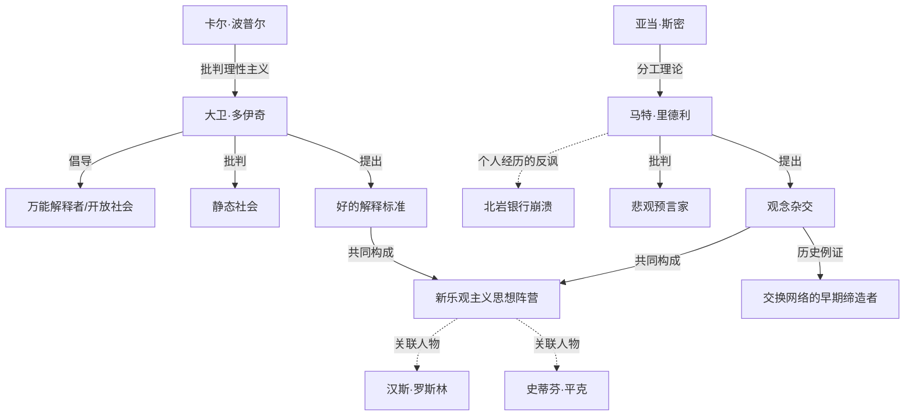

# 《无穷的开始》与《理性乐观派》跨学科深度解析
### 文学评论 × 历史学 × 哲学 × 心理学 × 社会学 × 政治学 × 经济学 × 组织行为学 × 商业战略 × 职业规划

> 说明：以下内容中，**【事实】**标注可考的作者背景/文本依据，**【原著观点】**标注大卫·多伊奇《无穷的开始》与马特·里德利《理性乐观派》各自在书中提出的论点，**【学界/评论观点】**标注后世学者、评论家的分析与批评，**【本团队分析】**标注本次跨学科解读的推论。四者严格区分，避免混淆。
>
> 特别说明：本次分析对象是两部独立但思想高度互补的非虚构著作——大卫·多伊奇《无穷的开始：世界进步的本源》（*The Beginning of Infinity*，2011）聚焦知识增长的哲学/物理学基础，马特·里德利《理性乐观派：一部人类经济进步史》（*The Rational Optimist*，2010）聚焦交换与分工驱动繁荣演化的经济史证据。二者常被并列归入21世纪初"新乐观主义"思想谱系（与史蒂芬·平克《当下的启蒙》、汉斯·罗斯林《事实》并称），本报告将二者作为一组互相印证又存在张力的思想整体加以分析，在【二、故事结构】与【三、人物全景分析】两部分转化为"两条论证脉络的汇流与分野"及"贯穿两部作品的关键思想角色原型"进行处理。

---

## 【一、作品全景】

**【事实】** 大卫·多伊奇（David Deutsch）是牛津大学物理学家，量子计算理论的奠基人之一，长期致力于将卡尔·波普尔的批判理性主义认识论与物理学、计算理论相结合，《无穷的开始》是其在1997年前作《实在性的结构》基础上，进一步系统阐述"知识增长本质"这一哲学主题的通俗化力作，2011年出版。

**【事实】** 马特·里德利（Matt Ridley）是英国科学作家，动物学博士出身，此前以《基因组》《红色皇后》等演化生物学科普作品闻名，《理性乐观派》2010年出版，系统梳理人类经济史，论证"交换与分工"是驱动繁荣演化的核心机制。**【事实】** 里德利本人此前曾任英国北岩银行（Northern Rock）董事长，该银行在2007年爆发英国150年来首次银行挤兑事件、最终被政府接管国有化，这一经历后来成为评论界审视其"理性乐观"立场时反复援引的重要背景细节。

**【事实/时代环境】** 两部作品均成书于2008年全球金融危机之后的历史节点——彼时全球公共舆论弥漫着对资本主义、全球化、技术进步的深刻怀疑情绪，两位作者不约而同地选择在这一悲观氛围中，以截然不同的学科路径（多伊奇诉诸认识论与物理学，里德利诉诸经济史与演化生物学）系统性地为"进步是真实且可持续的"这一命题辩护。

**【学界/评论观点】** 二人常与史蒂芬·平克、汉斯·罗斯林一同被评论界归入"新乐观主义者"（New Optimists）思想阵营，这一阵营的共同特征是以系统性数据或理论论证反驳"世界正在变得更糟"的流行直觉，同时也因此常常一并遭受同一类批评（详见第六部分）。

**【本团队分析】** 两部作品的创作动机存在微妙但重要的差异：多伊奇的动机更接近纯粹的哲学辩护——他试图证明，只要人类持续生产"好的解释"（good explanation），任何非受物理定律禁止的问题原则上都可解，这是一种关于知识本质的形而上学论证；里德利的动机则更接近经验性的历史举证——他试图用具体的经济史数据证明，人类通过交换与分工实现的繁荣积累，其规模与速度远超大众直觉。二者一虚一实、一哲学一史学，构成了一组罕见的互补论证。

**【本团队分析】一句话总结：**

> **这两部作品真正讨论的不是"人类历史上取得了哪些具体的进步成就"，而是"知识的持续增长与自由交换的持续扩展，这两种机制本身是否具备使人类问题永远可解、繁荣得以无限演化的内在动力"。**

---

## 【二、故事结构：两条论证脉络的汇流与分野】

> 两部作品均非叙事文学，而是论证性著作。以下分别梳理二者各自的论证脉络，并在结尾处呈现二者的交汇点与分歧点。

### 多伊奇《无穷的开始》论证脉络

| 阶段 | 核心论证 | 起因/设问 | 论证逻辑 | 结论 |
|---|---|---|---|---|
| 开端 | 反驳"归纳主义"认识论 | 知识究竟是如何增长的？是通过归纳观察得出的，还是通过其他机制？ | 多伊奇继承并发展卡尔·波普尔的立场，指出科学知识从不来自对观察的简单归纳概括，而是来自大胆的猜想（conjecture）与随后的严格证伪检验（refutation） | 知识增长的本质是"猜想—批判—修正"的持续过程，而非"观察—归纳"的被动积累过程 |
| 发展 | 提出"好的解释"标准 | 什么样的解释才是可靠的、值得信赖的？ | 一个"好的解释"必须是"难以被随意改动"（hard to vary）的——即解释中的每个部分都对其所要说明的现象承担不可替代的功能，而非可以随意替换却不影响解释力的松散拼凑 | 这一标准可用于区分科学理论与伪科学、神话、教条，是全书评估一切知识主张的核心工具 |
| 高潮 | "乐观主义原则"与问题的可解性 | 人类面临的种种"罪恶"（贫困、疾病、压迫）究竟是否可以被彻底解决？ | 多伊奇提出，任何非受物理定律本身禁止的问题，原则上都可以通过获得正确的知识（好的解释）得以解决；反之，任何持续存在的"罪恶"，本质上都源于知识的匮乏而非某种不可动摇的必然限制 | "问题是不可避免的，但问题也是可解的"——这一命题构成全书的核心哲学立场，也是书名"无穷的开始"（人类知识的增长在原则上没有上限）的直接来源 |
| 转折 | 批判"静态社会"与文化相对主义 | 为何有些社会长期停滞不前，而有些社会能持续自我革新？ | 多伊奇区分"静态社会"（依赖禁忌与权威压制批判性思考、抵制变革）与"动态社会"（鼓励批判性讨论、允许错误被及时纠正），并明确反对将不同文化/社会的知识体系视为"同等有效、无高下之分"的文化相对主义立场 | 一个社会能否实现持续进步，关键在于其制度与文化是否容许"试错—纠错"这一知识增长机制自由运作，而非其初始资源禀赋或传统智慧存量 |
| 结局 | 知识增长的无限性与人类作为"万能解释者/构造者" | 人类知识增长的上限究竟在哪里？ | 多伊奇论证，人类（区别于其他生物与目前的人工系统）具备一种独特的能力——能够生产可以解释任何现象、进而构造出任何非物理定律所禁止之物的知识，这种能力在原则上没有边界 | 这正是"无穷的开始"这一书名的核心含义：人类文明目前所取得的一切进步，相对于知识增长的理论上限而言，仍只是"无穷旅程"极早期的起点 |

### 里德利《理性乐观派》论证脉络

| 阶段 | 核心论证 | 起因/设问 | 论证逻辑 | 结论 |
|---|---|---|---|---|
| 开端 | 反驳"自给自足更优越"的直觉 | 为何人类历史上专业化分工与相互依赖的社会，反而比追求自给自足的社会更加繁荣？ | 里德利延续亚当·斯密"分工创造财富"的经典命题，进一步提出"观念杂交"（ideas having sex）概念——不同个体、不同群体的专业知识通过交换相互结合，产生任何单一个体或封闭群体都无法独立生成的复合创新 | 交换本身（而非单纯的技术发明）才是人类历史上生产力持续跃升的根本引擎 |
| 发展 | 梳理交换与分工驱动繁荣的历史脉络 | 从史前狩猎采集社会到现代工业社会，交换网络的扩张如何一步步推动生活水平提升？ | 里德利援引大量历史与考古证据（如史前贸易网络、古代城市的兴起、近代全球贸易体系的扩张），论证交换网络的地理与规模扩张与人类生活水平提升高度同步 | 现代社会的繁荣本质上是数万年交换网络不断扩张、专业化程度不断加深的历史性积累结果 |
| 高潮 | 系统性反驳"末日悲观论" | 人口爆炸、资源枯竭、环境危机等末日式预言是否真的会应验？ | 里德利逐一审视马尔萨斯人口论、20世纪"人口炸弹"式预言、资源枯竭论等历史上反复出现的悲观预言，指出这些预言在过去两个世纪中几乎全部被证明严重高估了危机、低估了人类通过创新与替代实现的适应能力 | 技术创新与市场机制具有历史上反复验证的"化解稀缺"能力，简单的资源存量外推式悲观预测长期而言屡屡失灵 |
| 转折 | 为全球化、市场与技术乐观辩护 | 全球化贸易、化石能源、转基因技术等争议性议题应当如何评估？ | 里德利以经济史证据为基础，为贸易自由化、技术创新（包括部分争议性技术）的历史贡献进行系统性辩护，同时对气候变化等议题采取相对审慎乐观（"温和怀疑"）的立场 | **【本团队分析】** 这一部分是全书争议最集中的领域，尤其里德利在气候变化风险评估上的立场，与主流气候科学界的风险评估存在明显分歧，也是评论界批评最为集中之处（详见第六部分） |
| 结局 | 繁荣是"演化"而非"设计"的产物 | 人类的繁荣究竟是由某个中心化的规划或权威设计出来的，还是自发演化而来的？ | 里德利将繁荣的产生类比为生物演化过程——没有中心化的设计者，而是无数个体交换决策的自发累积与筛选，最终涌现出超越任何个体理性所能规划的复杂繁荣秩序 | 人类历史上最持久的繁荣往往产生于自发交换网络的扩展，而非自上而下的中心化规划，这一立场与哈耶克式的自发秩序理论高度呼应 |

### 两条脉络的交汇点与分野（本团队分析）

**交汇点**：二者均坚定反对"进步是虚幻的"或"人类历史正在整体倒退"这类流行悲观叙事，均认为人类面临的问题原则上具有可解性（多伊奇诉诸知识增长机制，里德利诉诸交换与创新机制），均强调开放性、去中心化的试错过程（而非中心化权威的规划）是持续进步的关键条件。

**分野**：多伊奇的论证是**认识论/哲学性**的——他关注的是知识本身"如何"增长的抽象机制，其论证对具体历史证据的依赖相对较少，更接近一种逻辑必然性的论证；里德利的论证是**经验/历史性**的——他依赖大量具体的经济史与考古证据，其论证的说服力与所引证据的准确性和代表性直接绑定，因此也更容易受到"选择性举证"式的批评。二者结合，恰好构成"为什么进步在原则上是可能的（多伊奇）"与"进步在历史上实际上是如何发生的（里德利）"这两个不同层次问题的互补回答。

### 底层逻辑（本团队分析）

1. **进步的本质是一个开放的、无预设上限的过程，而非趋向某个终点的收敛过程**：这是两部作品共享的最根本立场，也是二者与强调历史周期性摆荡（如《历史的教训》）或制度路径依赖恶性循环（如《国家为什么会失败》）的其他历史哲学论述最本质的分歧所在。
2. **知识与交换具有复合增长（compounding）特性**：无论是多伊奇的"猜想不断被更好的猜想取代"，还是里德利的"观念杂交产生指数级的新组合"，二者都强调这类机制具有类似复利的自我加速特性，这与"历史呈现钟摆式循环"的论述形成鲜明对照。
3. **去中心化的试错纠错机制优于中心化的权威规划**：无论是多伊奇对"静态社会"压制批判性思考的批判，还是里德利对自发交换秩序优于中心计划的论证，二者都共享一种对分散化、自下而上创新机制的信任。
4. **悲观预言在历史上反复被证伪，但这不构成对未来问题不存在的保证**：**【本团队分析】** 需要审慎指出，"过去的悲观预言大多落空"这一历史事实本身，并不能逻辑地推导出"未来的悲观预言也必然落空"这一结论，这是评估两部作品乐观论证时应当保持的方法论警觉（详见第六部分对气候议题的具体讨论）。

---

## 【三、人物全景分析（贯穿两部作品的关键思想角色原型）】

### 1. 大卫·多伊奇（作为知识哲学的元角色）
- **定位**：以物理学家身份介入认识论核心问题的当代思想家，全书论证的第一人称载体。
- **核心欲望/恐惧**：欲望是彻底捍卫"知识增长无上限"这一乐观立场，并将其严格奠基于波普尔式的批判理性主义；恐惧是知识论证滑向相对主义或权威主义（即认为某些知识体系天然优于其他体系而无需接受批判检验）。
- **优势/弱点/盲点**：优势是将物理学、计算理论与认识论融会贯通的罕见综合能力；盲点是**其"问题总是可解的"这一论断，在应用于具体社会/政治问题时，有时显得对现实中权力结构、资源约束等因素的复杂性关注不足**，这一点与强调制度性权力约束的政治经济学论述（如攫取性制度理论）形成有价值的对照。
- **心理学分析（荣格原型）**："智者/哲人（Sage）"原型的当代科学家变体——其思维方式高度依赖逻辑严谨性与抽象推演，ACT视角下，多伊奇对"问题是可解的"这一信念本身展现出一种罕见的、面对不确定性时的心理灵活性与建设性乐观（而非盲目乐观）。
- **现实映射**：坚信任何具体业务难题都存在尚未被发现的解决方案、拒绝接受"这个问题无解"式论断的技术型创业者/研发负责人。
- **借鉴与警示**：
  - 对创业者/研发管理者："问题是不可避免的，但问题也是可解的"这一心态本身具有强大的实践价值，但需警惕将其简化为对现实约束（资源、时间、组织能力）的盲目忽视；
  - 对30岁职场人：持续生产"难以被随意改动"的高质量解释/分析（而非泛泛而谈的表面判断），是提升专业可信度的核心方法论。

### 2. 卡尔·波普尔（多伊奇的精神导师，隐性存在的思想角色）
- **定位**：批判理性主义认识论的奠基人，多伊奇整个论证体系的哲学基础来源。
- **【原著观点】** 多伊奇明确承认其"猜想与反驳"框架直接继承自波普尔，并进一步将其扩展至物理学与政治哲学领域（波普尔本人也是"开放社会"概念的提出者）。
- **借鉴**：对组织决策者——将任何战略假设视为"有待被证伪的猜想"而非"已被证实的真理"，主动寻求反驳证据而非仅寻求确认证据，是提升决策质量的核心方法论工具（可类比商业分析中的"红队测试"思维）。

### 3. 马特·里德利（作为经济乐观主义的元角色，及其自身的反讽性弧光）
- **定位**：以经济史证据捍卫市场与交换机制的科学作家，同时也是本次分析中一个具有深刻反讽色彩的"人物"。
- **核心欲望/恐惧**：欲望是以扎实的历史数据彻底扭转公众对市场、全球化、技术进步的悲观直觉；恐惧（隐含）是被贴上"天真市场原教旨主义者"的标签。
- **【本团队分析】关键转折/反讽弧光**：里德利本人曾任英国北岩银行董事长，该银行在他任职期间因激进的资产负债表扩张策略而在2007年金融危机中率先爆雷，引发英国150年来首次银行挤兑，最终被政府接管——这一真实经历与他随后在《理性乐观派》中对市场自发秩序的高度信任形成了尖锐的现实反讽，也是评论界评估其论证可信度时最常援引的背景细节。
- **心理学分析**：CBT视角下，这一案例提示"确认偏误"（confirmation bias）的风险——即便亲身经历过市场机制在特定情境下的灾难性失灵，仍可能倾向于在后续论证中强化而非修正原有的理论信念，这是任何专家在建构宏大理论叙事时都需要警惕的认知陷阱。
- **现实映射**：拥有真实行业实战经验、但在总结行业规律时可能因个人经历的特殊性而产生认知偏差的资深从业者/顾问。
- **借鉴与警示**：
  - 对商业战略顾问/投资决策者：个人的实战经历是宝贵的洞察来源，但也可能成为强化既有信念、忽视反例的认知陷阱，需要主动寻求与自身经历相悖的证据加以检验；
  - 对30岁职场人：警惕将自己某一阶段的成功经验，不加批判地泛化为放之四海而皆准的普遍真理。

### 4. 亚当·斯密（里德利的精神导师，隐性存在的思想角色）
- **定位**：分工创造财富理论的古典奠基人，里德利"观念杂交"概念的直接思想源头。
- **【原著观点】** 里德利在斯密"专业化分工提升生产效率"这一经典命题基础上，进一步强调"交换本身"（而非单纯的分工）才是知识与创新得以跨个体、跨群体组合迭代的关键机制。
- **借鉴**：对组织管理者——团队内部与外部的知识交换密度，往往比单纯提升个体专业化程度更能驱动组织整体的创新产出。

### 5. 静态社会（Static Society，多伊奇批判的制度性角色原型）
- **定位**：依赖禁忌、权威与传统压制批判性思考、抵制知识增长的社会形态。
- **借鉴**：对组织文化建设者——任何压制内部不同意见、将既有决策奉为不容置疑权威的组织文化，本质上正是"静态社会"逻辑在企业内部的微观复现，长期而言必然丧失适应变化的能力。

### 6. 悲观预言家（The Malthusian Pessimist，里德利批判的历史人物原型）
- **定位**：托马斯·马尔萨斯及20世纪"人口炸弹"式预言的提出者群体，是里德利全书反复援引的历史反面案例。
- **【原著观点】** 里德利系统梳理了马尔萨斯人口论、20世纪中叶资源枯竭论等一系列历史上广受关注、却最终被证明严重高估危机程度的悲观预言案例。
- **【本团队分析】** 需要辩证看待这一论证的适用边界——历史上的悲观预言反复落空，主要源于低估了人类通过技术创新实现的资源替代与效率提升能力，但这并不意味着"任何形式的资源/环境约束警示都注定是错误的"，将二者混为一谈是对里德利论证的常见误读。
- **借鉴**：对战略决策者——识别过度依赖简单线性外推的风险预测模型（无论乐观或悲观方向），同时避免将"过去的预测曾经错误"简单等同于"未来的预测也必然错误"。

### 7. 交换网络的早期缔造者（The Early Trader）
- **定位**：史前及古代贸易网络的参与者，"观念杂交"机制最早期的历史体现者。
- **借鉴**：对创业者——主动建立并扩展自身的专业交流与协作网络（而非孤立地追求个体能力的自我提升），是获取超越个人能力边界的复合创新资源的关键路径。

### 8. 万能解释者/构造者（The Universal Explainer，多伊奇提出的人类未来图景）
- **定位**：多伊奇论述中，人类作为唯一已知能够生产"可以解释和构造任何非物理定律所禁止之物"的知识的物种这一未来图景的人格化身。
- **心理学分析**：这一图景本质上是对人类主体能动性（agency）的极致肯定，与心理学中"自我效能感"（self-efficacy）的积极心理学传统高度呼应。
- **借鉴**：对个人成长/职业规划——将自身定位为"持续生产更好解释、进而不断拓展可能性边界的行动者"，而非被动适应既定环境限制的接受者，这一自我定位本身具有强大的心理与实践驱动力。

### 角色关系网络（简要）

- **多伊奇论证轴**：卡尔·波普尔（哲学奠基）→ 大卫·多伊奇（当代阐发）→ 静态社会（批判对象）⇄ 万能解释者/开放社会（正面愿景）
- **里德利论证轴**：亚当·斯密（经济学奠基）→ 马特·里德利（当代阐发，兼具反讽性个人经历）→ 悲观预言家（批判对象）⇄ 交换网络的早期缔造者/自发繁荣秩序（正面愿景）
- **两轴交汇**：多伊奇的"知识增长机制"与里德利的"交换扩展机制"，共同构成"新乐观主义"思想阵营（与平克、罗斯林并列）对抗"历史悲观论/停滞论"的思想联盟

---

## 【四、思想与主题】

**【原著观点】** 两位作者的核心世界观均可归纳为**彻底的、非目的论的进步乐观主义**：进步不是朝向某个预设终点的线性收敛过程，而是一个原则上没有上限的开放性演化过程，其驱动引擎分别是知识（猜想与反驳的迭代）与交换（观念杂交的复合增长）。

**【本团队分析】** 与本系列此前分析的《人类简史》《国家为什么会失败》《历史的教训》相比较，这两部作品呈现出一种鲜明的立场反差：赫拉利强调"共同虚构"支撑合作规模但未必带来个体幸福；阿西莫格鲁与罗宾逊强调制度性权力分配的路径依赖可能导致长期的攫取性"陷阱"；杜兰特夫妇强调人性本能的历史稳定性导致文明呈现周期性钟摆而非单向进步。而多伊奇与里德利则共同主张，只要知识增长与自由交换这两种机制得以持续运作，进步在原则上不存在结构性上限——这构成了本系列迄今分析的诸多作品中，立场最为坚定乐观、也最少强调历史循环或结构性陷阱的一组论述，值得读者将其与前述更审慎甚至悲观的框架并置参照，而非单方面采信。

### 各主题的表达

- **权力**：多伊奇更关注知识/思想层面的"权威压制批判性思考"这一权力形式（静态社会），里德利则更关注经济层面的贸易壁垒、垄断管制对交换自由的限制，二者对"权力"的分析均相对聚焦于其对知识/交换自由流动的阻碍作用，对政治权力分配本身的制度性分析着墨相对有限（这与阿西莫格鲁/罗宾逊形成有价值的互补差异）。
- **利益**：里德利明确将"交换双方互利"（而非零和博弈）视为人类历史进步的核心经济逻辑，这与《历史的教训》中"生存竞争"的零和/丛林式底层假设形成鲜明对照。
- **组织**：多伊奇对"动态社会"（鼓励试错纠错）与"静态社会"（压制批判）的区分，可直接类比为现代组织文化中"心理安全感高、鼓励建设性异议"与"层级僵化、压制不同意见"两种组织形态。
- **战争**：两部作品均未将战争视为分析重心，这与《历史的教训》将战争视为历史近乎默认状态的立场形成鲜明反差，某种程度上体现了两部作品对冲突性历史力量的分析相对薄弱。
- **制度**：多伊奇更强调制度应服务于"容许知识试错纠错"这一功能性目标，里德利更强调制度应服务于"降低交换成本、扩大交换范围"这一功能性目标，二者均倾向于将好的制度定义为"促进开放性演化过程"的制度，而非某种固定的理想蓝图。
- **财富**：里德利明确反对将财富视为零和存量博弈的结果，而将其视为交换与分工带来的净增量创造，这一立场与"财富集中—再分配"的历史钟摆论述（《历史的教训》）构成鲜明对照，也部分回避了对财富分配不均问题的深入讨论。
- **自由**：两部作品均将"批判性讨论的自由"（多伊奇）与"交换的自由"（里德利）视为进步得以持续发生的先决条件，这使二者在政治哲学谱系上均带有鲜明的古典自由主义色彩。
- **责任**：多伊奇强调个体作为知识生产者对持续追问、批判既有解释负有认识论责任；里德利则相对较少讨论个体层面的伦理责任，更多聚焦于制度/市场层面的宏观机制。
- **命运**：两部作品共同的哲学立场是**彻底反宿命论、反决定论**——人类的命运不由地理、文化或历史必然性预先设定，而完全取决于知识生产与自由交换这两种开放性机制能否持续运作，这是二者与本系列此前分析的其他作品相比，立场最为激进乐观的核心差异所在。

### 作者真正想回答的问题（本团队分析）

> **人类的进步是否存在某种内在的结构性上限（无论是生物本能、地理禀赋，还是权力结构的路径依赖），还是原则上可以无限持续？** 两位作者的联合回答是明确且坚定的：只要知识增长（猜想—反驳的迭代）与自由交换（观念杂交的复合增长）这两种机制得以持续运作而不被人为压制，进步在原则上不存在结构性上限——这是对本系列此前分析的诸多"历史周期论"或"制度陷阱论"的一种有力的、值得认真对待的反命题。

### 跨时代仍然成立的规律

1. 知识的增长本质上是"猜想—批判—修正"的迭代过程，而非对既有观察的简单归纳，这一认识论洞察具有超越具体历史时期的持久有效性。
2. 交换与分工带来的复合创新（观念杂交）具有类似复利的自我加速特性，这一经济学洞察也具有跨时代的解释力。
3. 压制批判性讨论/交换自由的社会或组织形态，长期而言必然丧失适应变化与持续创新的能力。
4. 历史上反复出现的线性外推式悲观预言（资源枯竭、人口爆炸），普遍低估了知识与创新带来的适应能力，值得对同类预测保持方法论警觉，但不构成对一切风险警示的免疫理由。
5. 进步的可持续性并非由先天禀赋决定，而是由制度与文化是否容许开放性试错纠错机制自由运作所决定。

---

## 【五、多维度解读】

**①普通个人成长**：将个人成长理解为持续生产"难以被随意改动"的高质量自我认知（而非泛泛而谈的自我安慰式判断），并主动扩展与他人的观念交换网络，是这两部作品对个人成长最直接的方法论启示。

**②30岁成年人视角**：里德利"观念杂交"的核心机制提示，30岁前后应主动扩展跨领域、跨圈层的专业交流网络，而非仅仅深耕单一垂直领域的自我精进，因为复合创新往往产生于交换节点而非孤立的个体积累。

**③女性视角**：**【本团队分析】** 值得指出的是，两部作品对历史进步的经济与知识论证中，均较少专门讨论性别不平等这一议题本身，而是隐含地假设交换与知识增长的红利会自动惠及所有群体——这一假设值得读者结合《人类简史》中对父权制"历史悬案"的讨论进行批判性补充，审视进步红利的分配是否在性别维度上同样均等。

**④职场与组织管理**：多伊奇"静态/动态社会"的区分可直接迁移为组织文化诊断工具——评估团队内部是否容许对既有决策提出批判性质疑并及时纠错，还是压制异议、维护决策者权威不容挑战，这一诊断往往比单纯的绩效指标更能预测组织的长期适应力。

**⑤创业与商业战略**：里德利"观念杂交"理论提示，企业创新更多产生于内外部知识交换网络的密度与广度，而非单纯依赖内部研发投入的规模，这对评估创新战略的资源配置方向具有直接指导意义。

**⑥领导力**：多伊奇对"知识增长依赖持续的批判与纠错"这一立场，为领导力评估提供了核心标准——真正有效的领导力应主动创造容许下属提出反驳意见的心理安全环境，而非依赖权威压制异议来维系表面的组织稳定。

**⑦心理健康**：多伊奇"问题是不可避免的，但问题也是可解的"这一心态，与积极心理学中的"建设性乐观"（而非否认现实的盲目乐观）高度呼应，对缓解面对复杂问题时的无力感/习得性无助具有一定的心理调节价值。

**⑧社会制度**：两部作品共同为"开放社会"（容许批判性讨论与自由交换的制度环境）的持久价值提供了跨学科的双重论证（认识论与经济史），这与卡尔·波普尔、弗里德里希·哈耶克的古典自由主义思想传统一脉相承。

**⑨历史发展**：里德利对交换网络扩张与人类生活水平提升同步性的历史梳理，为理解全球化进程的长期正面价值提供了系统性的经济史证据支撑，也是评估当代"逆全球化"思潮时值得参照的历史纵深视角。

**⑩现代AI时代（本团队推演，部分结合原著后续讨论）**：多伊奇本人在其后续著作与公开演讲中，明确将人工智能（尤其是通用人工智能）视为"万能解释者"这一人类独有能力可能被机器共享甚至超越的关键议题，这与本书"知识增长无上限"的核心论证存在深刻的延伸张力——若AI系统也能生产"难以被随意改动"的好的解释，人类在知识生产链条中的独特地位将面临根本性的重新定义；里德利式的"观念杂交"机制在AI时代也可能被算法直接执行（大规模自动化的知识重组与创新生成），这既可能极大加速交换驱动的繁荣演化，也可能引发关于创新收益分配的新一轮制度性讨论。

---

## 【六、客观评价与争议】

**支持者的高度评价（学界/评论）**：
- 多伊奇的认识论论证被物理学界与科学哲学界广泛认为是波普尔批判理性主义传统在21世纪最具原创性的当代阐发之一；
- 里德利对经济史证据的系统梳理，为反驳"世界正在变得更糟"的流行悲观直觉提供了扎实的数据支撑，与平克、罗斯林等人的工作共同重塑了公共讨论中对"进步"议题的实证基础；
- 二者共同为"开放性、去中心化的试错机制优于中心化权威规划"这一立场提供了跨学科的双重论证支持。

**批评者的主要质疑**：
- **多伊奇论证的现实约束不足**：部分政治学者与社会科学家批评，多伊奇"问题总是可解的"这一命题在应用于具体社会/政治议题时，对现实中权力结构、资源分配约束、集体行动困境等复杂因素的关注相对不足，存在将复杂社会问题简化为纯粹认识论问题的风险。
- **里德利的个人背景与其论证的信誉张力**：里德利曾任北岩银行董事长、该银行在其任期内因激进扩张策略而在2007年金融危机中崩溃这一事实，被评论界广泛认为对其随后在《理性乐观派》中高度信任市场自我调节能力的立场构成了尖锐的现实反讽，也常被援引作为质疑其论证客观性的重要依据。
- **里德利气候变化立场的科学争议**：**【学界/评论观点】** 里德利在气候变化风险评估上采取相对审慎乐观（"温和怀疑"）的立场，与主流气候科学界（如政府间气候变化专门委员会历次评估报告）对气候变化风险的评估存在明显分歧，多位气候科学家公开批评其低估了相关风险；评论界也曾指出里德利家族拥有煤矿相关土地权益这一背景，并援引其作为审视其气候立场客观性的相关背景信息。**【本团队分析】** 这一议题涉及具体的科学证据评估，本报告不对气候变化的科学结论本身做出判断，仅如实呈现这一争议在学界与评论界的存在情况。
- **"新乐观主义者"阵营的整体性批评**：部分历史学家与生态学者批评，多伊奇、里德利与平克、罗斯林等人共同构成的"新乐观主义"论述群体，普遍存在对环境承载力、生态系统临界点等具有客观物理约束的议题关注不足的倾向，其乐观论证的举证逻辑（援引历史上悲观预言的失败）未必能够充分排除未来出现真正结构性约束的可能性。

**哪些属于时代局限**：两部作品均写作于2008年金融危机后、全球化仍被广泛视为主流共识的历史阶段，此后十余年间全球化retreat、地缘政治冲突加剧、气候变化风险的科学证据进一步累积等新的历史发展，也为重新评估书中部分乐观论断的适用边界提供了新的检验素材。

**哪些批评具有合理性**：里德利个人经历与其论证立场之间的信誉张力，是一个经得起检验的合理质疑，提醒读者在评估其经济史论证时保持必要的审慎；对气候风险评估的科学争议，也是一个具有实质性学术依据的批评焦点，值得读者结合最新的气候科学证据独立审视，而非仅采信本书的单一立场。

**【本团队综合评价】**：《无穷的开始》与《理性乐观派》共同构成了21世纪初"新乐观主义"思想阵营中论证最系统、影响最广泛的双重支柱，二者从认识论与经济史两个不同维度，为"进步具有内在的、原则上无上限的动力"这一命题提供了值得认真对待的有力论证，是本系列分析中立场最为坚定乐观的一组作品；但读者应清醒认识到，多伊奇论证对现实政治经济约束关注相对有限，里德利论证则背负着个人经历带来的信誉张力与气候立场的科学争议，二者均不应被视为对"进步是否存在结构性约束"这一问题的终局性答案，而应与本系列此前分析的《国家为什么会失败》《历史的教训》等更审慎甚至悲观的框架相互参照，形成更为完整的辩证认识。

---

## 【七、现实应用】

**人生原则（10条）**
1. 将任何具体困境视为"尚未找到好的解释"而非"天生无解"，主动追问是否存在被忽视的解决路径。
2. 持续追求"难以被随意改动"的高质量自我认知与判断，而非停留在泛泛而谈的表面自我安慰。
3. 主动扩展跨领域、跨圈层的观念交换网络，复合创新往往产生于交流节点而非孤立的自我积累。
4. 警惕将个人某一阶段的成功经验不加批判地泛化为普遍真理，主动寻求与自身经验相悖的反证。
5. 区分"建设性乐观"（承认问题存在但相信可解）与"盲目乐观"（否认问题的现实性），前者才具有真正的实践价值。
6. 对压制批判性反思、拒绝接受不同意见的自我认知模式保持警惕，这本质上是"静态社会"逻辑在个人层面的复现。
7. 不必因历史上的悲观预言屡屡落空而对一切风险警示免疫，保持对具体证据的审慎评估而非情绪化的站队。
8. 珍视并主动创造能够容纳不同意见、允许试错纠错的人际与工作环境。
9. 认识到进步并非命中注定，而是取决于知识增长与自由交流机制能否持续被主动维护。
10. 长期的个人价值创造，本质上依赖于能否持续为他人/社会提供真正互利的交换价值，而非零和式的资源争夺。

**职场原则（10条）**
1. 用"静态/动态团队"标准诊断组织文化：团队是否容许对既有决策提出批判性质疑并及时修正？
2. 主动扩展内外部知识交换网络的密度与广度，创新往往产生于交流节点而非孤立的部门内部积累。
3. 警惕将某一阶段的成功经验固化为不容挑战的"最佳实践"，持续检验其在新情境下的有效性。
4. 追求"难以被随意改动"的高质量分析与建议，而非可以被轻易替换却不影响结论的泛泛而谈。
5. 建立容许下属提出反驳意见的心理安全环境，而非依赖权威压制异议维系表面的团队和谐。
6. 评估自身职业发展路径时，优先考虑能够持续接触多元观念交换的岗位与环境。
7. 对行业内流行的悲观/乐观叙事保持独立的证据评估能力，而非简单跟随情绪化的舆论站队。
8. 认识到互利型合作（而非零和式的内部竞争）往往能带来更持久的团队与组织价值创造。
9. 主动将自己定位为持续生产更好解决方案的行动者，而非被动适应既定流程限制的执行者。
10. 警惕个人的行业实战经验可能带来的确认偏误，主动寻求跨行业、跨背景的多元视角校准判断。

**组织管理原则（10条）**
1. 建立鼓励批判性讨论、容许试错纠错的组织文化，警惕决策权威不容挑战的"静态组织"倾向。
2. 主动设计促进内外部知识交换的机制（跨部门轮岗、外部专家网络），而非仅依赖内部研发资源的规模积累。
3. 将任何具体经营困境视为"知识/信息不足"的信号，主动追问是否存在尚未被发现的解决路径，而非简单归因于"天生无解"。
4. 定期检验组织内部长期奉行的"最佳实践"是否仍然适用于变化后的新环境，避免路径依赖式的教条化。
5. 建立组织决策的"红队测试"机制，主动寻求反驳既有战略假设的证据，而非仅收集确认性证据。
6. 认识到组织内部与外部合作伙伴之间的互利型交换关系，往往比零和式的内部资源争夺更能创造长期价值。
7. 警惕管理层因个人过往的实战经验而产生确认偏误，主动引入外部多元视角校准组织战略判断。
8. 建立容许下属提出反驳意见的心理安全环境，是组织长期适应变化能力的核心基础设施。
9. 评估组织的创新产出时，关注知识交换网络的密度与广度，而非仅关注单一部门的专业化投入规模。
10. 长期组织韧性依赖于持续的试错纠错机制，而非对某一阶段成功经验的路径依赖式固化。

**商业战略原则（10条）**
1. 将行业内长期未被解决的痛点视为"尚未找到好的解释/方案"的信号，而非视为该问题天然无解的结构性限制。
2. 战略创新的核心资源是知识交换网络的密度与广度，而非单纯依赖内部研发投入规模的堆积。
3. 警惕将企业过往某一阶段的成功战略不加批判地泛化为放之四海而皆准的普遍法则，持续检验其适用边界。
4. 评估市场悲观/乐观叙事时，保持独立的证据审视能力，避免被情绪化的行业舆论简单裹挟战略判断。
5. 建立组织内部的"反驳文化"，主动测试既有战略假设的薄弱环节，而非仅寻求确认性市场反馈。
6. 认识到与合作伙伴、客户之间的互利型交换关系，是比零和式竞争更具长期可持续性的战略选择。
7. 全球化与跨区域市场扩张的历史证据表明，扩大交换网络的地理与规模范围，往往能带来超越单一市场深耕的复合增长。
8. 战略决策者的个人过往行业经验是宝贵资产，但也需警惕其可能带来的确认偏误，主动引入外部视角校准。
9. 技术创新与市场机制在历史上反复展现出化解"稀缺性危机"的适应能力，但这不构成对具体风险评估的免责理由，需结合最新证据审慎评估。
10. 长期竞争优势的构建，本质上依赖组织能否持续维持知识生产与价值交换的开放性机制，而非依赖某个阶段的资源垄断地位。

**沟通与人性规律（10条）**
1. 追求能够经得起追问、"难以被随意改动"的论证质量，是建立长期专业信誉的核心基础。
2. 面对分歧时，将对方的质疑视为帮助自己发现解释漏洞的宝贵机会，而非需要被防御的威胁。
3. 主动创造容许不同意见被公开表达的沟通环境，压制异议只会延迟而非消除潜在问题的爆发。
4. 警惕将个人的实战经历不加批判地当作普遍真理进行说服，主动承认经验的局限性反而更能建立信任。
5. 识别对话/谈判对象是否秉持互利导向而非零和思维，这决定了长期合作关系能否真正建立。
6. 对流行的悲观或乐观叙事保持独立判断，避免在沟通中简单复述情绪化的群体共识而不加辨析。
7. 主动扩展跨圈层、跨背景的交流网络，是获得超越自身经验局限的复合判断力的重要途径。
8. 承认"过去的预测曾经被证明错误"不等于"未来的预测也必然错误"，避免在沟通中过度简化这一逻辑关系。
9. 建立能够容纳批判性反馈的关系模式，长期而言比单纯维护表面和谐更有利于关系的健康发展。
10. 保持对自身论证/信念可能存在确认偏误的清醒认知，是获得他人长期信任的重要基础。

**最值得警惕的错误**：将"问题总是可解的"这一哲学立场简化为对现实资源与权力约束的盲目忽视；将个人特定阶段的实战经验不加批判地泛化为普遍真理（里德利式的确认偏误风险）；将历史上悲观预言的反复落空，简单等同于对一切未来风险警示的免疫理由。

**最值得长期坚持的价值观**：对知识增长与自由交换机制的持久信任与主动维护；建设性乐观（承认问题存在但相信可解）而非盲目乐观或虚无悲观；对自身论证与信念保持持续的自我批判与证伪意识。

**现实案例应用示例**：企业创新团队因压制内部批判性反馈、固守既往成功经验而逐渐丧失适应新市场变化的能力（对照"静态社会"逻辑的组织复现）、行业专家因个人过往实战经验的特殊性而在公开论述中出现系统性确认偏误（对照里德利式的信誉张力案例）、战略决策者将历史上市场悲观预言的反复落空简单等同于当下具体风险警示的不可信（对照对里德利气候立场的方法论审慎提醒），都是可直接迁移的分析框架。

---

## 【八、最终总结】

**①一句话总结**：《无穷的开始》与《理性乐观派》共同论证了"知识的持续增长与自由交换的持续扩展，是驱动人类进步且原则上没有内在上限的两大核心引擎"这一坚定乐观的历史哲学立场。

**②核心思想（约100字）**：多伊奇从认识论与物理学角度论证，只要人类持续生产"难以被随意改动"的好的解释，任何非受物理定律禁止的问题原则上都可解，知识增长因而没有理论上限；里德利从经济史角度论证，交换与分工带来的"观念杂交"是人类繁荣持续跃升的核心引擎，历史上的悲观预言普遍被证明低估了创新的适应能力；二者共同构成对"进步存在结构性上限"这一悲观立场最系统的当代反驳，同时也提醒我们，这种乐观论证需要与对现实权力结构、资源约束及具体科学证据的审慎评估相互校准，而非单方面采信。

**③最重要人物 TOP10**：大卫·多伊奇、卡尔·波普尔、马特·里德利、亚当·斯密、静态社会（角色化概念）、悲观预言家（托马斯·马尔萨斯等历史人物群像）、万能解释者/构造者（角色化概念）、交换网络的早期缔造者（角色化概念）、史蒂芬·平克与汉斯·罗斯林（作为同一思想阵营的关联人物）、里德利的北岩银行董事长身份（作为具有反讽意义的自身经历角色）。

**④最重要事件（论证节点）TOP10**：多伊奇对归纳主义认识论的系统反驳、"好的解释"标准的提出、"问题是不可避免的，但问题也是可解的"命题的确立、静态社会与动态社会的区分论证、里德利"观念杂交"概念的提出、交换网络扩张与人类生活水平提升同步性的历史梳理、马尔萨斯式悲观预言历史性落空案例的系统清算、里德利本人北岩银行崩溃事件（作为论证信誉的现实检验）、两部作品共同回应2008年金融危机后悲观社会氛围的历史节点、"新乐观主义"思想阵营在21世纪初的整体形成。

**⑤最经典论点（附背景与含义，均为对原著论证精神的转述概括，非逐字引用）**：
- 关于问题的可解性——多伊奇提出的核心命题指出，人类历史上遭遇的种种困境本质上源于知识的匮乏而非某种不可撼动的必然限制，只要获得正确的解释，绝大多数问题原则上都可被解决，这是"无穷的开始"这一书名的哲学内核。
- 关于好的解释——多伊奇提出，判断一个理论是否可靠的核心标准在于其是否"难以被随意改动"，即理论的每个组成部分都对其解释力承担不可替代的功能，这一标准可用于区分严谨知识与似是而非的教条。
- 关于观念杂交——里德利提出的核心比喻指出，人类历史上的创新爆发从根本上源于不同个体、不同群体的专业知识通过交换相互结合，产生任何孤立个体或封闭群体都无法独立生成的复合创新。
- 关于悲观预言的历史性落空——里德利系统梳理指出，从马尔萨斯人口论到20世纪资源枯竭恐慌，历史上诸多广受关注的末日式预言普遍严重低估了人类通过技术创新实现适应的能力，这一历史模式值得在评估当代类似预言时保持方法论上的审慎参照。

**⑥思维导图（Markdown）**

```
无穷的开始 × 理性乐观派
├── 多伊奇：认识论/哲学论证
│   ├── 反归纳主义：知识增长 = 猜想—批判—修正
│   ├── "好的解释"标准：难以被随意改动
│   ├── 乐观主义原则：问题不可避免，但问题可解
│   └── 静态社会 vs 动态社会（试错纠错能力的差异）
├── 里德利：经济史/演化论证
│   ├── 分工与交换：观念杂交产生复合创新
│   ├── 交换网络扩张 ↔ 生活水平提升的历史同步性
│   ├── 系统性反驳马尔萨斯式悲观预言
│   └── 繁荣是自发演化而非中心化设计的产物
├── 共同立场：进步无内在结构性上限，反宿命论、反历史循环论
├── 核心争议：里德利的个人信誉张力（北岩银行）与气候立场的科学争议
└── 现实映射：组织文化诊断 / 创新战略 / 个人成长网络 / 风险评估方法论
```

**⑦人物关系图（Markdown / Mermaid）**



**⑧故事时间线（写作与论证脉络，Markdown）**

```
1934年      卡尔·波普尔发表《科学发现的逻辑》，奠定批判理性主义认识论基础
1776年      亚当·斯密《国富论》提出分工创造财富的经典命题
1798年      托马斯·马尔萨斯发表《人口论》，成为里德利后续批判的历史靶标
1997年      大卫·多伊奇出版前作《实在性的结构》，初步阐述其物理学与认识论融合思想
2007年      马特·里德利任董事长期间，英国北岩银行爆发挤兑危机，成为其后续论证的现实反讽背景
2008年      全球金融危机爆发，公共舆论悲观情绪高涨，构成两部作品共同的写作时代背景
2010年      马特·里德利出版《理性乐观派》
2011年      大卫·多伊奇出版《无穷的开始》
2010年代    两部作品与史蒂芬·平克、汉斯·罗斯林的相关著作共同被归入"新乐观主义"思想阵营
其后至今    两部作品持续在科技乐观主义、创新战略、公共政策辩论等领域被广泛引用与争议
```

**⑨争议观点对照表**

| 议题 | 支持/肯定观点 | 批评/质疑观点 |
|---|---|---|
| 多伊奇的知识增长论证 | 被科学哲学界认为是波普尔传统21世纪最具原创性的当代阐发之一 | 部分社会科学家认为对现实政治权力结构与资源约束关注相对不足 |
| 里德利的经济史论证 | 为反驳"世界正在变糟"的悲观直觉提供了扎实数据支撑 | 部分学者批评存在选择性举证以支持既定乐观结论的风险 |
| 里德利的个人背景 | 拥有真实的金融行业实战经验背景 | 北岩银行崩溃事件被广泛认为对其市场信任立场构成现实反讽与信誉挑战 |
| 里德利的气候变化立场 | 提醒公众警惕线性外推式悲观预言的历史性失灵 | 与主流气候科学界的风险评估存在明显分歧，遭多位气候科学家批评 |
| "新乐观主义"阵营整体 | 系统性地以数据反驳流行的历史悲观叙事 | 部分历史学家/生态学者批评对生态系统临界点等客观物理约束关注不足 |

**⑩推荐延伸阅读、影视作品及相关学术资料**
- 卡尔·波普尔《科学发现的逻辑》《开放社会及其敌人》——多伊奇整个认识论论证体系的哲学源头。
- 大卫·多伊奇《实在性的结构》——《无穷的开始》的前作，进一步展开其物理学与认识论融合的思想背景。
- 亚当·斯密《国富论》——里德利"分工创造财富"论证的古典经济学源头。
- 史蒂芬·平克《当下的启蒙》、汉斯·罗斯林《事实》——同属"新乐观主义"思想阵营的重要参照著作，可与本组作品相互印证比较。
- 达龙·阿西莫格鲁、詹姆斯·罗宾逊《国家为什么会失败》、威尔与阿里尔·杜兰特《历史的教训》——本系列此前分析的作品，与本组作品在"进步是否存在结构性上限"这一核心问题上形成有价值的立场对照，建议结合阅读以获得更完整的辩证视角。
- 相关书评与学术争鸣：可查阅气候科学界对里德利气候立场的公开批评文章，以及经济史学界对里德利历史举证方法论的专业书评，作为平衡视角的重要补充阅读。

---

*本文档为跨学科分析框架下的综合解读，旨在提供系统性理解与现实应用参考，不构成学术定论，读者可结合原著与更多学术文献进一步深入研究。*
