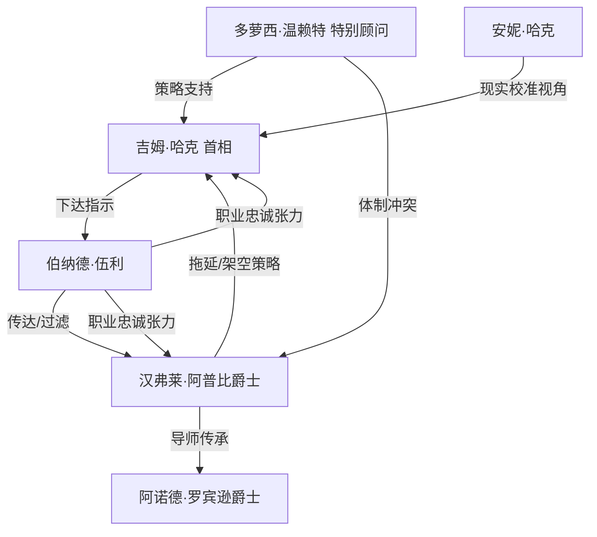

# 《是，首相》跨学科深度解析
### 文学评论 × 历史学 × 哲学 × 心理学 × 社会学 × 政治学 × 经济学 × 组织行为学 × 商业战略 × 职业规划

> 说明：以下内容中，**【事实】**标注可考的创作背景/文本依据，**【原著观点】**标注剧集文本本身传达的立场，**【学界/评论观点】**标注后世研究者与评论家的分析，**【本团队分析】**标注本次跨学科解读的推论。四者严格区分，避免混淆。
>
> 特别说明：《是，首相》（*Yes, Prime Minister*，1986-1988）是英国BBC情景喜剧《是，大臣》（*Yes Minister*，1980-1984）的续集，主角吉姆·哈克从内阁大臣升任首相。本报告以两部剧集作为一个完整的创作整体进行分析，重点聚焦"首相"阶段的权力结构变化。

---

## 【一、作品全景】

**【事实】** 本剧由安东尼·杰伊（Antony Jay）与乔纳森·林恩（Jonathan Lynn）共同创作。杰伊此前长期在BBC从事时事节目制作，并著有《管理与马基雅维利》（*Management and Machiavelli*）；林恩是演员出身的编剧兼导演。两人在创作前系统采访了多位真实的英国前任大臣、常任秘书（Permanent Secretary）及内阁办公室官员，剧中大量台词与情节设计直接取材于这些一手访谈素材。

**【事实】** 《是，大臣》1980-1984年首播，《是，首相》1986-1988年首播，均由BBC One制作播出，采用情景喜剧形式，穿插"纪录片式"的旁白与人物独白，风格接近政治讽刺剧与伪纪录片的结合体。

**【事实】** 时任英国首相玛格丽特·撒切尔是本剧公开的忠实观众，曾在1984年英国电视和广播行业奖颁奖礼上亲自与剧中演员出演过一段致敬短剧，这一事实本身就构成了剧集与现实政治高度互文的著名注脚。

**【事实/时代环境】** 本剧创作于1979-1990年撒切尔主义盛行的时期，彼时英国社会正围绕"民选政治家是否真正掌握国家权力，还是被永久任职、不受选举问责的文官体系（Civil Service）实际操控"这一命题展开激烈公共讨论，本剧被普遍认为是对这一命题最尖锐、也最具娱乐性的文化回应。

**【文学/影视地位】** 本剧被广泛认为是英国情景喜剧史上最杰出的作品之一，多次获得英国电影和电视艺术学院奖（BAFTA），并被印度、荷兰等多国改编翻拍（如印度版《Ji Mantriji》）。剧中"Yes, Minister"式的官僚辞令已进入英语政治词汇体系，成为描述"表面服从、实则拖延或架空决策"这一行为模式的通用代称。

**【学界/评论观点】** 本剧长期被英美多所大学的公共管理学、政治学课程列为教学素材，用以讲解官僚制、政策制定过程与政治沟通中的语言策略，其现实指导意义已远超娱乐作品范畴。

**【本团队分析】** 创作动机可归纳为：在选举政治日益依赖媒体形象管理、而现代国家治理日益依赖专业文官体系的双重背景下，创作者试图揭示一个此前很少被公众直观理解的结构性真相——现代民主国家的真实权力运作，往往不在选举结果本身，而在"谁能定义议程、控制信息流、掌握制度记忆"这一层面。

**【本团队分析】一句话总结：**

> **这部作品真正讨论的不是"英国政治的荒诞笑话"，而是"科层官僚体系凭借制度记忆、语言策略与程序惯性，如何持续驯服并消解民选权力的短暂意志"。**

---

## 【二、故事结构：因果链与底层逻辑】

> 本剧是情景喜剧而非单一线性叙事，但《是，首相》两季存在一条隐含的整体弧线：哈克从意外当选的"过渡型首相"逐步尝试建立个人政治遗产，而这一尝试反复与文官体系的结构性惯性发生碰撞。以下梳理其整体弧线及典型单集因果范式。

### 整体弧线（开端—发展—高潮—结局）

| 阶段 | 关键情节 | 起因 | 关键人物选择 | 直接后果 |
|---|---|---|---|---|
| 开端 | 哈克意外当选首相（"Party Games"篇） | 执政党内两大派系候选人势均力敌、互不相让，哈克作为"最不令人反感的妥协人选"渔翁得利 | 阿普比爵士（时任内阁秘书阿诺德爵士）与党内各派暗中运作，选择一个"容易被文官体系管理"的候选人 | 揭示了本剧最核心的制度性反讽：首相职位的获得未必依靠政治才能或民意授权，而可能是官僚体系"择优挑选便于管理者"的结果 |
| 发展 | 哈克试图推行个人议程（教育改革、核威慑政策、经济政策等系列单集） | 哈克希望在首相任内留下可被历史铭记的政绩，摆脱"过渡首相"标签 | 汉弗莱·阿普比爵士（此时升任内阁秘书）以"成立跨部门委员会""起草白皮书征求意见""泄露风声试探舆论"等标准化拖延程序应对 | 绝大多数改革议程被稀释、拖延或悄然搁置，形成本剧最典型的叙事母题 |
| 发展 | 哈克逐渐掌握"反制汉弗莱"的方法（如"The Key"篇：以钥匙象征的档案与情报权力博弈） | 哈克意识到必须理解并利用文官体系自身的逻辑（如部门预算焦虑、晋升考量、丑闻规避本能）才能推动议程 | 哈克开始有策略地利用汉弗莱对"部门声誉受损"或"个人仕途风险"的恐惧，反向施压 | 双方权力博弈从单向压制逐渐转变为动态博弈，哈克偶尔能够"以其人之道还治其人之身" |
| 高潮 | 核威慑伦理困境（"The Grand Design"篇）、欧洲共同体政策博弈等重大政策情节 | 涉及国家根本安全与外交战略的议题，文官体系的"专业权威"与首相的"政治问责"直接正面冲突 | 哈克需要在"文官体系提供的专业建议"与"个人政治判断/道德立场"之间做出艰难抉择 | 揭示现代国家治理中"专业官僚的知识权力"与"民选官员的政治责任"之间的根本张力，通常以某种脆弱的妥协收场 |
| 结局（系列收尾） | 哈克始终未能完全掌控文官体系，但也始终未被完全架空 | 双方力量结构性地相互制衡——文官体系需要首相的政治授权才能合法行使权力，首相也离不开文官体系的专业执行能力 | 全剧未提供一个"谁赢了"的明确答案 | **【本团队分析】** 这一开放式结局本身即是核心论点：现代民主治理不是零和博弈，而是两种不同性质权力（民意授权的临时权力 vs 制度记忆的永久权力）的永恒动态平衡 |

### 单集典型因果范式（本团队分析的结构模型）

绝大多数单集遵循以下四步循环，这是理解全剧"底层逻辑"的关键：

1. **大臣/首相提出具有政治收益的提案**（回应选民诉求、树立政绩、应对媒体压力）；
2. **汉弗莱以表面顺从、实则拖延或架空的语言策略应对**（"这是一个非常勇敢的决定，部长"通常暗示该决定将带来政治灾难）；
3. **双方通过委员会、备忘录、泄密、语义重新定义等程序性工具展开博弈**；
4. **冲突通常以一种双方都能接受、但都非最初设想的妥协方案收场**，问题本身很少被真正解决，而是被"管理"。

### 底层逻辑（本团队分析）

1. **语言是权力的首要战场**：谁能定义一个提案的措辞（"勇敢的决定""有争议的举措""需要进一步研究"），谁就掌握了议程的实际走向——这是全剧最核心、也最具现实迁移价值的洞察。
2. **制度记忆胜过个人任期**：文官体系的权力来源于其永久性（部长任期通常仅两三年，常任秘书可任职数十年），这种时间维度上的不对称是理解官僚权力韧性的关键。
3. **拖延本身就是一种决策**：委员会、白皮书、跨部门协商等看似中立的行政程序，实际上是文官体系维持现状最有效的武器。
4. **双方的"胜利"都是暂时且局部的**：全剧刻意避免让任何一方取得压倒性、永久性的胜利，这一叙事选择本身反映了创作者对现实政治权力结构的深刻洞察——真实世界中不存在"一劳永逸"的权力斗争终局。

---

## 【三、人物全景分析】

### 1. 吉姆·哈克（Jim Hacker）
- **定位**：从环境大臣、行政事务大臣升任首相，代表"民选政治权力"一方。
- **核心欲望/恐惧**：欲望是留下可被铭记的政治遗产、获得连任与历史评价；恐惧是被文官体系架空、沦为"仪式性首相"、被媒体和党内对手抓住把柄。
- **优势/弱点/盲点**：优势是敏锐的政治嗅觉、对媒体形象的高度敏感、逐渐习得的"反制文官体系"的策略智慧；弱点是常常被短期政治收益（民调、媒体标题）左右决策，缺乏对政策细节的深度掌握；盲点是长期低估文官体系拖延策略背后的系统性动机，容易将个人挫败简单归因于汉弗莱的"个人刁难"，而非制度结构本身。
- **关键转折**：从《是，大臣》中屡屡被汉弗莱轻易操控的"新手大臣"，成长为《是，首相》中能够识别并部分反制官僚话术的"老练首相"，其成长弧光是全剧最重要的人物发展线。
- **心理学分析（荣格原型）**："凡人英雄（Everyman/Hero）"原型——一个能力有限但不断学习适应的普通人，被抛入远超其个人掌控力的庞大制度机器中；用CBT视角看，哈克常表现出"灾难化思维"（将媒体的负面报道等同于政治生涯终结），这也是其决策易受短期情绪驱动的认知根源。
- **历史原型**：**【学界/评论观点】** 评论界普遍认为哈克是英国多位战后中间派首相（如詹姆斯·卡拉汉、约翰·梅杰等"技术官僚型/过渡型"首相）气质的复合投射，而非对应某一位具体真实人物。
- **现实映射**：新任CEO/新晋高管，空降入一个拥有强大既有文化与中层权力结构的成熟组织。
- **借鉴与警示**：
  - 对30岁职场人/新晋管理者：进入一个"文化已成"的组织时，务必先理解现有权力结构的运行逻辑，再推行改革，否则极易重蹈哈克初期屡战屡败的覆辙；
  - 对创业者：警惕把"媒体声量/短期反馈"当作决策的主要依据，长期战略需要独立于舆论噪音；
  - 对管理者：真正的组织变革需要理解并利用既有体系的自身逻辑（如部门KPI、晋升机制），而非简单依靠职位权威强推。

### 2. 汉弗莱·阿普比爵士（Sir Humphrey Appleby）
- **定位**：从常任秘书升任内阁秘书，代表"永久文官体系"权力的最高化身。
- **核心欲望/恐惧**：欲望是维持文官体系的权力、预算与自主性不受政治干扰，维护"良好治理"的专业信念（即便这种信念常常等同于"不改变现状"）；恐惧是任何可能损害文官体系声誉、引发问责危机或打破既有权力平衡的"政治冒险"。
- **优势/弱点/盲点**：优势是无与伦比的制度知识、语言操控能力（以复杂修辞制造"表面回答实则回避"的效果）、对官僚程序的娴熟运用；弱点/盲点是**将"维持现状"等同于"良好治理"的根深蒂固的意识形态惯性**，导致其经常性地阻碍真正必要的改革，本质上是一种精致包装过的保守主义。
- **心理学分析（荣格原型）**："智者/圣贤（Sage）"原型的讽刺性变体——表面博学睿智，实则其"智慧"更多服务于维持体系惯性而非追求真理或公共利益；用ACT视角看，汉弗莱的语言策略是一种极致的"认知融合"（cognitive fusion）反向运用范例——他刻意制造语言与现实的分离（用"这需要进一步研究"掩盖"我不打算做这件事"），这一话术模式值得职场人反向识别与警惕。
- **历史原型**：**【学界/评论观点】** 普遍认为其原型综合了多位真实的英国内阁秘书/常任秘书（如伯纳德·英厄姆等同时代高级文官）的行事风格与话术特征，是对"永业文官"（career civil servant）这一群体的高度典型化提炼，而非指向单一真实人物。
- **现实映射**：大型成熟组织中掌握核心资源与制度知识、任期远超轮岗高管的资深职业经理人/"公司老臣"。
- **借鉴与警示**：
  - 对管理者/创业者：警惕组织内部存在"表面配合、实则拖延架空"的隐性权力中心，识别"这需要更多研究""让我们成立一个工作组"等经典拖延话术；
  - 对30岁职场人：学习汉弗莱式的精准语言表达能力（即便不用于阻碍决策，这种语言精确性本身是职场核心竞争力）；
  - 对组织行为学视角：制度性权力的正当性来源与滥用边界，是任何组织设计都必须正视的问题。

### 3. 伯纳德·伍利（Bernard Woolley）
- **定位**：首席私人秘书，同时对首相与内阁秘书负有职务忠诚，是全剧结构性张力的"中间人"角色。
- **核心欲望/恐惧**：欲望是尽职履行公务员的中立职责、维护个人职业前途；恐惧是被迫在"忠于首相"与"忠于文官体系晋升阶梯"之间做出非此即彼的选择。
- **优势/弱点/盲点**：优势是语言学素养（常以词源学式的字面解读揭穿汉弗莱的修辞游戏，成为全剧重要的喜剧与讽刺装置）、良好的职业操守；弱点/盲点是**长期回避直接冲突、依赖"技术性诚实"（字面意义上不撒谎，但也不主动澄清误导）自我合理化**，这是一种典型的道德回避策略。
- **心理学分析**：荣格"信使/仆人（Messenger）"原型；CBT视角下，伯纳德的"技术性诚实"策略是一种通过重新定义问题边界来降低认知失调（cognitive dissonance）的适应机制——他借助"我并没有说谎，我只是没有主动纠正"这一框架，缓解夹在两种忠诚之间的心理压力。
- **现实映射**：夹在高层管理者与资深部门负责人之间、必须同时对双方负责的中层管理者/项目经理。
- **借鉴与警示**：
  - 对中层管理者/职场人：伯纳德式的"技术性诚实"虽然是一种生存策略，但长期回避真正的立场表态会侵蚀个人的职业信誉与决策能力，需警惕陷入"永远不选边站"的舒适陷阱；
  - 对30岁职场人：精确的语言表达能力（识别话术、避免被误导性措辞左右判断）是可迁移的核心职场技能。

### 4. 多萝西·温赖特（Dorothy Wainwright，特别顾问）
- **定位**：哈克任内引入的政治任命顾问，是全剧少数直接挑战文官体系逻辑的女性角色。
- **【本团队分析】**：温赖特代表了一种"外部专业智识对抗内部制度惯性"的力量，她的存在揭示了"政治任命顾问 vs 永业文官"这一现实世界中普遍存在的现代治理张力（在英美等国被称为"special advisor"体系）。
- **对现代女性的借鉴**：在传统由男性主导、依赖"圈内话术与人脉"运作的权力结构中，外部专业能力与直接表达风格可以成为打破封闭话语体系的有效武器，但也常因"不懂规矩"而遭遇更大阻力，需要策略性地平衡直接性与体制适应性。

### 5. 安妮·哈克（Annie Hacker，首相夫人）
- **定位**：哈克的配偶，代表私人生活与公共权力场域之外的"常识视角"。
- **借鉴**：对职场/管理者——身边保有一个不受组织内部话语体系影响的"局外人视角"（配偶、挚友、导师），有助于避免陷入权力场域的认知茧房。

### 6. 阿诺德·罗宾逊爵士（Sir Arnold Robinson，前任内阁秘书）
- **定位**：汉弗莱的前任与导师，代表文官体系的"制度传承"本身。
- **借鉴**：对组织管理——文官体系的权力韧性很大程度上来自这种"导师—继任者"式的隐性文化传承机制，这提醒管理者关注组织中非正式的"文化传承路径"，其影响力常常超过正式的组织架构图。

### 人物关系网络（简要）

- **权力博弈核心轴**：吉姆·哈克（民选权力）⇄ 汉弗莱·阿普比爵士（永久文官权力），伯纳德·伍利居中传导双方指令与信息，其"忠诚分裂"状态是全剧张力的日常化身。
- **辅助制衡轴**：多萝西·温赖特（外部政治任命顾问）为哈克提供对抗汉弗莱逻辑的策略弹药；阿诺德爵士作为汉弗莱的精神导师，代表文官体系代际相传的运作智慧；安妮·哈克提供婚姻/私人领域的现实校准视角。

---

## 【四、思想与主题】

**【原著观点】** 全剧反复通过喜剧化的对白直接点明其核心命题：现代民主国家的真实权力运作，未必如宪法文本所描述的那样"民选政府掌握行政权"，而更多取决于谁掌握信息、语言与制度记忆的实际控制权。

**【本团队分析】** 但细读全剧会发现一个比"官僚阻碍改革"更深层的张力：汉弗莱式的保守惯性虽常显得荒谬可笑，却也不时在剧中扮演"防止哈克因短期政治冲动做出灾难性决策"的制衡角色（如核政策相关情节）。这构成了对"民主问责"与"专业治理"孰优孰劣这一问题的辩证呈现，而非简单地将文官体系塑造为纯粹反派。

### 各主题的表达

- **权力**：权力被呈现为"谁能控制议程设置与信息流动"的能力，而非仅仅取决于职位头衔的正式权限——这与政治学中"议程设置权力"（agenda-setting power）理论高度契合。
- **利益**：文官体系的行为逻辑始终围绕"部门预算、编制规模、机构声誉"这些组织性利益展开，个人官员的"信念"往往与其所在机构的利益结构高度重合，难以完全区分公心与部门私利。
- **家庭**：安妮·哈克提供的私人领域视角，反衬出公共权力场域对个人生活的持续侵蚀，两者构成的张力是理解"公职人员如何维持心理边界"的重要切口。
- **组织**：全剧本质上是一部关于"科层官僚制内部运作逻辑"的深度案例研究，其对委员会政治、跨部门协调、机构自保本能的刻画，具有极强的组织行为学分析价值。
- **战争/国家安全**：核威慑伦理相关情节展现了"专业机构的知识权威"与"民选官员的最终政治责任"之间的根本性张力——谁应该为核按钮的道德后果负责？专家建议是否能替代政治问责？
- **制度**：全剧对"白皮书、跨部门委员会、公务员晋升体系"等具体制度设计的细致刻画，揭示了看似中立的行政程序本身就是权力分配的隐性载体。
- **自由**：哈克的"自由"始终受限于文官体系提供的信息范围与政策选项菜单——这提出了一个尖锐的问题："如果决策者只能在他人筛选后的选项中做选择，他的自由意志还剩多少？"
- **责任**：全剧反复呈现"责任"在文官体系与政治任命官员之间的相互推诿——政策失败时，究竟应由提出政策的大臣负责，还是执行政策的文官负责？这一命题至今仍是公共行政学的核心争议。
- **命运**：哈克能否留下政治遗产，很大程度上不取决于其个人意志，而取决于他能否理解并驾驭一个远比自己任期更古老、更庞大的制度机器——这构成了全剧的悲喜剧式命运观。

### 作者真正想回答的问题（本团队分析）

> **在一个宪法上"民意至上"、但实际运作上高度依赖专业官僚体系的现代国家中，谁真正对国家治理负最终责任？民选官员的短期问责压力，与文官体系的长期制度理性，究竟应该如何被制度化地平衡？** 本剧没有给出简单答案，而是通过持续的喜剧化拉锯战，让观众直观体验这一张力的复杂性与永恒性。

### 跨时代仍然成立的规律

1. 语言的精确控制权（谁能定义问题、谁能重新措辞）是组织与政治权力斗争的首要战场。
2. 制度性权力的韧性来源于其时间维度的持久性，远超任何个人任期。
3. "拖延"本身是一种极其有效、且往往难以被追责的决策方式。
4. 专业知识权威与民主问责机制之间存在结构性张力，不存在一劳永逸的解决方案，只能持续动态平衡。
5. 组织内部的"部门利益"往往会包装成"专业判断"或"公共利益"，识别这种包装是有效管理与决策的关键能力。

---

## 【五、多维度解读】

**①普通个人成长**：哈克从被动挨打到逐步学会理解并利用系统逻辑的成长弧线，提示我们进入任何新环境（新公司、新社群）时，理解既有权力结构远比急于表达个人意志更重要。

**②30岁成年人视角**：伯纳德式的"技术性诚实"策略在职业早期是一种有效的生存智慧，但30岁前后应警惕长期依赖这种策略而丧失建立个人立场与信誉的能力。

**③女性视角**：多萝西·温赖特作为剧中少数直接挑战体制话语的女性角色，其"外部专业性"与"体制内话术"之间的冲突，映射了现实中女性进入传统男性主导的权力场域时常面临的"合规性代价"（既要展现专业能力，又要应对"不懂规矩"的隐性排斥）。

**④职场与组织管理**：全剧堪称一部生动的"如何识别并应对组织内部隐性权力中心"教科书，尤其是识别"表面配合、实则拖延"的话术模式（"这是一个非常勇敢的决定"），对任何管理者都有直接的现实应用价值。

**⑤创业与商业战略**：哈克与汉弗莱的博弈提示创业者/新任高管，在进入或改造一个成熟组织时，必须理解现有"文官体系"（老员工、既得利益部门）的自我保护逻辑，才能设计出真正可执行的变革路径，而非仅依靠自上而下的行政命令。

**⑥领导力**：全剧展现了两种截然不同的领导力模式——哈克式的"魅力/媒体驱动型"领导力与汉弗莱式的"制度知识驱动型"领导力，二者的持续博弈提示，真正有效的现代领导力需要同时具备两种能力的部分特质。

**⑦心理健康**：伯纳德长期处于双重忠诚的角色张力中，是"角色冲突"（role conflict）导致职业倦怠的经典案例；哈克的灾难化思维模式（将媒体负面报道等同于政治生涯终结）也是可用CBT框架分析的典型认知扭曲。

**⑧社会制度**：本剧对"永业文官制"这一现代国家治理核心制度设计的利弊做了迄今为止最具娱乐性也最深刻的公共讨论，至今仍是公共行政学教学的重要素材。

**⑨历史发展**：本剧诞生于撒切尔主义试图"改革公务员体系、削减国家机器规模"的历史节点，其对"文官体系抵抗改革"的刻画，是理解1980年代英国政治经济转型的一手文化文献。

**⑩现代AI时代（本团队推演，非剧集原文）**：若剧情设定在今天，社交媒体将极大压缩哈克式媒体形象管理的决策窗口（危机响应从"数天"压缩到"数小时甚至数分钟"）；数据驱动的政策评估与算法辅助决策可能部分削弱汉弗莱式"信息不对称"的权力基础，但也可能催生新的"技术官僚"权力中心（如数据团队、AI顾问），本质性的"民主问责 vs 专业知识权威"张力大概率会以新的形式延续而非消失。

---

## 【六、客观评价与争议】

**支持者的高度评价（学界/评论）**：
- 剧本的语言精确性与讽刺智慧被公认为英语情景喜剧的巅峰水准之一；
- 对官僚制运作逻辑的刻画具有极高的现实准确性，被多国公共行政学课程采用为教学素材；
- 对"民主问责 vs 专业治理"这一现代国家治理核心命题的呈现，兼具娱乐性与思想深度，历经数十年仍未过时。

**批评者的主要质疑**：
- **角色单一维度化**：部分评论者认为文官体系角色（尤其是汉弗莱）虽然刻画精妙，但也存在将复杂的官僚群体简化为"精致利己的阻碍者"这一单一刻板印象的风险，现实中的文官体系内部也存在大量真诚推动改革的个体。
- **性别与多元代表性不足**：全剧核心权力博弈几乎完全由男性角色主导，女性角色（多萝西、安妮）多处于边缘或辅助位置，反映了1980年代英国政治文化本身的性别结构局限，也是当代重看本剧时最容易被批评的短板。
- **阶层与英国中心视角**：全剧聚焦于威斯敏斯特体系内部的精英博弈，对更广泛的社会阶层、地区差异、殖民历史遗留问题着墨极少，这一"精英内部视角"的局限性也常被评论界提及。
- **喜剧化处理可能弱化制度批判的严肃性**：部分评论者指出，将官僚制的结构性弊病处理得如此幽默诙谐，客观上可能起到"消解而非激化"公众对相关问题严肃反思的效果。

**哪些属于时代局限**：性别代表性不足、精英中心视角，均是特定历史时期英国政治文化的产物，不宜脱离1980年代的社会语境简单苛责，但当代观众/读者应对此保持批判性认识。

**哪些批评具有合理性**：角色单一维度化的批评具有一定合理性——现实中的官僚体系远比剧中呈现的更加多元和复杂；性别与阶层代表性不足的批评也经得起当代视角的检验，是重看本剧时应主动补充的反思维度。

**【本团队综合评价】**：《是，首相》作为政治讽刺喜剧的典范之作，其对官僚制运作逻辑、语言与权力关系的洞察具有罕见的持久现实意义，时至今日仍是理解现代国家治理与大型组织内部权力博弈的绝佳"活教材"；但读者/观众应清醒认识到其角色刻画的简化倾向与性别、阶层代表性局限，将其视为"极具洞察力的讽刺文本"而非"官僚体系的全面写实记录"。

---

## 【七、现实应用】

**人生原则（10条）**
1. 进入任何新环境，先理解既有权力结构的运行逻辑，再谋求推动改变。
2. 语言的精确性是一种可迁移的核心能力，学会识别他人话语中的"表面回答实则回避"。
3. 警惕将短期舆论/他人评价的波动等同于长期结果的定论（哈克式灾难化思维的反面教材）。
4. "技术性诚实"是一种生存策略，但长期依赖会侵蚀个人建立真实立场的能力。
5. 制度性/结构性力量的影响，通常远超个人一时的意志与努力，理解这一点有助于减少不必要的自我归因。
6. 拖延有时是一种隐蔽而有效的"决策"，需要学会识别这种策略何时对自己不利。
7. 真正的权力常常隐藏在"谁定义问题"而非"谁做最终决定"这一环节。
8. 保有一个不受所处权力场域话语体系影响的"局外人视角"（挚友、导师、伴侣）。
9. 专业知识与民主问责（或对应到组织中的"专家意见"与"一线反馈"）需要动态平衡，而非非此即彼。
10. 任何看似荒诞的官僚现象背后，通常都有其自我保护的结构性逻辑，理解比嘲讽更有实用价值。

**职场原则（10条）**
1. 识别组织中"表面配合、实则拖延"的经典话术模式（"这需要进一步研究""让我们成立一个工作组"）。
2. 掌握精确的语言表达能力，这是应对官僚化沟通环境的核心武器。
3. 新任管理者推行变革前，务必先摸清既有部门利益结构与非正式权力网络。
4. 警惕陷入"永远不选边站"的中层生存策略，长期回避表态会侵蚀个人决策信誉。
5. 理解"部门利益"常被包装为"专业判断"，学会拆解话语背后的真实动机。
6. 制度记忆（老员工、资深团队）的影响力往往超过正式组织架构图，需要认真对待而非仅依赖流程图管理。
7. 危机公关/媒体形象管理需要有独立于短期舆论噪音的长期判断力。
8. 委员会、工作组等看似中立的行政程序，本身就是权力分配的隐性载体，需要审视其设计动机。
9. 建立跨部门信任关系，比单纯依靠职位权威更能推动实际变革。
10. 承认专业知识权威与一线执行者反馈之间可能存在张力，建立动态对话机制而非单方压制。

**组织管理原则（10条）**
1. 组织变革设计必须正视既得利益部门的自我保护逻辑，而非仅依赖自上而下的行政命令。
2. 建立能够识别并制衡"隐性拖延型权力中心"的治理机制。
3. 制度记忆的传承（导师—继任者式的隐性文化）应被纳入组织设计的正式考量，而非放任其自然演化。
4. 警惕将部门利益包装为"专业判断"或"整体利益"的话语策略在组织内部蔓延。
5. 建立跨部门/跨层级的直接沟通渠道，减少信息在层层传递中被"技术性诚实"式模糊处理的风险。
6. 领导者需同时具备"魅力/愿景驱动"与"制度知识驱动"两种能力，避免过度依赖单一领导力风格。
7. 委员会与工作组机制应设定明确的时限与产出要求，防止其异化为纯粹的拖延工具。
8. 组织问责机制需清晰界定决策者与执行者的责任边界，避免政策失败时的相互推诿。
9. 引入外部专业顾问（如"特别顾问"角色）可以有效打破封闭的内部话语体系，但需为其设计与既有体系对接的机制。
10. 长期制度理性与短期问责压力的动态平衡，应被视为组织治理的常态而非需要"一次性解决"的问题。

**商业战略原则（10条）**
1. 进入成熟市场/收购成熟组织前，评估其内部既得利益结构对战略执行的潜在阻力。
2. 品牌/政策叙事的措辞选择本身就是战略工具，需要像剧中官僚一样审慎设计话语框架。
3. 警惕组织内部将"维持现状"包装为"审慎的专业判断"，进而系统性阻碍必要的战略转型。
4. 建立能够穿透中层"技术性诚实"式信息过滤的直接反馈渠道，避免决策层被选择性信息误导。
5. 战略变革的成功往往取决于能否识别并利用既有体系的自身逻辑（如部门KPI、晋升机制）反向推动执行。
6. 危机沟通策略需要区分"短期舆论管理"与"长期战略判断"，避免被前者绑架后者。
7. 制度性优势（如先发的行业地位、深厚的客户关系）具有类似"文官体系"的持久性，应作为战略资产被认真评估。
8. 引入外部视角（顾问、新任高管）有助于打破组织内部的封闭话语体系，但需设计好其融入路径。
9. 拖延型竞争对手/合作伙伴的行为模式往往有迹可循，识别其背后的组织性动机比单纯抱怨更具战略价值。
10. 长期护城河的构建，部分取决于组织能否将制度记忆转化为可持续的竞争优势，而非仅仅依赖个别领导者的任期表现。

**沟通与人性规律（10条）**
1. "这是一个非常勇敢的决定"这类看似称赞实则警告的话术，提醒我们警惕话语表面含义与实际意图的错位。
2. 精确的语言表达能力本身就是一种权力形式，值得被认真训练而非视为"咬文嚼字"。
3. 面对复杂议题时，人们倾向于用委婉语（"需要进一步研究"）掩盖真实立场，识别这一点有助于更准确解读他人意图。
4. 长期处于双重忠诚的角色张力（如伯纳德）容易导致回避真实表态的习惯性防御模式，值得自我觉察。
5. 权力关系中，"谁能定义问题"往往比"谁做最终决定"更具决定性影响力。
6. 制度性力量的说服逻辑常常诉诸"专业性"与"审慎性"，需要具备拆解这类话语的批判性思维。
7. 建立与体制/权力结构中"局外人"角色（如温赖特式的外部顾问）的对话，有助于打破封闭话语体系的自我强化。
8. 责任推诿在复杂权力结构中是常态而非例外，沟通时应尽量明确责任边界以减少事后争议。
9. 保持对短期舆论/评价与长期真实判断之间张力的清醒认识，避免被前者过度左右决策。
10. 幽默与讽刺本身可以成为揭示制度性问题而不引发防御性对抗的有效沟通策略。

**最值得警惕的错误**：低估制度性/结构性力量而将挫败简单归因于个人对手（哈克早期的认知误区）；长期依赖"技术性诚实"逃避真实表态（伯纳德式的道德回避）；将部门/个人利益包装为客观专业判断而不自知（汉弗莱式的意识形态惯性）。

**最值得长期坚持的价值观**：对语言精确性的持续训练与警惕；理解并尊重专业知识权威与民主问责机制各自的合理性，避免非此即彼的简单化立场；在权力博弈中保持"局外人视角"以避免认知茧房。

**现实案例应用示例**：企业并购后新任管理层与原有团队的权力博弈（对照哈克与汉弗莱的动态）、组织内部"跨部门工作组"沦为拖延工具的常见现象（对照剧中经典的委员会拖延策略）、危机公关中"技术性诚实"式声明引发的信任危机（对照伯纳德式回避策略的长期代价），都是可直接迁移的分析框架。

---

## 【八、最终总结】

**①一句话总结**：《是，首相》是一部揭示"科层官僚体系如何凭借制度记忆与语言策略持续驯服民选权力短暂意志"的政治讽刺经典。

**②核心思想（约100字）**：全剧以首相吉姆·哈克与内阁秘书汉弗莱·阿普比爵士之间持续的权力拉锯为主线，揭示了现代民主国家治理中"民选权力的短暂性"与"文官体系的永久性"之间的结构性张力，语言的精确控制权成为这场博弈的首要战场；全剧未提供简单的胜负答案，而是以持续的动态平衡呈现出专业治理与民主问责这一命题在现代国家中永恒存在、无法一劳永逸解决的本质。

**③最重要人物 TOP10**：吉姆·哈克、汉弗莱·阿普比爵士、伯纳德·伍利、多萝西·温赖特、安妮·哈克、阿诺德·罗宾逊爵士、（剧中反复出现的）反对党领袖、财政部常任秘书等制度性配角、内阁办公室其他文官、媒体记者角色群像。

**④最重要事件（情节）TOP10**：哈克意外当选首相（"Party Games"）、教育改革提案的拖延与稀释、核威慑伦理困境（"The Grand Design"）、"The Key"篇的档案权力博弈、欧洲共同体政策谈判情节、荣誉制度改革相关情节、经济政策危机应对、媒体丑闻应对情节、特别顾问多萝西的引入与体制冲突、系列收尾处双方权力关系的持续悬而未决。

**⑤最经典语录（附背景与含义，均为对原著情节与台词精神的转述概括，非逐字引用）**：
- 关于"勇敢的决定"——汉弗莱习惯用"这是一个非常勇敢的决定，部长"来暗示某项政策提议实际上蕴含着巨大的政治风险，这句话的反讽用法后来成为英语政治文化中广为流传的经典梗。
- 关于"Yes, Minister"的表面服从——剧名本身即浓缩了全剧核心讽刺：文官对大臣说"是"，往往意味着"我听到了您的指示，但我将按照我认为合适的方式（即维持现状）执行"。
- 关于委员会与拖延——剧中反复出现"让我们成立一个跨部门工作组来研究这个问题"这一经典拖延话术，被后世广泛引用来形容任何组织中以程序性动作代替实质行动的现象。
- 关于文官体系的自我定位——剧中多次借汉弗莱之口表达"政府的职责是治理，而非改变"这一保守主义式的治理哲学，直接点明了文官体系与政治改革意愿之间的根本性张力。

**⑥思维导图（Markdown）**

```
是，首相
├── 权力结构
│   ├── 民选权力：吉姆·哈克（首相）—— 短暂、依赖民意与媒体形象
│   └── 永久权力：汉弗莱·阿普比爵士（内阁秘书）—— 持久、依赖制度记忆与语言策略
├── 核心武器
│   ├── 语言/话术：委婉语、模糊表态、"勇敢的决定"式反讽
│   ├── 程序/制度：委员会、白皮书、跨部门协商
│   └── 信息控制：泄密、选择性汇报、议程设置
├── 中介角色：伯纳德·伍利（双重忠诚的结构性张力）
├── 核心命题：专业治理 vs 民主问责，二者永恒动态平衡而非零和博弈
└── 现实映射：组织变革 / 官僚拖延 / 领导力风格 / 沟通话术识别
```

**⑦人物关系图（Markdown / Mermaid）**



**⑧故事时间线（Markdown）**

```
1980-1984  《是，大臣》播出：吉姆·哈克任行政事务大臣，与常任秘书汉弗莱展开日常权力博弈
1984年     撒切尔夫人公开表达对本剧的喜爱，并参与相关致敬活动
1986年     《是，首相》首播："Party Games"篇：哈克因党内派系僵局意外当选首相
1986-1987年 第一季：教育改革、经济政策、媒体丑闻应对等系列单集，哈克逐步学习反制汉弗莱的策略
1987年     核威慑伦理困境情节（"The Grand Design"）：专业知识权威与政治问责的正面冲突
1988年     第二季：欧洲共同体政策博弈、荣誉制度改革等情节，特别顾问多萝西的角色张力凸显
1988年     系列收尾，双方权力关系保持动态平衡，未提供明确"胜负"结局
其后       剧集持续在英美及多国公共管理/政治学课程中被引用，"Yes Minister"式话术成为通用政治词汇
```

**⑨争议观点对照表**

| 议题 | 支持/肯定观点 | 批评/质疑观点 |
|---|---|---|
| 官僚制运作的刻画 | 现实准确性极高，被公共行政学界广泛采用为教学素材 | 部分评论者认为存在将文官群体简化为"精致利己阻碍者"的刻板化倾向 |
| 语言与权力的呈现 | 对话精妙深刻，揭示了语言作为权力工具的核心机制 | 部分批评认为过度依赖语言游戏可能弱化对制度性弊病的严肃批判 |
| 性别代表性 | 多萝西等角色提供了一定的性别视角补充 | 核心权力博弈几乎完全由男性主导，反映1980年代英国政治文化的性别局限 |
| 阶层与视角广度 | 精准聚焦威斯敏斯特体系内部运作，具有高度专业深度 | 对更广泛社会阶层、地区差异关注不足，存在"精英内部视角"局限 |
| 喜剧化处理的社会效果 | 兼具娱乐性与思想深度，扩大了公众对官僚制议题的关注 | 部分评论者担忧幽默化处理可能消解而非激化公众对制度问题的严肃反思 |

**⑩推荐延伸阅读、影视作品及相关学术资料**
- 安东尼·杰伊《管理与马基雅维利》——理解本剧创作者组织权力观的重要背景著作。
- 马克斯·韦伯关于科层官僚制（bureaucracy）的经典社会学论述——理解本剧理论根基的必读文献。
- 印度改编版《Ji Mantriji》——可作为跨文化比较视角的参照文本，观察官僚制议题在不同政治文化中的呈现差异。
- 学术资料：多所大学公共管理学院（如伦敦政治经济学院）将本剧作为教学案例的相关课程材料与论文，可作为深入研究的补充资源。
- 相关纪录片/访谈：BBC及英国媒体关于本剧创作背景、演员访谈的相关纪录片素材，有助于理解剧集与真实政治人物、事件的互文关系。
- 延伸剧集：《是，大臣》（前作，理解哈克与汉弗莱关系起点的必要背景）。

---

*本文档为跨学科分析框架下的综合解读，旨在提供系统性理解与现实应用参考，不构成学术定论，读者可结合原剧与更多学术文献进一步深入研究。*
