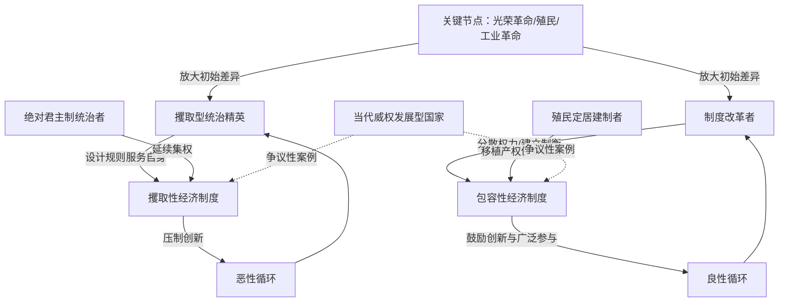

# 《国家为什么会失败》跨学科深度解析
### 文学评论 × 历史学 × 哲学 × 心理学 × 社会学 × 政治学 × 经济学 × 组织行为学 × 商业战略 × 职业规划

> 说明：以下内容中，**【事实】**标注可考的作者背景/文本依据，**【原著观点】**标注作者达龙·阿西莫格鲁与詹姆斯·罗宾逊在书中提出的论点，**【学界/评论观点】**标注后世经济学家、历史学家、政治学者的分析与批评，**【本团队分析】**标注本次跨学科解读的推论。四者严格区分，避免混淆。
>
> 特别说明：《国家为什么会失败》是比较制度经济学/政治学著作，没有传统意义上的"情节"与"虚构人物"。本报告在【二、故事结构】与【三、人物全景分析】两部分，分别转化为"论证的历史比较案例链"与"关键制度性角色原型"进行对应处理，以保留分析框架的深度，同时忠于本书的学术文体。

---

## 【一、作品全景】

**【事实】** 本书作者为达龙·阿西莫格鲁（Daron Acemoglu，麻省理工学院经济学教授，土耳其裔美国经济学家，专长政治经济学与增长理论）与詹姆斯·罗宾逊（James A. Robinson，政治学者，历史上曾任教哈佛大学、现任教于芝加哥大学，长期深耕拉丁美洲与非洲政治经济史田野研究）。本书出版于2012年，是二人二十余年学术研究成果（尤其是二人与西蒙·约翰逊合著、2001年发表于《美国经济评论》的奠基性论文《比较发展的殖民地起源》）面向大众读者的通俗化提炼。

**【事实】** 2024年，达龙·阿西莫格鲁、西蒙·约翰逊与詹姆斯·罗宾逊三人因"关于制度如何形成并影响繁荣"的研究，共同获得诺贝尔经济学奖，这使本书的核心论点在学术共同体中获得了最高规格的正式认可，也让本书在出版十二年后重新进入全球公共讨论视野。

**【事实/时代环境】** 本书成书于2008年全球金融危机余波未散、2010-2012年阿拉伯之春浪潮方兴未艾的历史节点，彼时"威权发展模式（如中国模式）是否优于西式自由民主+市场经济组合"这一问题在全球政策与学术界引发激烈争论，本书正是对这场争论最系统的介入之一，试图以严谨的比较历史证据回应"贫富分化的根源究竟是什么"这一根本问题。

**【原著观点】** 本书开篇即旗帜鲜明地反驳三种流行的国家贫富解释——**地理假说**（如贾雷德·戴蒙德式的气候/资源禀赋决定论）、**文化假说**（如马克斯·韦伯式的新教伦理决定论或对特定民族"文化劣根性"的归因）、**无知假说**（认为贫穷国家的领导人只是不懂得正确的经济政策）——并主张真正的决定性因素是"制度"，尤其是政治权力分配方式对经济激励结构的塑造。

**【文学/学术地位】** 本书自出版以来长期位居全球畅销书榜单，被译为四十余种语言，是21世纪以来发展经济学、比较政治学领域影响力最广泛的大众学术著作之一，深刻塑造了世界银行、国际货币基金组织等国际发展机构对"制度建设"议题的政策话语。

**【学界/评论观点】** 学术界对本书的评价同样呈现鲜明的两极分化：一方面其"攫取性—包容性制度"框架被广泛援引为理解国家兴衰的核心分析工具，另一方面也持续受到经济史学家关于"案例选择性偏差"与"因果关系方向"的方法论质疑（详见第六部分）。

**【本团队分析】** 创作动机可归纳为：在全球发展援助数十年投入却收效有限、"华盛顿共识"式技术官僚政策处方屡屡失效的背景下，两位作者试图证明，贫困的根源不是缺乏资本、技术或"正确政策清单"，而是深植于历史进程中的权力分配结构本身——这意味着单纯的经济政策改革，若不触及权力分配的政治制度层面，注定收效有限。

**【本团队分析】一句话总结：**

> **这部作品真正讨论的不是"贫富国家之间地理或文化上的先天差异"，而是"谁掌握了一国的政治权力、又是否愿意让经济利益向广大民众开放"这一制度性选择，如何在历史的关键节点被锁定，并通过自我强化的循环决定了一个国家此后数百年的命运。**

---

## 【二、故事结构：论证的历史比较案例链与底层逻辑】

> 本书没有情节意义上的单一叙事，其论证脉络是一系列"精心设计的历史比较实验"：通过寻找地理、文化、气候几乎完全相同、唯独制度设计不同的邻近案例，来隔离出"制度"这一变量的独立解释力。

### 论证脉络与因果链

| 阶段 | 核心论证案例 | 起因/设问 | 关键论证逻辑 | 得出的结论 |
|---|---|---|---|---|
| 开端：提出反常识证据 | 诺加莱斯双城对照（美国亚利桑那州诺加莱斯 vs 墨西哥索诺拉州诺加莱斯）；朝鲜半岛南北对照 | 同一民族、同一地理气候、甚至同一座城市被一道边境线劈开，为何两侧财富水平天差地别？ | 若地理/气候/民族文化能解释贫富差距，这类"隔壁对照组"案例本应表现出相似结果，但现实恰恰相反 | 地理假说与文化假说均无法解释这些紧邻案例中的巨大差距，唯一变量是两侧的政治与经济制度设计 |
| 发展：提出核心理论框架 | "攫取性制度"（extractive institutions）vs "包容性制度"（inclusive institutions） | 权力总是掌握在少数人手中还是被广泛分享？经济活动的成果是被少数精英攫取还是能被广大参与者分享？ | 政治制度决定谁能掌握并运用国家强制力；经济制度决定财产权保护程度、市场准入公平性与创新激励——两者相互强化 | 包容性政治制度支撑包容性经济制度，形成鼓励创新、投资与人力资本积累的"良性循环"；攫取性政治制度支撑攫取性经济制度，形成压制创新、维护既得利益的"恶性循环" |
| 高潮：关键节点与历史偶然性 | 光荣革命（1688年英国）vs 同期西班牙、俄国的绝对君主制延续；殖民地"定居者死亡率"决定殖民制度类型（北美 vs 拉丁美洲/撒哈拉以南非洲） | 为何看似微小的历史事件（一场瘟疫、一次王位继承危机、殖民者是否能长期定居）会造成此后数百年的巨大分流？ | "关键节点"（黑死病、地理大发现、工业革命）打破原有制度均衡，微小的初始制度差异在此类节点被急剧放大；殖民者若因疟疾/黄热病等疾病环境无法长期定居（如非洲、加勒比），便倾向建立纯粹汲取资源的攫取性殖民制度；若能大量定居（如北美、澳大利亚），则倾向复制本国的产权保护型包容性制度 | 制度分流并非命中注定，而是历史偶然性叠加路径依赖的产物——这是本书对"地理/文化决定论"最有力的正面反驳 |
| 转折：制度的自我强化机制 | "财富逆转"现象（Reversal of Fortune）：前殖民时代较富裕、人口稠密的地区（如墨西哥、秘鲁、印度）在殖民后期反而更贫穷；苏联式攫取性增长的极限 | 为何曾经的文明中心在殖民后期反而落后于曾经的"荒野"（如北美）？为何攫取性制度下的经济增长（如苏联工业化）终将停滞？ | 人口稠密、文明发达的地区更适合殖民者建立攫取性劳役/矿产掠夺体系（现成的劳动力与治理基础设施可供利用）；攫取性制度下的增长依赖于强制资源调配而非创新，一旦简单调配的潜力耗尽便难以为继，且统治精英出于对"创造性破坏"可能催生竞争对手的恐惧，主动压制技术与组织创新 | 攫取性制度可以带来短期甚至中期的增长（苏联、当代若干威权发展中国家），但缺乏长期可持续性，因为其增长逻辑与创新逻辑存在根本性冲突 |
| 结局/当代应用 | 博茨瓦纳（成功案例）vs 塞拉利昂、刚果（民主共和国）（失败案例）；对中国增长模式可持续性的预测性讨论 | 后殖民非洲国家为何走向截然不同的命运？当代威权国家的经济增长能否长期持续？ | 博茨瓦纳独立后延续了当地茨瓦纳酋长制传统中相对分权制衡的政治遗产，并主动选择包容性制度路径；塞拉利昂、刚果等则延续了殖民时期的攫取性权力结构，陷入"资源诅咒"与精英掠夺的持续循环 | **【原著观点】** 作者对中国等"政治攫取、经济部分包容"的发展模式提出审慎质疑，认为若不能实现政治制度层面的包容性转型，其增长的长期可持续性存疑——**这是本书迄今为止争议最大的预测性论断**（详见第六部分） |

### 底层逻辑（本团队分析）

1. **政治制度与经济制度互为因果、相互锁定**：谁掌握不受制衡的政治权力，谁就能够设计出有利于自身攫取经济利益的规则，这一权力—利益的闭环是理解制度持久性的核心钥匙。
2. **关键节点放大偶然性，而非应验必然性**：历史上一次瘟疫、一场王位继承危机、一次殖民地疾病环境的差异，都可能在"关键节点"被无限放大为此后数百年的国运分野——这是本书对任何形式的历史决定论（无论是地理决定论还是文化决定论）最根本的哲学反驳。
3. **恶性循环源于精英对"创造性破坏"的恐惧**：攫取性精英之所以持续压制创新与广泛参与，并非出于愚昧，而是深刻理解熊彼特式"创造性破坏"必然催生挑战其既得利益的新兴力量——这是一种理性的自利选择，而非无知的产物。
4. **良性循环依赖多元制衡而非单纯的善治意愿**：包容性制度之所以能够自我强化，关键在于权力被广泛分散于多个相互制衡的主体之间，使得任何单一集团都难以垄断规则制定权，而非依赖统治者个人的道德品质。

---

## 【三、人物全景分析（关键制度性角色原型）】

> 由于本书是学术论证而非叙事文学，此处将书中反复讨论的"制度性历史角色类型"作为分析单元。

### 1. 攫取型统治精英（Extractive Ruling Elite）
- **定位**：垄断政治权力、将经济规则设计为服务自身利益的统治集团，本书批判的核心对象。
- **核心欲望/恐惧**：欲望是维持并扩大对国家资源与强制力的垄断控制；恐惧是"创造性破坏"——任何技术革新、市场开放或新兴阶层崛起都可能催生足以挑战其权力垄断的新兴竞争者。
- **优势/弱点/盲点**：优势是短期内能够凭借强制力实现资源的高效再分配（如苏联式工业化初期的高速增长）；盲点/弱点是**将"权力垄断"本身误认为"长期繁荣"的必要条件**，从而系统性压制真正能带来长期增长的创新与广泛参与。
- **心理学分析（荣格原型）**："暴君/独裁者"（Tyrant，"统治者"原型的阴影面）——其行为逻辑并非源于非理性的贪婪，而是一种高度理性但视野受限的自利最大化：CBT视角下，这是一种"零和思维"（zero-sum thinking）的认知模式，将他人的获益等同于自身的损失，从而系统性抵制任何可能扩大整体蛋糕的制度改革。
- **历史原型**：**【事实】** 刚果自由邦时期比利时国王利奥波德二世的殖民掠夺体系、扎伊尔总统蒙博托·塞塞·塞科的家产制统治、西班牙美洲殖民地的"米塔"强制劳役制度，均是本书直接援引的攫取性统治典型案例。
- **现实映射**：过度集权、拒绝授权与制度化制衡、将企业视为个人私产的家族企业创始人/家长式管理者。
- **借鉴与警示**：
  - 对管理者/创业者：警惕将组织的短期效率等同于长期竞争力，压制内部创新（尤其是可能挑战自己地位的"创造性破坏"式创新）终将透支组织的长期生命力；
  - 对30岁职场人：识别组织中"权力垄断优先于整体效益"的决策模式，评估自身是否处于一个结构性压制个人成长空间的攫取型环境中。

### 2. 殖民定居建制者（Settler Colonist / Institution Builder）
- **定位**：因当地疾病环境适宜长期定居，将母国的产权保护型制度移植到殖民地的建制者群体，与"攫取型殖民者"形成鲜明对照。
- **【原著观点】** 阿西莫格鲁与罗宾逊提出的"殖民地定居者死亡率"理论指出，殖民者能否在当地长期定居（取决于疟疾、黄热病等疾病环境），决定性地影响了他们建立何种制度：能长期定居则倾向建立保护自身财产权的包容性制度（如北美十三州），无法长期定居则倾向建立纯粹掠夺资源、就地压榨的攫取性制度（如比属刚果、西属拉美矿区）。
- **历史原型**：北美十三州早期殖民定居者、澳大利亚与新西兰的英国移民建制传统。
- **现实映射**：新创企业早期核心团队所设计的股权结构、治理章程与文化基因，往往决定性地影响企业此后数十年的组织形态。
- **借鉴**：对创业者——企业成立初期设计的治理结构（谁有决策权、利益如何分配）具有极强的路径依赖效应，早期"顺手"的制度选择可能锁定企业此后数十年的组织基因，值得在创业之初就给予远超直觉的重视。

### 3. 制度改革者（Institutional Reformers）
- **定位**：在关键节点主动推动权力分散化、制度包容化的历史行动者。
- **历史原型**：**【事实】** 1688年英国"光荣革命"中限制王权、确立议会主权的政治行动者群体；博茨瓦纳独立后延续并制度化传统酋长会议分权传统的开国总统塞雷茨·卡马（Seretse Khama）及茨瓦纳部落长老群体。
- **心理学分析**：ACT（接纳承诺疗法）视角下，真正的制度改革者往往需要具备容忍短期不确定性、甚至主动让渡部分个人/集团既得利益以换取长期集体福祉的"心理灵活性"，这与攫取型统治者的零和思维形成鲜明对比。
- **借鉴**：对组织管理者/商业战略顾问——真正可持续的组织变革，往往需要设计者主动让渡部分个人集权，转而建立多元制衡的治理结构，这在短期内可能显得"效率降低"，但却是长期韧性的根本来源。

### 4. 普通企业家/创新者（The Entrepreneur under Divergent Institutions）
- **定位**：制度质量的最终检验者——同样的个体在攫取性与包容性制度下会展现出截然不同的行为模式与产出。
- **【本团队分析】**：诺加莱斯双城案例中，同一血缘、同一文化背景的居民，仅因制度环境不同（美国一侧财产权受保护、信贷可获得、法治可预期；墨西哥一侧则相反），便在创业意愿、投资规模与创新产出上呈现巨大差距，这一案例是理解"制度而非天赋决定发展"最直观的证据。
- **借鉴**：对30岁职场人/创业者——个人努力与才能的发挥空间，很大程度上受限于所处制度环境的激励结构；评估自身所在行业/组织/国家的制度环境，是理性规划个人长期发展路径不可忽视的前提。

### 5. 绝对君主制统治者（Absolutist Monarch）
- **定位**：与光荣革命后的英国形成对照的历史原型，代表未能实现权力分散化的欧洲大陆君主制。
- **历史原型**：西班牙哈布斯堡王朝、俄国沙皇专制体系，均长期维持高度集权的攫取性政治制度，即便面对工业革命的技术机遇，也因既得利益集团（贵族、教会、行会）的系统性抵制而错失创新窗口。
- **借鉴**：对组织管理——即便拥有技术或市场机遇，若组织内部的既得利益结构缺乏动力甚至主动抵制变革，机遇窗口终将被历史性地错过。

### 6. 当代威权发展型国家（Contemporary Authoritarian Developmental State）
- **定位**：本书出版后引发最持久学术辩论的当代案例类型，中国是其中最受关注的讨论对象。
- **【原著观点】** 作者认为，中国模式代表了一种"政治制度攫取、经济制度部分包容"的特殊组合——在维持高度集中政治权力的同时，允许相当程度的市场竞争与私人产权，这种组合能够带来阶段性的追赶式高速增长（依靠引进既有技术与资源重新配置），但作者审慎质疑其长期可持续性，认为若无政治制度层面的包容性转型，终将面临创新动能枯竭与增长放缓的挑战。
- **【学界/评论观点】** 这一预测自本书出版以来持续引发激烈争论：批评者指出，中国经济在本书出版后的十余年间仍保持了显著增长与技术进步（尤其在若干高科技领域取得突破），对"缺乏政治包容性必然导致增长停滞"这一论断构成挑战；支持者则认为，评估这类论断需要更长的历史时间尺度，且近年来中国经济增速放缓、部分行业创新活力与房地产等领域出现的结构性问题，可被理解为该理论预测正在以更长周期显现的迹象。**【本团队分析】** 这一议题本质上是尚未有定论的开放性实证与政治经济学争论，读者应将其视为一个值得持续关注、而非已被证实或证伪的理论假说来看待。
- **借鉴**：对企业战略/投资决策者——评估任何依赖特定政治制度环境的长期增长故事时，需要区分"阶段性追赶红利"与"制度性长期韧性"两个不同层面的问题。

### 7. 资源诅咒受害国家（Resource Curse States）
- **定位**：因自然资源丰裕反而加剧攫取性制度、陷入持续贫困的国家类型。
- **历史原型**：塞拉利昂的钻石产业、刚果民主共和国的矿产资源，均成为本地精英与外部势力争夺攫取控制权的焦点，而非广泛民众福祉的来源。
- **借鉴**：对组织管理——一个部门/团队若拥有远超其治理能力的"资源禀赋"（预算、特殊权限），反而可能加剧内部权力争夺而非提升整体绩效，资源禀赋本身并非组织健康的充分条件。

### 8. 作者自身：阿西莫格鲁与罗宾逊（元角色）
- **定位**：以严谨计量经济学方法论（如"殖民地定居者死亡率"作为制度质量的工具变量）为学术论证根基、同时致力于大众科普传播的经济学家与政治学者。
- **【本团队分析】**：二人2024年获颁诺贝尔经济学奖这一事实，客观上为本书核心论点提供了学术共同体层面的高规格背书，但也意味着读者应认识到，本书面向大众的简化论证背后，是一整套更为复杂精细（也更具方法论争议）的计量经济学研究体系，二者不应被简单等同。

### 角色关系网络（简要）

- **权力—经济制度轴**：攫取型统治精英 ⇄ 攫取性经济制度（互相锁定强化）；制度改革者 ⇄ 包容性经济制度（互相锁定强化）
- **历史分流轴**：关键节点（光荣革命/殖民定居死亡率差异/工业革命）→ 制度类型的历史性锁定 → 数百年后果的持续分野
- **当代争议轴**：当代威权发展型国家（中国模式）成为检验本书核心理论预测效力的最重要"活体实验"，其后续发展将持续影响学术界对本书理论的评价

---

## 【四、思想与主题】

**【原著观点】** 作者的核心世界观是**彻底的制度决定论与反宿命论**：一国的贫富并非由地理、气候、民族性格或历史文化"天注定"，而是由特定历史时刻做出的、此后被制度惯性不断复制强化的权力分配选择所决定——这意味着贫困从根本上是一个政治问题，而非单纯的经济或技术问题。

**【本团队分析】** 这一框架的深层价值在于，它把"发展"从一个技术官僚式的政策清单问题（"应该采取哪些正确的经济政策"），重新定义为一个权力政治问题（"谁愿意、谁被迫放弃对权力的垄断"）——这也解释了为何数十年的国际发展援助往往收效有限：援助方案通常回避触及受援国内部真实的权力分配结构。

### 各主题的表达

- **权力**：权力被理解为决定"谁能设计经济规则"的根本变量，政治制度是否包容，直接决定经济制度是否包容——政治先于经济，这是本书区别于纯粹经济学分析的核心立场。
- **利益**：攫取型精英的利益逻辑是"零和"的——任何广泛的经济增长若伴随权力分散，都可能威胁其垄断地位，因此精英往往理性地选择牺牲整体增长以维护自身权力安全。
- **组织**：国家本身被视为一种"组织"，其治理结构（谁参与决策、如何制衡权力滥用）与企业治理原理具有高度可类比性，这也是本书对组织行为学与商业战略领域具有直接迁移价值的原因。
- **战争与冲突**：殖民扩张本身即是一种系统性暴力建制过程，书中并未回避这一过程的暴力本质，而是将其作为攫取性制度如何被强行植入的关键历史机制加以分析。
- **制度**：制度是全书唯一且贯穿始终的核心分析范畴，被细分为"政治制度"（权力如何被获取和制衡）与"经济制度"（财产权、市场准入、创新激励如何被设计），二者的互动关系构成全书的理论骨架。
- **财富**：财富的可持续创造被明确等同于"创造性破坏"得以持续发生的能力，而这一能力又完全取决于制度是否容许新兴力量挑战既得利益。
- **自由**：政治自由（多元制衡、权力可问责）被证明是经济自由（市场准入公平、财产权受保护）得以长期存续的前提条件，二者不可分割看待。
- **责任**：书中隐含一种对国际发展援助体系的伦理批评——若援助方案系统性回避触及受援国的权力分配结构，此类援助在道德意图良好的同时，也可能客观上延续甚至强化了攫取性制度的持久性。
- **命运**：全书最根本的哲学立场是**反宿命论**——历史的"关键节点"证明国运的分流具有极大的偶然性与可塑性，任何国家的贫困都不是地理或文化意义上"命中注定"的结果，这既是本书最具解放性的论点，也是其最容易被误读为"制度万能论"的风险所在。

### 作者真正想回答的问题（本团队分析）

> **决定一个国家长期繁荣或持续贫困的根本变量究竟是什么？是先天禀赋（地理、文化），还是可以被人为选择和改变的制度设计？** 作者的回答是明确且具有强烈规范性意涵的：制度是可以被改变的政治选择，而非无法撼动的先天命运，这意味着贫困国家的出路不在于等待技术转移或援助资金，而在于能否在权力结构层面实现真正的包容性转型。

### 跨时代仍然成立的规律

1. 权力的分配方式决定经济利益的分配方式，二者是同一枚硬币的两面，不可分离讨论。
2. 历史的关键节点会将微小的初始制度差异急剧放大为长期的巨大分流，历史进程具有本质上的偶然性而非决定性。
3. 攫取型统治者压制创新，并非源于无知，而是源于对"创造性破坏"催生权力挑战者的理性恐惧。
4. 制度一旦形成自我强化的循环（无论良性或恶性），其惯性远超个别领导人或政策调整所能撼动的力量。
5. 短期高速增长（依靠资源调配或技术追赶）与长期可持续繁荣（依赖持续创新）遵循不同的制度逻辑，不能简单互相替代论证。

---

## 【五、多维度解读】

**①普通个人成长**：审视自己所处环境（家庭、学校、职场）的"权力分配结构"是包容性还是攫取性——是否存在广泛参与和公平回报的机制，还是资源与话语权被少数人系统性垄断，这一诊断有助于更理性地规划个人努力的投放方向。

**②30岁成年人视角**：诺加莱斯双城的案例提醒我们，个人的努力天花板很大程度上受限于所处制度环境的激励结构，30岁前后的关键职业决策（选择行业、公司、乃至国家/城市），本质上也是一次"选择制度环境"的决策，其重要性不亚于个人能力本身的提升。

**③女性视角**：**【本团队分析】** 本书虽未直接以性别视角展开论述，但其"谁被排除在权力分配与经济参与之外"的核心分析框架，天然适用于分析性别不平等——将职场/社会中对女性参与机会与话语权的系统性限制，理解为一种"局部攫取性制度"，有助于超越单纯的个体归因，转而关注结构性制度设计的改革空间。

**④职场与组织管理**：诺加莱斯双城模型可直接迁移为组织诊断工具——评估一个团队/部门的资源分配、晋升机制与决策参与度，是趋向包容（广泛参与、公平激励）还是攫取（少数人垄断话语权与资源），这一诊断往往比单纯的绩效指标更能预测组织的长期健康度。

**⑤创业与商业战略**：创业初期的股权与治理结构设计具有极强的路径依赖效应，如同殖民地"定居者死亡率"决定制度类型一样，企业早期"顺手"确定的治理惯例，可能在企业成长壮大后被证明极难修正，值得创始人在早期给予远超直觉重要性的审慎设计。

**⑥领导力**：本书提供了一种区分领导力"善意"与"制度设计"的分析维度——真正可持续的领导力，其核心不在于领导者个人是否贤明，而在于能否主动设计出制约自身权力、促成广泛参与的制度机制，"贤君"式的个人依赖终将随领导者更替而失效。

**⑦心理健康**：攫取型统治精英的"零和思维"认知模式，在个人心理层面同样具有普遍性——将他人（同事、伴侣、竞争对手）的获益本能地解读为自身的损失，这种认知扭曲会系统性地阻碍合作与共赢关系的建立，值得以CBT框架加以自我觉察和调整。

**⑧社会制度**：本书为理解当代国际发展援助体系的局限性提供了核心分析工具——技术性、资金性援助若不触及受援国权力分配结构本身，往往难以带来根本性改变，这一洞察持续影响着国际发展机构的政策设计范式。

**⑨历史发展**：本书对光荣革命、殖民地定居差异、工业革命等关键历史节点的重新解读，已成为经济史与比较政治学教学的标准案例库，深刻影响了此后关于"大分流"（Great Divergence）议题的学术讨论走向。

**⑩现代AI时代（本团队推演，非原著内容）**：若以本书框架审视AI时代的制度挑战，一个值得关注的新变量是——算法与数据基础设施本身是否会成为新的"攫取性经济制度"载体（少数科技巨头/国家垄断关键算力与数据资源，系统性压制潜在竞争者的"创造性破坏"能力）；同时，AI技术本身是否被广泛开放应用（包容性）还是被少数主体垄断控制（攫取性），very可能重演本书所述历史模式，成为21世纪版本的"制度分流关键节点"。

---

## 【六、客观评价与争议】

**支持者的高度评价（学界/评论）**：
- 2024年诺贝尔经济学奖的授予，标志着其核心研究方法论（尤其是以殖民地定居者死亡率作为制度质量的工具变量）获得了学术共同体的最高认可；
- 成功地将严谨的计量经济学研究成果转化为具有广泛公共影响力的大众叙事，深刻塑造了国际发展政策话语中对"制度建设"议题的重视程度；
- 提供了强有力的反宿命论证据，对地理决定论与文化决定论构成了迄今为止最系统的实证反驳。

**批评者的主要质疑**：
- **案例选择性偏差**：部分经济史学家批评本书的比较历史案例（如诺加莱斯双城、南北朝鲜）虽然直观有力，但作为叙事证据的说服力，与严谨计量研究所需的系统性证据存在方法论差距，存在为验证既定理论而选择性援引案例的风险。
- **因果关系方向的争议**：部分学者（如经济学家杰弗里·萨克斯在权威期刊上的书评批评）指出，制度质量与经济繁荣之间可能存在双向因果甚至由第三方变量（如公共卫生环境、地理禀赋）共同决定的"内生性"问题，仅凭历史比较案例难以完全排除这一可能性，尽管作者的学术论文中运用了工具变量方法试图应对这一挑战。
- **"攫取性/包容性"二分框架的可操作性质疑**：部分政治学者认为，现实中的制度类型远比"攫取/包容"二元对立更为复杂多元，过于简化的分类框架存在"事后一切皆可用制度解释"从而丧失可证伪性的风险。
- **对中国案例预测的持续争议**：这是本书迄今为止最受关注也最具争议的部分——本书出版后十余年间，中国经济增长与技术进步的实际表现，被部分评论者认为对"缺乏政治包容性必然导致长期停滞"这一预测构成了显著挑战；另一部分评论者则认为，近年来中国经济增速放缓及部分领域出现的结构性问题，恰恰印证了作者审慎预测的长周期效应正在显现。**这一议题目前仍是开放的实证与理论争论，并无普遍公认的定论**，读者应对双方观点保持关注而非简单选边。

**哪些属于时代局限**：本书写作于阿拉伯之春方兴未艾、"民主转型必然带来繁荣"这一政治乐观情绪相对强烈的历史节点，其对政治包容性重要性的强调，也需结合此后十余年全球民主倒退趋势与部分威权国家持续增长的现实证据加以动态审视。

**哪些批评具有合理性**：因果关系内生性问题的批评，是任何比较历史研究都难以完全回避的方法论挑战，具有实质性的学术价值；框架可操作性与可证伪性的质疑，也提醒读者在应用本书理论时保持必要的审慎与语境敏感度。

**【本团队综合评价】**：《国家为什么会失败》作为一部兼具学术严谨性与公共传播力的比较制度经济学著作，其最持久的价值在于提供了一套具有强大解释力与政策指导意义的"制度—权力—繁荣"分析框架，2024年诺贝尔经济学奖的授予进一步确证了其学术分量；但读者应清醒认识到，比较历史案例研究本身存在方法论上难以完全回避的因果推断挑战，尤其对当代威权发展模式（如中国）长期可持续性的预测，仍是一个开放的、需要以更长历史尺度持续检验的理论假说，而非已被确证的历史规律。

---

## 【七、现实应用】

**人生原则（10条）**
1. 评估自己所处环境的资源分配机制，是包容参与型还是少数垄断型，据此调整个人努力的投放策略。
2. 认识到个人努力的天花板很大程度上受限于所处制度环境，理性规划环境选择与个人能力提升同等重要。
3. 警惕"零和思维"——将他人的成功本能地解读为自己的损失，这种认知模式会系统性阻碍合作共赢。
4. 短期的资源攫取式收益（如依靠信息不对称或权力寻租）与长期可持续的能力积累，遵循不同的逻辑，不可混淆。
5. 关键的人生节点（择业、择偶、择友）如同历史的"关键节点"，微小的选择差异可能在长期被急剧放大。
6. 真正的成长空间来自能否持续接受"创造性破坏"式的自我革新，而非维护既有舒适区的路径依赖。
7. 对"命中注定"式的宿命论保持警惕，个人处境更多是可被改变的选择结构，而非无法撼动的天定命运。
8. 建立多元的支持与制衡关系（导师、伙伴、反馈渠道），而非依赖单一权威来源，有助于长期决策质量的提升。
9. 权力与资源过度集中在自己手中时，主动建立自我制衡机制，警惕自身滑向"攫取型"思维模式。
10. 长期主义的回报逻辑，本质上依赖于环境是否鼓励持续的创新与试错，而非仅仅依赖个人的勤奋努力。

**职场原则（10条）**
1. 用"诺加莱斯双城模型"诊断团队：资源分配、晋升机会、话语权是广泛开放还是被少数人垄断？
2. 警惕组织内部以"效率"之名压制潜在竞争性创新的攫取型决策逻辑。
3. 识别"零和思维"型的同事/上级——将他人贡献本能视为对自身地位威胁的心理模式。
4. 组织内部的早期治理惯例（谁参与决策、如何分配资源）具有极强的路径依赖性，越早期介入设计越重要。
5. 短期依靠信息垄断/资源寻租获得的职场优势，往往难以转化为长期可持续的核心竞争力。
6. 主动为团队/自身建立多元制衡与反馈机制，而非依赖单一权威判断，能提升长期决策质量。
7. 评估自己所处行业/公司是处于良性循环（鼓励创新与广泛参与）还是恶性循环（既得利益压制变革），据此调整职业规划。
8. 组织的"创造性破坏"承受能力，是判断其长期竞争力的核心指标，警惕系统性抵制内部创新的组织文化。
9. 权力与资源分配的公平性，往往比单一的薪酬水平更能预测员工的长期投入意愿。
10. 建立跨层级、跨部门的广泛参与机制，比依赖少数核心决策者的个人判断更具组织韧性。

**组织管理原则（10条）**
1. 治理结构设计应优先于具体业务策略——谁参与决策、权力如何被制衡，决定了此后一切经济决策的质量。
2. 主动设计约束自身权力的制度机制（如董事会制衡、独立监督），而非依赖管理者个人的善意与贤明。
3. 警惕组织资源禀赋（预算、特殊权限）过度集中在缺乏制衡的部门/个人手中，这本身即是治理风险的信号。
4. 组织的短期高速增长（依赖资源调配、外部红利）与长期可持续繁荣（依赖持续创新）需要以不同的治理逻辑分别评估。
5. 建立容许"创造性破坏"发生的内部机制（如允许新业务挑战现有业务线），是长期竞争力的根本来源。
6. 早期治理惯例一旦形成路径依赖，后期修正成本极高，创业/组建团队初期应给予治理设计远超直觉的重视程度。
7. 组织变革的核心难点往往在于既得利益部门的理性抵制，而非单纯的执行力或资源不足，需针对性设计激励兼容机制。
8. 广泛参与型治理结构虽然短期内可能显得决策效率较低，但长期韧性通常显著优于高度集权模式。
9. 评估合作伙伴/收购对象时，应重点考察其内部权力分配结构，而非仅关注财务报表数字。
10. 制度惯性一旦形成自我强化循环（良性或恶性），需要极大的外部冲击或主动设计才能扭转，不应低估变革的系统性难度。

**商业战略原则（10条）**
1. 进入新市场前，评估当地制度环境（产权保护、契约执行、市场准入公平性）对长期战略可行性的决定性影响。
2. 警惕依赖特定政治/资源垄断优势的增长故事，区分"阶段性追赶红利"与"制度性长期护城河"。
3. 长期战略护城河的构建，本质上依赖于组织能否持续容纳"创造性破坏"式的内部创新，而非单纯依靠先发优势。
4. 评估投资标的所在国家/行业的制度环境，是理性预判其长期增长可持续性不可忽视的核心变量。
5. 资源禀赋型优势（垄断牌照、特殊资质）若缺乏制度性制衡，长期可能演变为组织创新惰性的温床。
6. 商业模式若依赖攫取性市场结构（信息垄断、渠道垄断）获利，需警惕其长期可持续性存在结构性天花板。
7. 关键的战略决策节点（如是否开放平台生态、是否引入外部竞争）如同历史的"关键节点"，微小的选择差异可能带来长期巨大分流。
8. 建立能够容纳多元声音与制衡机制的公司治理结构，长期而言比高度集权的决策模式更具适应力。
9. 评估合作/并购对象的治理结构健康度，往往比短期财务表现更能预判整合后的长期协同效果。
10. 战略耐心需要与制度环境的现实评估相结合，避免将短期威权/垄断红利误判为可持续的长期竞争优势。

**沟通与人性规律（10条）**
1. 识别对话/谈判对象是否持有"零和思维"（将你的获益视为其损失），这决定了合作能否真正达成。
2. 权力分配不透明、话语权被少数人垄断的沟通环境，长期会系统性侵蚀参与者的真实投入意愿。
3. 真正可持续的信任关系，依赖于建立相互制衡与问责机制，而非仅仅依赖对方的个人善意承诺。
4. 对"这是唯一正确的方式"式的话语保持警惕，追问其背后是否隐藏着维护既得利益结构的动机。
5. 广泛参与型的决策沟通过程，虽然耗时更长，但通常能获得更持久的执行力与认同度。
6. 微小的初期沟通/合作惯例，可能在长期关系中被不断放大强化，值得在关系初期给予足够的审慎设计。
7. 面对既得利益方对变革的抵制时，理解其抵制源于理性的自利计算而非单纯的顽固，有助于设计更有效的说服策略。
8. 建立多元信息来源与反馈渠道，避免因单一信息垄断而做出系统性偏差的判断。
9. 承认历史/关系走向存在偶然性与可塑性，避免用"这就是命中注定"式的宿命论为维持现状找借口。
10. 长期的合作共赢关系，本质上依赖于双方是否愿意共同建立并遵守制衡彼此权力的规则，而非单方面的善意期待。

**最值得警惕的错误**：将短期资源攫取/权力垄断带来的效率误判为长期可持续的竞争优势；用地理/文化/天赋等宿命论式归因，掩盖真正可被改变的制度性选择空间；低估既得利益结构对变革的理性抵制强度。

**最值得长期坚持的价值观**：对权力集中保持持续的警惕与制衡意识；相信个人与组织的处境是可以通过制度性选择改变的，而非命中注定；珍视并主动设计能够容纳"创造性破坏"的开放性环境。

**现实案例应用示例**：家族企业因创始人拒绝制度化分权、过度依赖个人权威而在传承阶段陷入危机（对照攫取型统治精英的路径）、初创公司因早期股权/治理结构设计不慎导致后期内部权力斗争（对照殖民地定居者制度类型分流）、行业龙头因系统性压制内部颠覆性创新而被新兴挑战者超越（对照精英对"创造性破坏"的理性恐惧），都是可直接迁移的分析框架。

---

## 【八、最终总结】

**①一句话总结**：《国家为什么会失败》是一部论证"国家的贫富并非天注定，而是由历史关键节点锁定的权力分配制度——是攫取还是包容——所决定"的比较制度经济学经典之作。

**②核心思想（约100字）**：全书通过一系列地理气候几乎相同、唯独制度迥异的历史比较案例，反驳了地理决定论、文化决定论与政策无知论，提出国家兴衰的根本变量在于政治权力是被少数精英垄断（攫取性）还是被广泛分享制衡（包容性），这一权力分配格局往往在历史的关键节点被历史偶然性锁定，并通过自我强化的良性或恶性循环持续影响此后数百年的经济命运，其核心启示是：贫困从根本上是可以被制度性选择改变的政治问题，而非无法撼动的先天命运。

**③最重要"人物"（角色原型）TOP10**：攫取型统治精英、殖民定居建制者、制度改革者、普通企业家/创新者、绝对君主制统治者、当代威权发展型国家、资源诅咒受害国家、作者阿西莫格鲁与罗宾逊、光荣革命中的英国议会行动者、博茨瓦纳开国总统塞雷茨·卡马。

**④最重要"事件"（历史论证案例）TOP10**：诺加莱斯双城对照、南北朝鲜对照、光荣革命（1688年）、西班牙美洲殖民地"米塔"强制劳役制度、殖民地定居者死亡率决定制度分流、"财富逆转"现象、苏联式攫取性增长的兴衰、博茨瓦纳独立后的包容性制度选择、塞拉利昂/刚果的资源诅咒困境、当代中国增长模式可持续性的开放性争论。

**⑤最经典论点（附背景与含义，均为对原著论证的转述概括，非逐字引用）**：
- 关于诺加莱斯双城——作者以一座被国境线一分为二的城市为例，指出同一民族、同一地理条件下，仅制度差异便造成巨大的财富鸿沟，这是全书最直观有力的开篇论证。
- 关于攫取性与包容性制度——全书的核心理论概念，指出经济繁荣从根本上取决于政治权力是被少数人垄断用以自肥，还是被广泛分享并相互制衡以鼓励全民参与创造。
- 关于创造性破坏与精英恐惧——作者指出，攫取型统治者压制创新并非源于无知，而是清醒地意识到技术与组织革新可能催生足以挑战自身权力的新兴力量，这是理解许多历史停滞现象的关键。
- 关于历史的偶然性——作者反复强调，殖民地定居者死亡率、王位继承危机等看似微小偶然的历史事件，在"关键节点"被急剧放大为此后数百年的国运分流，国家的命运并非地理或文化注定，而是充满历史偶然性的政治选择结果。

**⑥思维导图（Markdown）**

```
国家为什么会失败
├── 反驳的三种流行解释
│   ├── 地理假说（气候/资源禀赋决定论）
│   ├── 文化假说（民族性/宗教伦理决定论）
│   └── 无知假说（领导人不懂正确政策）
├── 核心理论框架
│   ├── 攫取性制度：权力垄断 → 经济利益被少数人攫取 → 恶性循环
│   └── 包容性制度：权力分散制衡 → 经济利益广泛分享 → 良性循环
├── 历史分流机制
│   ├── 关键节点（黑死病/地理大发现/工业革命）放大初始差异
│   └── 殖民地定居者死亡率决定殖民制度类型
├── 当代争议焦点：威权发展模式（如中国）长期可持续性的开放性预测
└── 现实映射：组织治理 / 商业战略 / 个人环境选择 / 领导力设计
```

**⑦"人物"（角色原型）关系图（Markdown / Mermaid）**



**⑧故事时间线（历史论证案例，Markdown）**

```
14世纪     黑死病作为"关键节点"，在西欧催生劳动力议价能力上升，为后续制度分流埋下伏笔
1492年起   欧洲殖民扩张开始，殖民地定居者死亡率决定各殖民地未来数百年的制度类型
16-17世纪  西班牙美洲殖民地建立"米塔"等攫取性强制劳役制度；北美十三州逐步建立产权保护型制度
1688年     英国光荣革命：议会主权确立，限制王权，开启包容性政治制度的历史进程
18世纪末   工业革命首先在英国而非西班牙、俄国等绝对君主制国家爆发，验证制度差异的长期后果
20世纪初-中期 苏联式攫取性增长实现阶段性高速工业化，此后逐步陷入停滞
1966年     博茨瓦纳独立，延续并制度化传统分权治理遗产，走向包容性发展路径
20世纪下半叶 塞拉利昂、刚果民主共和国等资源丰裕国家陷入持续的资源诅咒与攫取性统治循环
2012年     《国家为什么会失败》出版，系统提出攫取性/包容性制度理论框架
2024年     阿西莫格鲁、约翰逊、罗宾逊因该研究方向共同获得诺贝尔经济学奖
```

**⑨争议观点对照表**

| 议题 | 支持/肯定观点 | 批评/质疑观点 |
|---|---|---|
| 攫取性/包容性制度框架 | 提供了强有力的反宿命论证据，获2024年诺贝尔经济学奖认可 | 部分政治学者认为二元分类过于简化，存在"事后皆可解释、难以证伪"的风险 |
| 历史比较案例方法 | 诺加莱斯、南北朝鲜等案例直观有力，极具公共传播效果 | 经济史学家批评案例选择存在为验证理论而选择性援引的方法论风险 |
| 制度与繁荣的因果方向 | 作者运用殖民地定居者死亡率作为工具变量，试图严谨确立因果关系 | 部分学者认为仍难完全排除内生性与第三方变量（如公共卫生环境）的混淆影响 |
| 对当代中国案例的预测 | 部分评论者认为近年增速放缓等结构性问题印证了作者的长周期预测 | 部分评论者认为出版后十余年的持续增长与技术进步对该预测构成显著挑战，双方均无定论 |
| 对国际发展援助的启示 | 提醒援助机构必须正视受援国权力分配结构，而非仅关注技术/资金转移 | 部分发展经济学者认为该框架对具体政策操作的指导性仍显抽象，落地路径不够清晰 |

**⑩推荐延伸阅读、影视作品及相关学术资料**
- 达龙·阿西莫格鲁、詹姆斯·罗宾逊《狭窄的走廊》（*The Narrow Corridor*，2019）——本书理论框架的重要延伸，进一步探讨国家能力与社会制衡之间"狭窄走廊"式的动态平衡。
- 阿西莫格鲁、约翰逊、罗宾逊《比较发展的殖民地起源》（2001年《美国经济评论》论文）——本书核心方法论（殖民地定居者死亡率工具变量）的原始学术文献。
- 贾雷德·戴蒙德《枪炮、病菌与钢铁》——本书重点反驳的"地理假说"代表性著作，可作为对照阅读的重要文本。
- 道格拉斯·诺斯《制度、制度变迁与经济绩效》——新制度经济学的奠基性著作，是理解本书理论谱系的重要学术背景。
- 2024年诺贝尔经济学奖颁奖委员会官方学术背景说明文件——可作为理解本书研究成果学术定位的权威参考资料。
- 相关书评：杰弗里·萨克斯在《外交事务》等权威期刊发表的批评性书评，可作为平衡视角的重要补充阅读。

---

*本文档为跨学科分析框架下的综合解读，旨在提供系统性理解与现实应用参考，不构成学术定论，读者可结合原著与更多学术文献进一步深入研究。*
